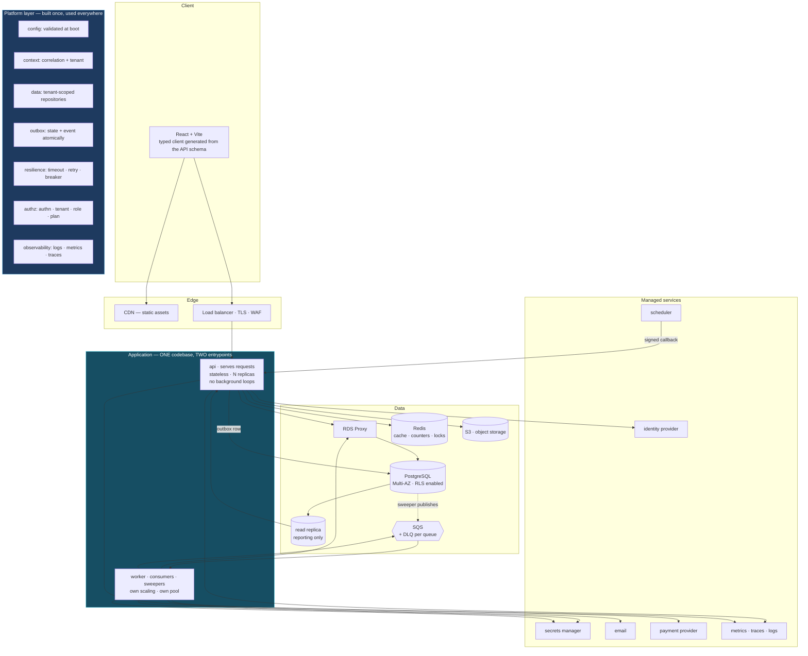

# The golden path

The recommended starting architecture for a new SaaS product, the order to
build it in, and the classification of every technology and pattern as
default, optional, or advanced.

---

## 1 The six patterns most worth having

These are the highest-leverage structures in a commercial SaaS. Each is
expanded in its own reference.

1. **A transactional outbox with per-consumer fan-out** — atomic lease-based
   claiming, per-attempt audit records, exponential backoff with jitter, and
   parent-status roll-up from child workers. A genuinely difficult pattern that
   repays the effort the first time an event would otherwise have been lost.
2. **A four-layer authorization model** — authentication, then tenant
   membership, then role permission, then **plan entitlement**. Making "has this
   customer paid for this capability?" a first-class, data-driven concern rather
   than plan checks scattered through the code is the single most reusable idea
   in this standard.
3. **A composable resilience pipeline** — retry, timeout, circuit breaker,
   bulkhead, rate limiter and fallback as interchangeable middleware behind a
   vendor-neutral adapter layer.
4. **A saga task chain with explicit compensation contracts** — every step
   implements execute, rollback and can-continue, which makes a multi-system
   business operation reviewable.
5. **Fail-fast configuration validation at boot** — a missing required
   environment variable terminates the process instead of surfacing as
   `undefined` during an incident.
6. **Externalised durable scheduling** — business-critical timers delegated to a
   managed scheduler rather than in-process cron, so timers survive deploys and
   do not multiply across replicas.

---

## 2 The seven capabilities to fund deliberately

In an ecosystem without an opinionated application framework, these are the
places where a team gets no default and must build one. None can be deferred.

| # | Capability | Why it cannot be deferred | Reference |
|---|---|---|---|
| 1 | **Framework-enforced tenant scoping** | Isolation implemented as a convention degrades with every new call site | `16-multi-tenancy.md` |
| 2 | **A CI quality gate** | Tests that do not run automatically are documentation | `32-cicd.md`, `33-testing.md` |
| 3 | **Immutable, reproducible build artifacts** | You cannot roll back to an image you cannot rebuild identically | `31-infrastructure-and-deployment.md` |
| 4 | **Exact-decimal money types and a balance projection** | Floating point and full-history aggregation both fail silently and late | `18-billing-and-money.md` |
| 5 | **Metrics, tracing, and health endpoints** | Logs alone cannot answer "is it slow, and where" | `21-observability.md` |
| 6 | **Declarative transaction demarcation** | Hand-threaded transaction objects drift from intent as code grows | `06-transactions-and-integrity.md`, `04-platform-layer.md` |
| 7 | **A published internal contract package** | Copied shared code diverges; a versioned package cannot | `30-code-architecture.md` |

### The organising lesson

The strongest engineering in a system like this is **deliberately hand-built
platform capability**: the outbox, the resilience pipeline, the entitlement
layer, the saga manager, the boot-time configuration validation.

The areas needing the most investment are, almost without exception, **the
places where a framework would normally have supplied the default**: tenant
scoping, transaction demarcation, connection governance, health and metrics
endpoints, build reproducibility, and internal contract publishing.

**That asymmetry is the whole lesson.** The platform layer is not overhead to be
deferred — it is the first feature. Build it early, build it once, and make it
impossible to bypass.

---

## 3 Target architecture



---

## 4 Component-by-component recommendation

| Layer | Recommendation | Rationale |
|---|---|---|
| **Front end** | React + Vite + TypeScript; typed client generated from the API schema; server cache and UI state kept separate | The generated client is the only cross-boundary contract that fails a build |
| **Back end** | **One modular monolith**, two entrypoints (`api`, `worker`) from one codebase | Independent scaling of request and background work without distributed-systems cost |
| **API** | REST with OpenAPI, or GraphQL if clients compose deeply nested reads. Cursor pagination, DTOs, `Idempotency-Key`, correlation IDs | Contract-first; the expensive things are free at the start and costly to retrofit |
| **Authentication** | Managed identity provider; short access tokens; refresh rotation; TTL'd revocation denylist | Credential handling is not differentiating work |
| **Authorization** | Four layers; permission and entitlement as data over one capability vocabulary; **declared per operation and verified in CI** | The single most valuable pattern in this standard |
| **Multi-tenancy** | Shared database, `tenant_id` on every scoped table, required tenant parameter in the data layer, **RLS as the backstop** | Isolation as a mechanism, not a convention |
| **Database** | PostgreSQL, Multi-AZ, RLS on, connection proxy, one read replica for reporting | Relational integrity plus a clear scaling path |
| **Migrations** | Automated, locked, blocking pipeline step; every migration backward-compatible | Removes a manual step and a class of deploy risk |
| **Cache** | Redis — cache with TTL, counters, distributed leases; **never the source of truth** | Necessary once there is more than one replica |
| **Queue** | Managed queue with a DLQ per queue, bounded concurrency, idempotent handlers | Managed removes broker operations entirely |
| **Workers** | Separate deployable; atomic claiming; bounded concurrency; idempotent; resumable | Independent scaling; no duplicate work |
| **Events** | Transactional outbox from day one | Cheaper than the first lost event |
| **Scheduling** | Managed scheduler with signed callbacks | Timers that survive deploys |
| **Integrations** | One adapter per provider; timeout, retry, breaker, bulkhead; kill switch; per-tenant rate limit | Every external dependency is a failure domain |
| **Webhooks** | Signature verified, deduplicated, persisted, acknowledged, then processed async | Untrusted write paths need all five |
| **Billing** | Managed subscription provider + local append-only ledger in exact decimals + reconciliation | Buy the commodity; own the audit trail |
| **Money** | `NUMERIC` or integer minor units; currency on every amount; explicit rounding | Non-negotiable |
| **Observability** | Structured logs to stdout; RED/USE/saturation metrics; distributed tracing; liveness/readiness/startup; SLOs with burn-rate alerts | All three pillars from the start; retrofitting is far harder |
| **Security** | Secrets manager; platform identity; least-privilege IAM; non-root containers; lockfile builds; dependency and image scanning; audit log | Platform hygiene, cheap at the start |
| **Infrastructure** | Containers on managed orchestration; IaC from day one; a private registry; Multi-AZ; auto-scaling on a measured signal | Managed orchestration without cluster operations |
| **CI/CD** | Blocking gate on every PR; build once; promote by digest; migrations then rolling deploy; smoke tests; automatic rollback | The multiplier for everything else |
| **Testing** | Integration tests against containerised infrastructure; generated cross-tenant matrix; concurrency tests on every invariant; near-total coverage on money | Weighted by failure cost |

---

## 5 The platform layer — build this first

This is the concrete answer to "the ecosystem gives us no framework". **Build
these ten modules first, before any feature.** Everything afterwards inherits
them.

```
platform/
  config/        typed, validated at boot, fails fast; absence ≠ false
  context/       AsyncLocalStorage: correlationId · tenantId · userId · locale
                 installed at EVERY entrypoint (http · consumer · cron · scheduler)
  logging/       structured JSON to stdout; context injected automatically
  metrics/       RED · USE · saturation helpers; low-cardinality labels enforced
  tracing/       OpenTelemetry; propagation across HTTP and queue boundaries
  db/            connection + pool; transaction helper; TenantRepository base with
                 a REQUIRED branded tenant parameter; GlobalRepository for reference data
  outbox/        write(tx, event) · publisher · sweeper (queries the invariant)
  resilience/    timeout · retry(transient) · breaker · bulkhead, composable
  authz/         authenticate · tenant · permission · entitlement; declared per
                 operation and verified by a CI check
  health/        /health/live · /health/ready · /health/startup
```

**The two-week investment is not overhead. It is the difference between**
consistency enforced by a mechanism and consistency maintained by memory across
every future pull request — and memory does not scale with headcount.

Full reference implementations: `04-platform-layer.md`.

---

## 6 Week by week

| Weeks | Focus |
|---|---|
| **1–2** | Repository, CI gate, IaC skeleton, artifact pipeline, the platform layer above |
| **3–4** | Identity provider integration, four-layer authorization, tenancy with RLS, the first domain module |
| **5–6** | Worker entrypoint, outbox, queue with DLQ, first integration adapter with full resilience |
| **7–8** | Billing: subscription provider, ledger in exact decimals, webhooks, reconciliation |
| **9–10** | Observability completion: metrics, tracing, SLOs, runbooks, alert routing |
| **11–12** | Test suite depth: cross-tenant matrix, concurrency, failure injection; load test the hot paths |
| **Ongoing** | Features. The platform now enforces correctness by default. |

---

## 7 What NOT to build initially

| Do not build | Until |
|---|---|
| Microservices | A boundary has a proven independent scaling curve **and** owns its data |
| Kubernetes | You can name the specific capability managed orchestration lacks |
| Event sourcing | A regulatory requirement mandates full event history |
| CQRS with separate stores | Read and write loads demonstrably conflict |
| A service mesh | Service count and cross-service policy needs justify it |
| Multi-region | A latency or data-residency requirement exists |
| Sharding | Partitioning and vertical scaling are exhausted |
| A custom identity provider | Never |
| A custom billing engine | Never, unless billing *is* the product |
| A second database technology | Access pattern, durability, retention, **and** cost all diverge |

---

## 8 DEFAULT — start here

Classified by engineering reasoning, not by popularity.

| Technology / pattern | Why it is a default |
|---|---|
| **PostgreSQL** | Transactions, integrity, expressive SQL, a known scaling path |
| **One modular monolith, two entrypoints** | Independent scaling of request and background work without distributed cost |
| **Managed identity provider** | Credential handling is commodity and high-risk to build |
| **Row-level tenancy + RLS** | The only strategy that scales to many tenants affordably |
| **Four-layer authorization** | All four questions must be answered by any commercial product |
| **Entitlement as data** | Pricing changes without deploys |
| **Transactional outbox** | Cheaper than the first lost event |
| **Idempotency keys** | At-least-once is the only guarantee available |
| **Cursor pagination** | Free now; a breaking change later |
| **Explicit DTOs** | Prevents schema leakage into client contracts |
| **Timeouts on every external call** | A call without one is a resource leak |
| **Retry with backoff and jitter (transient only)** | Transient failures are the common case |
| **Circuit breaker** | Retry without it amplifies failures |
| **Structured logs to stdout + correlation IDs** | Prerequisite for every investigation |
| **RED + USE metrics** | Otherwise "is it slow?" is unanswerable |
| **Liveness / readiness / startup endpoints** | The platform needs them to route and restart correctly |
| **Graceful shutdown** | Required for zero-downtime deploys |
| **Managed queue with a DLQ** | Async work must survive restarts |
| **Managed scheduler** | Timers must survive deploys |
| **Exact-decimal money + append-only ledger** | Non-negotiable for money |
| **Managed subscription billing** | Enormous domain; buy it |
| **Webhook signature verification + dedupe** | Untrusted write paths |
| **Infrastructure as code** | Review, history, reproducibility, DR |
| **CI gate blocking merges** | The multiplier for all quality work |
| **Immutable artifacts promoted by digest** | Prerequisite for rollback |
| **Automated, backward-compatible migrations** | Removes a manual deploy step |
| **Secrets manager + platform identity** | Rotation without a deploy |
| **Non-root containers from pinned bases, lockfile builds** | Cheap now; hard to retrofit |
| **Integration tests against real infrastructure** | Mocks cannot verify constraints or transactions |
| **Sortable opaque public identifiers** | Removes enumeration as a capability |

## 9 OPTIONAL — introduce when the requirement is demonstrated

| Technology / pattern | Introduce when |
|---|---|
| **Redis** | More than one replica must share state, or a measured read is hot and repeated |
| **Distributed leases** | Scheduled or exclusive work runs in a replicated service |
| **Distributed rate limiting** | Per-instance counters are insufficient |
| **Read replica** | Reporting competes with transactional load |
| **Separate real-time deployable** | Live updates are a product requirement |
| **Federated GraphQL** | Clients compose one screen from several domains |
| **A separate service** | A boundary owns its data and has an independent scaling curve |
| **Event-driven integration between services** | Synchronous coupling between services becomes a reliability problem |
| **Saga with compensation** | An operation spans systems that cannot share a transaction |
| **Document store** | Access pattern, durability, retention, and cost all diverge |
| **Bulkheads** | Dependencies have materially different latency profiles |
| **Feature flags** | Release must be decoupled from deploy |
| **DI container** | Manual wiring becomes the bottleneck |
| **Message schema registry** | Queue payload changes start breaking consumers |
| **Compiled language for a hot path** | A measured CPU-bound workload exists |
| **Auto-scaling** | Load varies enough that fixed capacity is wasteful or insufficient |
| **Connection proxy** | Replica count × pool size approaches the connection ceiling |

## 10 ADVANCED — only at genuine scale or complexity

| Technology / pattern | Prerequisite |
|---|---|
| **Microservices with separate databases** | Proven team and scaling boundaries; platform maturity to operate them |
| **Kubernetes** | A named capability that managed orchestration lacks |
| **Service mesh** | Enough services that cross-service policy is unmanageable otherwise |
| **CQRS with separate read stores** | Read and write loads demonstrably conflict after replicas |
| **Event sourcing** | Full event history is a hard requirement |
| **Table partitioning** | Individual tables are large enough that maintenance windows hurt |
| **Sharding** | Partitioning and vertical scaling are exhausted |
| **Multi-region active-active** | Latency or residency requirements, and a team ready for conflict resolution |
| **Custom orchestration or workflow engines** | Managed options are demonstrably insufficient |
| **Chaos engineering** | Basic failure drills are already routine |
| **Cell-based architecture** | Blast-radius isolation per tenant group is a requirement |

**The classifying question for anything in ADVANCED:** *what specific, measured
problem does this solve that the tier below cannot?* If it cannot be answered
with a number, it is not yet time.
