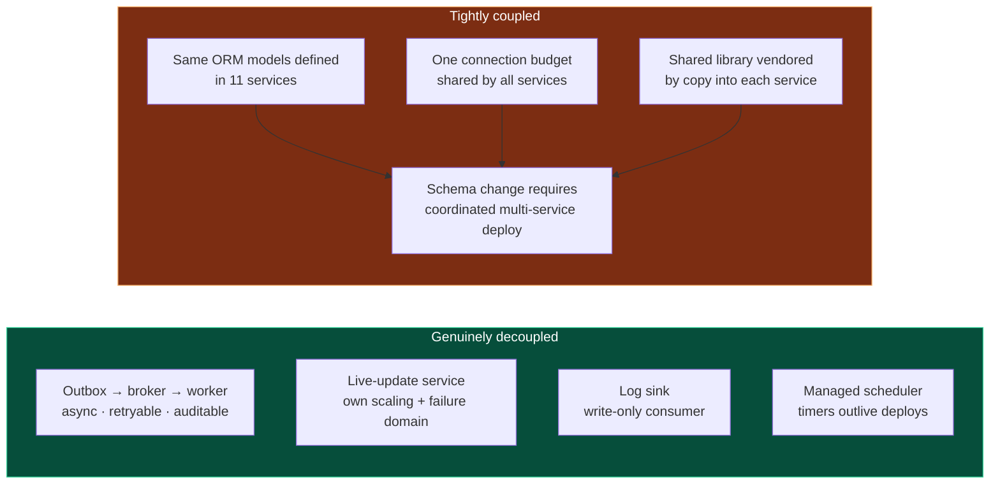
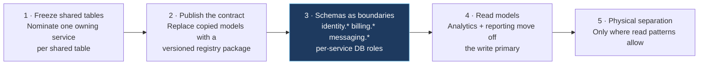

# Architecture and service boundaries

## Part 3 — Architectural style

### 3.1 Classification

Repository count suggests microservices. The code supports a more precise description.

| Dimension | Evidence | Verdict |
|---|---|---|
| Code boundaries | 13 repositories, separate builds, no shared package registry | Distributed |
| Deployment boundaries | Each unit deploys through its own pipeline | Distributed |
| Runtime boundaries | Separate processes, ports, containers | Distributed |
| API boundaries | Federated GraphQL with explicit subgraph schemas | Distributed |
| **Data boundaries** | **One PostgreSQL database; `users` / `workspaces` / `user_workspaces` models defined in all 11 TS services; 21 model names shared by ≥5 services** | **Monolithic** |
| Schema ownership | Migrations for shared tables distributed across services (157 / 156 / 146 / 133); the Go service has 0 migrations while writing shared tables | **Unowned** |
| Failure isolation | Any service can consume the shared connection budget or lock shared rows | Not isolated |
| Scaling isolation | Compute scales independently; all services contend for one database | Partially isolated |

#### Classification: a **federated, event-augmented distributed monolith**, with three genuinely decoupled edges

- **Distributed monolith in the data tier** — the dominant characteristic.
- **Event-driven in specific flows** — outbox → broker → worker chains are real asynchronous decoupling, not RPC in disguise.
- **Real-time at the edge** — a dedicated stateful WebSocket service with pub/sub fan-out.
- **Partially serverless** — durable scheduling delegated to a managed scheduler; one Lambda in automation.
- **Not microservices** in the sense that matters most: services do not own their data.

### 3.2 Where coupling concentrates



### 3.3 What transfers

**The shape to avoid.** Microservice topology with monolithic data.

**Intent.** Independent team velocity and independent scaling.

**What is achieved.** Independent *deployment* — genuinely useful. Independent *change* is not achieved: a modification to a shared table still requires coordinating eleven codebases, which is the coordination cost a monolith would impose, plus network partitions, plus eleven pipelines.

**Principle.** **A service boundary is a data-ownership boundary, or it is decoration.** Splitting code without splitting data incurs distributed-systems cost and monolithic coupling simultaneously.

**Applicability.** Universal. This is the most common expensive architectural mistake in SaaS.

**Trade-offs.** Real data separation forces you to give up cross-domain joins and accept eventual consistency. For a small team, a **modular monolith is usually the better answer**: one deployable, one database, enforced internal module boundaries, extractable later.

**Domain-specific?** No — this arises from organic growth, not from any real-time requirement.

#### Reference flow: how to get from here to owned data, in dependency order



Step 3 is the high-leverage one and is often skipped. Namespaced schemas plus per-service database roles — write access on owned schemas, read-only elsewhere — make the boundary **enforced by the database** rather than by developer memory. It is cheap, reversible, requires no application rewrite, and takes effect immediately.

#### Decision rule for a new product

```
Team ≤ 15 engineers, or domain boundaries still moving?
  → Modular monolith. One deployable, one database, enforced module seams,
    one CI pipeline. Extract later; the seams make it cheap.

An independent scaling curve is PROVEN and a domain owns its data cleanly?
  → Extract that ONE service, WITH ITS OWN DATABASE.

Anything else?
  → Stay in the monolith.
    Extracting from a clean monolith is a week.
    Un-distributing a distributed monolith is a year.
```

---

## Part 4 — Service boundaries

**Classification** answers one question: would this boundary make sense in a completely different SaaS?

| Service | Responsibility | Owns its data | Why separate | Classification |
|---|---|---|---|---|
| **Identity & tenancy** | Auth, users, tenants, roles, permissions, entitlements, integrations | Shared | Universal cross-cutting domain; distinct security posture and change cadence | **Strong reusable boundary** |
| **Billing** | Subscriptions, invoices, payments, disputes, refunds, price catalogue | Shared | Money carries different correctness, audit, and compliance requirements | **Strong reusable boundary** |
| **Ledger (Go)** | Usage metering, double-entry journal, balance, auto-recharge | Shared | Compute-heavy, numerically sensitive, high write volume | **Strong reusable boundary** — separating the *ledger* from the *biller* is good practice |
| **Live updates** | Subscription transport and fan-out | Minimal | Long-lived connection state must not block stateless deploys | **Strong reusable boundary** |
| **Log sink** | Consume log events → document store | Yes | Write-heavy; different retention economics; must never slow callers | **Strong reusable boundary** |
| **Upload** | Multipart ingest, media transform, object storage | Partly | Large payloads and CPU-bound transcode would starve API event loops | **Strong reusable boundary** |
| **Media & AI processing** | Long-running media and AI pipelines | Partly | Long jobs, external AI vendors, bursty cost profile | **Strong reusable boundary** |
| **Provider integration** | External provider adapter, inbound webhooks, long-running operation orchestration | Shared | Confines a volatile vendor contract to one codebase and one deploy | **Strong reusable boundary** — as *"isolate your primary external dependency"* |
| **Notification** | Email and push dispatch, templating | Partly | Fan-out delivery with third-party failure modes | **Context-dependent** — fine as a module in a smaller system |
| **Messaging** | Conversations, threads, campaigns, scheduling | Shared | High volume, distinct lifecycle | **Context-dependent** |
| **Analytics** | Aggregations, KPIs, dashboards | Reads others' tables | Read-mostly, heavy queries, different SLO | **Context-dependent** — the underlying need is a *read model*, not a service on the write primary |
| **Chat** | Internal team chat | Shared | Boundary appears organisational rather than technical | **Potentially unnecessary** — a whole deployment, pipeline and on-call surface for a boundary that is organisational rather than technical |

### 4.1 The reusable boundary catalogue

Five of these generalise to almost any SaaS, for reasons unrelated to this domain:

1. **Identity and tenancy** — different security posture, different auditors, different change cadence.
2. **Billing and money** — a higher correctness bar; you want a small, heavily-reviewed, well-tested surface.
3. **Long-lived connections** — stateful transport must not constrain stateless deploys.
4. **Heavy or bursty asynchronous work** (media, AI, exports) — protects request latency and lets you scale cost independently.
5. **Your primary volatile external dependency** — an adapter service confines vendor churn to one codebase.

### 4.2 Two boundary shapes to avoid

**Analytics as a service over the transactional primary.** This isolates nothing: heavy analytical queries still land on the write primary and compete for the same buffers, locks, and connections. The three correct shapes are a **read replica**, a **materialised read model**, or a **separate analytical store fed by events**.

**A service extracted along team lines rather than data lines.** Every deployable carries a fixed cost: a pipeline, a runtime, a connection allocation, an on-call surface, and a dependency-upgrade treadmill. Pay it only for a boundary that buys isolation.

**Principle.** *A new service must be justified by at least one of: data ownership, an independent scaling curve, an independent failure domain, or an independent security posture. "A different team works on it" is not on that list.*

### 4.3 Boundary specification template

Adopt this as a required artifact before any service is created:

```
Service name:
Owned tables:                    (must be non-empty)
Published API:                   (GraphQL subgraph / REST / events)
Consumed APIs:                   (who it depends on, synchronously)
Consumed events:                 (who it depends on, asynchronously)
External dependencies:           (with timeout + retry + breaker policy per dependency)
Scaling model:                   (stateless N replicas / partitioned / singleton)
Failure domain:                  (what breaks if this is down; what does NOT break)
Deploy independence:             (can it ship without coordinating another service? prove it)
Justification:                   (which of the four criteria in 4.2 applies)
```

If **Owned tables** is empty, the correct outcome is a module, not a service.

---

## Part 35 — Classification: what transfers and what does not

The most important table in this standard. Copying a decision without its context is how one team's solution becomes another team's complexity.

**Legend**

| Class | Meaning |
|---|---|
| **A** | **Universal SaaS principle** — consider for essentially every SaaS |
| **B** | **Scalable SaaS principle** — becomes important at meaningful scale |
| **C** | **Domain-dependent** — depends on product requirements |
| **D** | **Real-time / high-throughput** — driven by that workload class |
| **E** | **Context-specific** — do not copy without re-deriving the decision |

| # | Decision | Class | Why |
|---|---|---|---|
| 1 | Relational database as the system of record | **A** | Almost every SaaS domain is relational; transactions and integrity are foundational |
| 2 | Row-level multi-tenancy | **A** | The only strategy that scales to many tenants with acceptable operational cost |
| 3 | Four-layer authorization (auth → tenant → role → plan) | **A** | Every commercial multi-tenant product needs all four questions answered |
| 4 | Entitlement modelled as data, not code | **A** | Pricing changes without deploys; the upgrade path becomes derivable |
| 5 | Transactional outbox for state-change side effects | **A** | The only correct way to make a state change and an external effect consistent |
| 6 | Idempotency keys on consumers and mutations | **A** | At-least-once is the only delivery guarantee available |
| 7 | Cursor pagination by default | **A** | Costs nothing initially; a breaking change to retrofit |
| 8 | Explicit DTOs separating the API from the schema | **A** | Prevents schema changes from leaking into the client contract |
| 9 | Adapter module per external system | **A** | Confines vendor churn to one module |
| 10 | Explicit timeout on every external call | **A** | A call without a timeout is a resource leak waiting for a slow day |
| 11 | Retry with backoff and jitter, transient errors only | **A** | Without classification, retry amplifies load |
| 12 | Circuit breaker wherever there is retry | **A** | Prevents a degradation from becoming an outage |
| 13 | Fail-fast configuration validation at boot | **A** | A missing variable should stop a deploy, not surface at 3 a.m. |
| 14 | Structured JSON logging with a correlation ID | **A** | Unstructured logs are not searchable at scale |
| 15 | Ambient request context (`AsyncLocalStorage`) | **A** | Reliable correlation without polluting signatures |
| 16 | Graceful shutdown with signal handling | **A** | Required for zero-downtime deploys |
| 17 | Double-entry, append-only ledger for money | **A** | Auditability and reconstructability are non-negotiable for money |
| 18 | Exact-decimal money representation | **A** | Floating-point money is a defect that surfaces late |
| 19 | Webhook signature verification + deduplication | **A** | Any inbound webhook is an untrusted write path |
| 20 | Layered code architecture, applied uniformly | **A** | Navigability at scale is worth more than local optimality |
| 21 | Saga with compensation for cross-system operations | **A** | The only correct model when a transaction cannot span the systems |
| 22 | Explicit state machines for multi-state entities | **A** | Prevents invalid transitions; makes lifecycles observable |
| 23 | Managed identity provider rather than home-grown auth | **A** | Credential handling, MFA, and rotation are not differentiating work |
| 24 | Shared code as a versioned package | **A** | Copies diverge; packages do not |
| 25 | CI gate blocking merges | **A** | Every other quality investment compounds through it |
| 26 | Immutable, reproducible build artifacts | **A** | Prerequisite for reliable rollback |
| 27 | Externalised durable scheduling | **A** | In-process timers do not survive deploys or replication |
| 28 | Federated GraphQL across services | **B** | Justified when a client renders one screen from many domains |
| 29 | Separate deployable for long-lived connections | **B** | Justified once connection count or deploy frequency makes coupling painful |
| 30 | Redis for shared coordination state | **B** | Needed once multiple replicas must share state |
| 31 | Message broker for async work | **B** | Needed once work must survive a process restart |
| 32 | Dedicated log/audit store separate from the primary | **B** | Needed once log volume threatens the transactional database |
| 33 | Distributed rate limiting | **B** | Needed once one instance's counters are insufficient |
| 34 | Connection proxy in front of the database | **B** | Needed once replica count × pool size approaches the connection ceiling |
| 35 | Read replicas for analytics | **B** | Needed once reporting competes with transactional load |
| 36 | Compiled language for compute-heavy work | **B** | Justified by a measured CPU-bound workload |
| 37 | Worker-level (not event-level) retry granularity | **B** | Justified once one event drives several side effects |
| 38 | Database-backed handler registry with tenant scoping | **B** | Justified for per-customer integrations without deploys |
| 39 | Partitioning and archival | **B** | Table size, not row count, is the trigger |
| 40 | Per-tenant credentials for an external provider | **C** | Only when the provider's model requires it |
| 41 | Usage-based metering and a wallet | **C** | Only for consumption-priced products |
| 42 | AI/ML pipeline as a separate service | **C** | Only when AI features exist and are bursty |
| 43 | Document store alongside the relational primary | **C** | Only for genuinely schema-variable, high-write data |
| 44 | Localised server-side error messages | **C** | Only for multi-locale products |
| 45 | Bot and abuse defence at signup | **C** | Proportional to the cost of an abusive account |
| 46 | Sub-millisecond coordination state in a cache | **D** | Only with a hard sub-second coordination requirement |
| 47 | Hot-path validation collapsed into one database round trip | **D** | Only when round trips have been measured and matter |
| 48 | Second-granularity usage metering | **D** | Only for continuous-consumption billing |
| 49 | Real-time fan-out infrastructure | **D** | Only when live updates are a product requirement |
| 50 | Provider webhook filter pipelines | **D** | Only with high-volume, multi-type inbound event streams |
| 51 | One shared database across many services | **E** | An outcome of growth, not a design to copy — see this document |
| 52 | ORM models duplicated per service | **E** | Replace with a published contract package |
| 53 | Build-on-target-host deployment | **E** | Replace with a registry artifact pipeline |
| 54 | Business rules in stored procedures | **E** | Only for a measured hot path, with the guardrails in `05-data-architecture.md` §4 |
| 55 | Application logs routed through the business broker | **E** | Replace with stdout plus platform collection |
| 56 | In-process background polling loops | **E** | Replace with a worker deployable and atomic claiming |
| 57 | Two error-tracking systems | **E** | Consolidate to one |
| 58 | Two ORMs over one schema | **E** | One owner per schema |
| 59 | Approver allow-lists in pipeline YAML | **E** | Use platform environment protection |
| 60 | Static cloud credentials in environment variables | **E** | Use platform identity |

**How to use this table.** Class **A** items belong in a new project's first month. Class **B** items are the scaling roadmap — know them and adopt on evidence. Class **C** items are requirement-driven. Class **D** items require the constraint that motivated them. Class **E** items are documented here so they are not reproduced by imitation.
