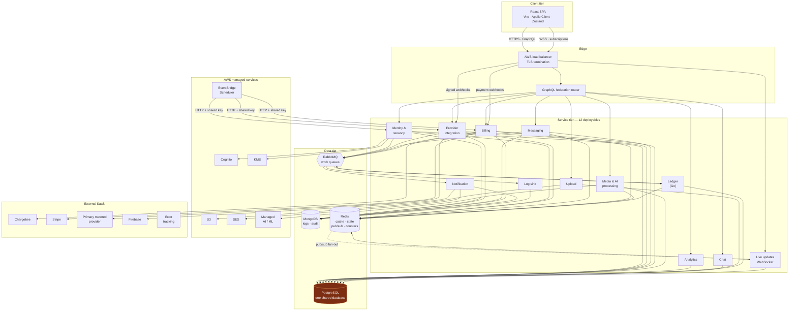

# The reference stack

## Part 1 — System reconstruction

### 1.1 A reference deployable inventory

| # | Deployable unit | Language | Runtime shape |
|---|---|---|---|
| 1 | Identity & tenancy | TypeScript | GraphQL subgraph + REST + queue consumers |
| 2 | Provider integration | TypeScript | GraphQL subgraph + inbound webhooks + consumers |
| 3 | Messaging | TypeScript | GraphQL subgraph + REST + consumers + cron |
| 4 | Billing | TypeScript | GraphQL subgraph + payment webhooks + consumers |
| 5 | Media & AI processing | TypeScript | GraphQL subgraph + async job pipelines |
| 6 | Notification | TypeScript | GraphQL + email/push dispatch |
| 7 | Analytics | TypeScript | GraphQL subgraph, read-mostly |
| 8 | Ledger / wallet | **Go** | HTTP + consumers + cron |
| 9 | Chat | TypeScript | GraphQL subgraph |
| 10 | Log sink | TypeScript | Queue consumer → document store |
| 11 | Live updates | TypeScript | **WebSocket** / GraphQL subscriptions |
| 12 | Upload | TypeScript | REST + media processing |
| 13 | Web client | TypeScript / React | SPA (Vite, PWA) |
| — | Ops automation | Python + Go | Ad-hoc scripts, queue drainer, one Lambda |

A **GraphQL federation router** fronts the subgraphs.

### 1.2 Shared infrastructure

| Component | Role in the architecture |
|---|---|
| **PostgreSQL** | System of record, a few hundred tables, one shared logical database |
| **MongoDB** | Log, audit and integration-trace sink |
| **Redis** | Cache, ephemeral shared state, pub/sub fan-out, denylists, counters, coordination flags |
| **RabbitMQ** | Durable inter-service work queues |
| **AWS Cognito** | Identity provider and JWT issuer; two client IDs for differing token lifetimes |
| **AWS S3** | Object storage with presigned URL access |
| **AWS SES** | Transactional email |
| **AWS KMS** | Field-level encryption of third-party credentials |
| **AWS EventBridge Scheduler** | Durable scheduled callbacks into services |
| **Managed AI / ML inference** | Managed AI and ML inference |
| **Firebase Cloud Messaging** | Mobile and web push |
| **Chargebee** | Subscription management and invoicing |
| **Stripe** | Payment gateway, disputes and refunds |
| **Error tracking** | Exception aggregation |
| **Primary metered provider SDK** | The primary external metered dependency; treated generically throughout |

### 1.3 The reference architecture

**The highlighted node is the architecturally decisive one.** Every arrow entering it is a write path from a different deployable. `02-architecture-and-boundaries.md` works through what follows from that.

---

## Part 2 — Technology inventory

The **Why it exists** column is the point of this table; a dependency list is not an architecture.

### 2.1 Languages and runtimes

| Category | Technology | Version | Purpose | Where used | Why it exists |
|---|---|---|---|---|---|
| Language | TypeScript | 5.x | Primary application language | Nearly all units | Type safety over Node; one language across the stack |
| Runtime | Node.js | 22.17 | Service runtime | All TS services | I/O-bound workload; large ecosystem |
| Language | Go | 1.25 | Ledger and usage computation | 1 service | CPU-bound aggregation; goroutine concurrency; strict typing on money paths |
| Language | Python | 3.x (uv) | Operational automation, one Lambda | Automation repo | Rapid scripting for data operations |

**Analysis.** The Go service is the one place language choice was driven by workload rather than uniformity — and it is the money service, where numeric behaviour and concurrency matter most. That instinct is correct and worth repeating.

**Reference rule.** *Default to one language for cohesion. Introduce a second only where the workload profile genuinely differs — CPU-bound computation, strict numeric requirements, or true parallelism — and accept that the second language needs its own full complement of tests, migrations, observability, and deployment tooling. A polyglot service with half the system support is more expensive than a monoglot one.*

### 2.2 API and framework layer

| Category | Technology | Version | Purpose | Why it exists |
|---|---|---|---|---|
| GraphQL server | `@apollo/server` | 4.x | HTTP GraphQL runtime | One typed contract for a SPA with deeply nested reads |
| Federation | `@apollo/subgraph` | 2.x | Subgraph composition | One client-facing graph over many services; avoids client-side orchestration |
| HTTP | Express | 4.18 | Webhooks, REST, uploads | GraphQL cannot receive third-party webhooks or stream multipart |
| WebSocket | `graphql-ws` + `ws` | 5.x / 8.x | Live subscriptions | Isolates long-lived connections from stateless services |
| Web framework | Gin | 1.9 | HTTP for the Go service | Lightweight Go router |
| Validation | Joi | 17.x | Request and DTO validation | Runtime validation, which TypeScript cannot provide |
| Errors | `@hapi/boom` | 10.x | Typed HTTP errors | Consistent status and shape on REST paths |
| i18n | `i18n` | 0.15 | Localised messages | Multi-locale product surface |
| Module aliasing | `module-alias` | 2.2 | `@src/...` imports | Avoids deep relative paths |

**Analysis — the federation decision.** Federation is correct for a SPA that renders one screen from six domains. Without it the client makes six calls and performs the joins, or you build a bespoke aggregation layer. The cost is that a shared type must be understood by every subgraph that references it, which creates pressure toward duplicating type and model definitions.

**Reference rule.** *Federate the graph only if you also fund shared-type ownership: one owning service per shared type, a published schema contract, and a composition check in CI that fails on a breaking change. Federation without governance converts a schema problem into an organisational one.*

### 2.3 Data layer

| Category | Technology | Purpose | Why it exists |
|---|---|---|---|
| RDBMS | PostgreSQL (`pg` 8.x) | System of record | Relational integrity, transactions, expressive SQL, PL/pgSQL |
| ORM | Sequelize 6.x | Mapping + migrations (TS) | Model definitions and migration tooling |
| ORM | GORM 1.25 | Mapping (Go) | Idiomatic Go data access |
| Document store | MongoDB / Mongoose 8 | Logs, audit, integration traces | Schema-free, high-write, cheap-retention sink |
| Cache / state | Redis (`redis` 4, `ioredis` 5) | Cache, shared state, pub/sub, counters | Sub-millisecond state shared across replicas |
| Broker | RabbitMQ (`amqplib`, `amqp-connection-manager`) | Async work distribution | Decouples slow and failure-prone work from requests |
| Decimal math | `shopspring/decimal` | Exact decimal arithmetic | Required on every money path |
| Identifiers | KSUID (`ksuid`, `segmentio/ksuid`) | Sortable unique IDs | Time-ordered, non-guessable, no coordination needed |
| Pooling | ORM-native pools | Connection management | — |
| Connection proxy | — | — | **Required — commonly missing** |
| Read replicas | — | — | **Required — commonly missing** |
| Partitioning / sharding | — | — | **Required — commonly missing** |

**Analysis — identifiers.** Time-sortable, non-sequential identifiers are an underrated default: index locality (unlike random UUIDv4), no cross-node coordination (unlike sequences), and no enumerable values in URLs. The system also uses integer surrogate keys on core tables, and those are the ones exposed through the API.

**Reference rule.** *Use a sortable opaque identifier as the **external** identifier for every resource. An integer surrogate key is fine internally; it must never be the value a client sends. An enumerable public identifier converts every missing authorization check into a data-enumeration capability.*

**Analysis — two ORMs over one schema.** When two runtimes map the same tables, the schema has two independent representations and only one of them owns migrations.

**Reference rule.** *Exactly one component owns a table's schema and owns its migrations. Any other component reads through an API, a replica, or an event stream — or, at minimum, through a database view that constitutes a deliberate published contract.*

### 2.4 Security, resilience, operations

| Category | Technology | Purpose | Why it exists |
|---|---|---|---|
| Identity | AWS Cognito (`aws-jwt-verify`, `amazon-cognito-identity-js`, `cognito-srp-helper`) | Auth, JWT, MFA, SRP | Outsources credential storage, MFA, and rotation |
| Encryption | AWS KMS + `@aws-crypto/client-node` | Field-level encryption | Protects third-party credentials at rest |
| Rate limiting | `rate-limiter-flexible` | Redis-backed distributed limits | Limits must hold across replicas |
| Resilience | `cockatiel` | Retry, timeout, breaker, bulkhead | Node has no built-in resilience framework |
| Error tracking | `@sentry/node`, `@sentry/react` | Exception aggregation | Grouped, alertable exceptions |
| Logging | `winston` | Structured JSON logs | Machine-parsable output |
| Logging | `log/slog` | Structured logs (Go) | Standard library |
| Containers | Docker + Compose | Packaging and run | — |
| CI | GitHub Actions | Deployment automation | 40 workflows |
| Abuse defence | reCAPTCHA, FingerprintJS Pro | Signup/login abuse control | Fraud control on a metered product |
| OAuth | `openid-client` | Third-party integration auth | Standards-based OAuth/OIDC client |
| Metrics (Prometheus / OTel / StatsD) | — | — | **Required — commonly missing** |
| Distributed tracing | — | — | **Required — commonly missing** |
| Container orchestration | — | — | **Required — commonly missing** |
| Infrastructure as code | — | — | **Required — commonly missing** |
| Managed secrets store | — | — | **Required — commonly missing** |
| SAST / dependency scanning / SBOM | — | — | **Required — commonly missing** |

**The shape of that list of gaps is itself the lesson.** Every entry is a *platform* concern, and every one is supplied by default by an opinionated framework plus a conventional artifact pipeline — a management endpoint module for health and metrics, a metrics facade and OpenTelemetry for tracing, build-tool lockfiles for reproducibility, a config server or secrets integration for credentials. This is the thesis of `04-platform-layer.md`, reached from the gaps rather than assumed.

### 2.5 Front-end stack

| Category | Technology | Purpose | Why it exists |
|---|---|---|---|
| Framework | React 18 + Vite | SPA | Fast builds and HMR |
| Data layer | Apollo Client 3.13 + GraphQL Codegen | Typed GraphQL operations | **Types generated from the live schema** — a compile-time contract with the backend |
| Client state | Zustand 5 | UI and local state | Deliberately separate from the server cache |
| Forms | React Hook Form + Zod | Validation | Schema-driven client validation |
| UI | Ant Design 5 + Tailwind 4 | Components + utility CSS | Delivery speed over a bespoke design system |
| i18n | i18next | Localisation | Mirrors backend localisation |
| PWA | `vite-plugin-pwa` | Installable shell | Desktop-application feel from one codebase |
| Realtime | `graphql-ws` 6 | Subscriptions | Live UI without polling |
| Observability | `@sentry/react` | Client error tracking | Client-side exception visibility |
| Testing | Vitest | Unit and component tests (35 files) | — |

**Analysis — the one machine-enforced contract.** GraphQL Codegen means a backend schema change that breaks the client fails the client's type-check. This is the strongest cross-boundary guarantee in the system: queue message shapes and shared table structures have no equivalent.

**Reference rule.** *Every boundary should have a contract that fails a build rather than a request. Generate client types from the server schema; generate queue-message types from a schema registry; generate database types from migrations. A contract enforced only by review is enforced only sometimes.*

**Analysis — the mixed UI strategy.** A component library plus a utility CSS framework means two styling authorities. It ships features quickly and accumulates visual inconsistency.

**Reference rule.** *Pick one styling authority per surface. If you deliberately run two, define in writing which owns layout, which owns component internals, and budget a consolidation before the design surface grows large.*
