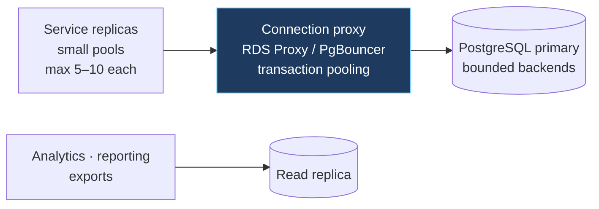

# Data architecture

## 5.1 The reference implementation

| Concern | Implementation |
|---|---|
| Primary store | PostgreSQL, one logical database, a few hundred tables |
| Access | Sequelize (TS) and GORM (Go) over the same schema |
| Raw SQL | ~1,510 raw-SQL call sites |
| Stored logic | PL/pgSQL functions for hot-path validation, entitlement, quota, reporting |
| Soft delete | `deleted_at` universally; every predicate carries `deleted_at IS NULL` |
| Migrations | `sequelize-cli`; 592 migration files across the four largest services |
| Document store | MongoDB for logs, audit, integration traces |
| Cache / state | Redis, several logical databases on one instance |
| Connection pool | ORM-native; hard-coded in some services, environment-driven in others |
| Connection proxy / replicas / partitioning / archival | **Required — commonly missing** |

## 5.2 PostgreSQL as the system of record

**Intent.** Relational integrity, real transactions, and expressive SQL for a domain dense with many-to-many relationships (tenants ↔ users ↔ roles ↔ resources ↔ plans).

**Principle.** *Start relational. Choose PostgreSQL unless you can name the specific property it lacks that your workload requires.* Very little in a typical SaaS domain model is served better by a document store than by PostgreSQL with `jsonb` where the data is genuinely schemaless.

**Applicability.** Universal — **DEFAULT**.

**Trade-off.** A single writable primary is a scaling ceiling. That ceiling is distant (`29-scalability.md`) and the steps to raise it are well understood and ordered. Prefer the ceiling you understand.

## 5.3 A second datastore for logs — the reasoning, and the operational cost

**Intent.** Logs, audit trails, and integration traces are high-volume, schema-variable, append-only, and have different retention economics from business data. Keeping them out of the transactional database protects it.

**Principle.** *A second datastore is justified when the access pattern, the durability requirement, the retention policy, **and** the cost curve all differ from the primary.* Logs satisfy all four.

**Applicability.** **OPTIONAL** — introduce when log volume actually threatens the primary.

**Trade-off.** A second database is a second backup story, a second failover story, a second driver to patch, and a second credential to rotate. On AWS, a managed log destination — CloudWatch Logs or OpenSearch Service — delivers retention policies, full-text search, and alerting without owning a database.

**Reference rule.** *Prefer a managed log destination to a self-operated document store, unless you have a query requirement the managed service cannot serve. Operating a database to store logs is a cost that compounds quietly.*

## 5.4 Database-resident business logic — a legitimate trade-off, applied narrowly

**The reference implementation.** The highest-frequency validation path resolves tenant, retrieves credentials, checks entitlement, and enforces quota in a **single stored function call**, returning either a result set or raising an exception that the application maps to a user-facing error.

**Intent, and it is sound.** On a latency-critical path, four sequential application queries cost four network round trips; one function call costs one. On a hot path that is a genuine, measurable win.

**Principle.** *Collapsing a chatty read sequence into a single round trip is a legitimate optimisation for a latency-critical path.*

### Reference flow: database-resident logic done safely

If you adopt this pattern, four properties are required — each addressing a way the pattern degrades:

**1. Signal business outcomes with a private error class, never a standard one.**

Standard SQLSTATE classes have defined meanings: `02000` is *no data*, `23000` is *integrity constraint violation*, `23502` is *not-null violation*, `53000` is *insufficient resources*. If a function raises those to signal *business* outcomes, a genuine constraint violation elsewhere in that function becomes indistinguishable from a deliberate rejection, and will be reported to the user as a business error.

```sql
-- Reference: a private, discriminated signal
RAISE EXCEPTION 'quota_exceeded'
  USING ERRCODE = 'P0001',                       -- private class, reserved for app use
        DETAIL   = 'limit=100 current=100',
        HINT     = 'quota.exceeded';             -- stable key the app maps to a message
```

The application matches on `HINT` (a stable machine key), not on a numeric class it shares with the database engine.

**2. Every branch must terminate explicitly.**

A conditional that has no `ELSE` returns zero rows and raises nothing. The caller receives nulls and proceeds — which, for a limit check, means the limit silently does not apply. A limit that appears enforced and is not is more dangerous than no limit, because nothing prompts investigation.

```sql
-- Reference: exhaustive branching with an explicit failure for the unmapped case
IF tier = 1 THEN
...
ELSIF tier = 2 THEN
...
ELSE
    RAISE EXCEPTION 'unconfigured_tier'
      USING ERRCODE = 'P0001', HINT = 'quota.tier_unconfigured';
END IF;
```

**3. Quota enforcement must be an atomic reservation, not a count-and-compare.**

```sql
-- NOT this: two concurrent callers both read 99 against a limit of 100, both proceed
SELECT count(*) INTO current FROM usage WHERE tenant = t AND day = today;
IF current >= limit THEN RAISE ...; END IF;

-- This: the increment and the decision are one atomic statement
INSERT INTO usage_counters (tenant_id, window_start, used)
VALUES (t, date_trunc('day', now()), 1)
ON CONFLICT (tenant_id, window_start)
DO UPDATE SET used = usage_counters.used + 1
        WHERE usage_counters.used < :limit          -- the precondition IS the predicate
RETURNING used;
-- Zero rows returned ⇒ the quota is exhausted. No race is possible.
```

This also removes a growing aggregate from the hot path: a counter row is an O(1) read and write, whereas counting a high-volume event table per request has a cost that grows with daily traffic.

**4. Keep policy in the application; keep set-based computation in the database.**

**Principle.** *Reserve stored procedures for set-based data operations where moving computation to the data is the point. Keep **policy** in the application, because policy needs tests, review, and version history alongside the code that depends on it.*

**Applicability.** **OPTIONAL / ADVANCED.** Justified for a proven hot path. Not a default: it is invisible to application tooling, hard to unit-test, and not searchable from the service repository.

## 5.5 Raw SQL and the escape hatch

Parameter binding is used correctly on the paths inspected: user-supplied values pass through `replacements` / `bind`, and only compile-time constants are interpolated.

**Reference rules.**

1. *Bind every value. Never interpolate a value into SQL, ever, including "internal" values.*
2. *Never accept a string destined for an **identifier** position (table, column, direction, ordering) from any caller. Map an enum to a fixed allow-list of literals instead.*

```ts
// Reference: identifier positions come from a closed allow-list, never a parameter
const SORTABLE = { created: 'created_at', amount: 'amount' } as const;
const DIRECTION = { asc: 'ASC', desc: 'DESC' } as const;

const column    = SORTABLE[input.sortBy]     ?? SORTABLE.created;
const direction = DIRECTION[input.direction] ?? DIRECTION.desc;
// column and direction are now literals from our own source, not caller input
```

3. *Expose the raw-SQL escape hatch narrowly.* A generic `query(sql)` method on a shared base repository makes raw SQL available to every module by default, which is how a codebase accumulates 1,500 raw-SQL sites. Put raw SQL behind an explicitly named, deliberately awkward surface so its use is a decision.

## 5.6 Connection governance

**The shape to avoid.** Pool size hard-coded in some services, environment-driven in others; no connection proxy; an in-process polling loop shares the API server's pool.

The budget arithmetic is unforgiving:

```
total backends = services × replicas × pool_max
              + migration jobs + cron processes + ad-hoc scripts + ops tooling
```

Twelve services at `pool_max = 10` with two replicas each reaches **240 backends** before anything operational. PostgreSQL consumes roughly 5–10 MB per backend and degrades sharply beyond a few hundred.

### Reference flow: connection governance



**Reference rules.**

1. *Pool size is environment-driven in every service — no exceptions.* You cannot tune a hard-coded pool during an incident without a deploy.
2. *Compute and document the global budget in one place*, including crons, migrations, and operational tooling.
3. *Put a pooler in front of the database before you need it.* On AWS, RDS Proxy is managed and requires no operational ownership. Per-replica pools then multiplex onto a bounded set of real backends, and replica count stops being a database risk.
4. *Never run an unbounded polling loop in the same process as the request path* — it competes for the same pool and the same event loop. Background pollers belong in a separate deployable with its own pool allocation (`09-queues-and-async.md`).
5. *Route analytics and exports to a replica.* Reporting queries and transactional queries have incompatible profiles.

## 5.7 Transport security to the database

**Reference rule.** *Assert security properties; never infer them from configuration that looks correct.*

ORM-level TLS options are **driver-specific**. An option name valid for one database driver is silently ignored by another — the configuration reads as security and provides none. The correct pattern is to specify the driver's actual option **and verify it at startup**:

```ts
// PostgreSQL: the pg driver's actual TLS options
dialectOptions: {
  ssl: { require: true, rejectUnauthorized: true, ca: fs.readFileSync(RDS_CA_BUNDLE) }
}

// …and prove it, at boot, before serving traffic
const [row] = await sequelize.query(
  `SELECT ssl, version, cipher FROM pg_stat_ssl WHERE pid = pg_backend_pid()`,
  { type: QueryTypes.SELECT }
);
if (!row?.ssl) {
  logger.fatal('Database connection is not encrypted', row);
  process.exit(1);            // fail closed, at boot, not at audit time
}
```

**Principle.** *If a security control matters, add a startup assertion that proves it is in effect and fails closed. Silent configuration is the most expensive kind.*

## 5.8 General SaaS data architecture principles

1. **One writer per table.** Data ownership defines a service boundary.
2. **Start with PostgreSQL.** Add a second store only when access pattern, durability, retention, *and* cost curve all diverge.
3. **Cache when a measured read is hot, repeated, and staleness-tolerant** — never to compensate for a missing index.
4. **Never let a cache own truth** unless the data-loss behaviour has been accepted in writing and tested.
5. **Connection pools are a global budget.** Size centrally, configure per environment, front with a pooler.
6. **Schema boundaries before database boundaries.** Namespaced schemas plus per-service roles deliver most of the isolation at a fraction of the cost, enforced by the database.
7. **Set-based computation in the database; policy in the application.**
8. **Every tenant-scoped table has a tenant column, a leading index on it, and a query layer that cannot omit it.**
9. **Analytics reads a replica or a read model, never the write primary.**
10. **Soft delete is a business decision, not a default.** Applied universally it must appear in every predicate *and every unique index*, or you get silent correctness failures. Apply it deliberately and consistently, or not at all.
11. **Every counter that gates behaviour is an atomic reservation**, never a read-then-compare.
12. **Assert security properties at boot.** Fail closed.
