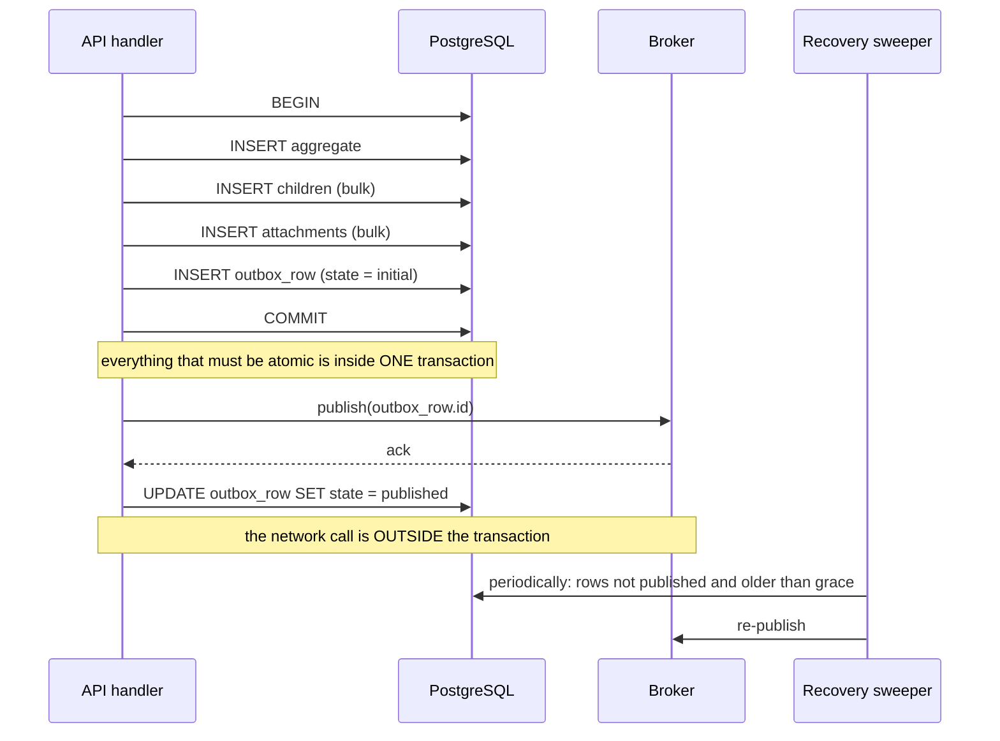

# Transactions and data integrity

## 6.1 The reference producer flow, in the reference design

The bulk-campaign creation path is a **correct transactional outbox producer** and is the model to copy.



Everything requiring atomicity is inside one transaction. The network call is outside it. The *intent to publish* is durable before the publish is attempted. **This is the correct shape.**

## 6.2 Reference flow: a recovery sweep that survives a crash

The subtlety that determines whether an outbox actually recovers is **how the sweeper selects work**.

A sweeper that selects rows in an explicitly-recorded failure state can only recover failures that the failing path successfully recorded. That excludes the most important case: the process died between commit and publish, so nothing was recorded at all. The row sits in its initial state indefinitely, invisible to recovery.

```sql
-- Reference: select on the INVARIANT ("should be published and is not"),
-- with a grace period so rows still legitimately in flight are skipped.
SELECT id, message_type, payload, tenant_id
  FROM outbox
 WHERE state <> 'published'
   AND state <> 'terminated'
   AND attempts < :max_attempts
   AND created_at < now() - interval '30 seconds'
   AND (locked_at IS NULL OR locked_at < now() - interval '5 minutes')
 ORDER BY created_at
 FOR UPDATE SKIP LOCKED                -- many sweeper replicas, no double work
 LIMIT :batch;
```

**Principle.** **A reconciliation query is defined by the invariant, not by the error path.** "Find everything that should have completed and has not" survives a crash. "Find everything marked failed" cannot, because marking requires a live process.

**Corollary — the caller's contract.** When a publish attempt fails after the transaction has committed, the operation has **succeeded** from the business's point of view: the intent is durable and recovery is guaranteed. The API should return success, not an error. Returning an error invites the user to retry, producing a second committed aggregate alongside the first. *Once the commit lands, the response reflects the commit — never the delivery.*

## 6.3 Reference flow: never place I/O inside a transaction

A database transaction holds a pooled connection and row locks for its entire duration. Placing an external call inside it means:

- If the third party degrades to 10-second latencies, every such operation pins a connection for 10 seconds. With a pool of 10, eleven concurrent operations exhaust the pool and the whole service loses database access. **A slow third party becomes a database outage.**
- Rollback cannot un-send an email, un-charge a card, or un-publish a message. The transaction creates an *illusion* of atomicity across a boundary where atomicity is impossible.

```
✗  BEGIN
     INSERT notification
     await sendEmail(...)            ← network call holding a DB connection + locks
     COMMIT

✓  BEGIN
     INSERT notification (status = pending)
     INSERT outbox (type = 'notification.send', ref = notification.id)
   COMMIT
   ── worker, later, retryable, idempotent ──
     send email → UPDATE notification SET status = sent, sent_at = now()
```

**Principle.** **A database transaction contains only database work.** Every external effect happens after commit, driven by a durable record written *inside* the commit. The outbox is not an advanced pattern reserved for cross-service events; it is the default mechanism for *any* side effect that must accompany a state change.

## 6.4 Reference flow: state transitions as conditional writes

The common shape below is a race by construction — two concurrent requests both read the pre-state, both pass the guard, both write:

```ts
✗ const record = await repo.findById(id);
  if (record.terminatedAt) throw new ConflictError('already terminated');
  await repo.update(id, { terminatedAt: new Date(), terminatedBy: user.id });
```

Express the precondition **as the predicate of the write** and the database adjudicates the race, once, correctly:

```sql
✓ UPDATE sessions
     SET terminated_at = now(), terminated_by = :userId, terminate_reason = :reason
   WHERE id = :id
     AND tenant_id = :tenantId      -- tenant scope in the same statement
     AND terminated_at IS NULL            -- the precondition
  RETURNING *;
-- 0 rows ⇒ another actor won the race. Report that. No prior read required.
```

For richer transitions, carry an explicit version and make the transition table data:

```sql
✓ UPDATE orders SET status = :next, version = version + 1, updated_at = now()
   WHERE id = :id AND version = :expectedVersion AND status = :expectedCurrent
  RETURNING version;
-- 0 rows ⇒ concurrent modification. Reload and re-decide, or surface a conflict.
```

**Principle.** **A state transition is a conditional write whose predicate encodes the precondition.** Read-check-write is only safe under a lock you have taken deliberately.

## 6.5 Reference flow: two writes that must both land

```
✗ await Promise.all([ repo.updateParent(...), repo.updateChild(...) ]);
    // concurrency, not consistency: if the second fails, the first stands

✓ await sequelize.transaction(async (t) => {
      await repo.updateParent({ ..., transaction: t });
      await repo.updateChild ({ ..., transaction: t });
  });
```

**Principle.** *`Promise.all` is a concurrency primitive, not a consistency primitive. Two writes that must both land belong in one transaction.*

## 6.6 Isolation levels

No explicit isolation level appears anywhere in a system of this class, so all work runs at PostgreSQL's default `READ COMMITTED`.

`READ COMMITTED` is the right default for most SaaS work, but it does **not** prevent lost updates across statements. Anything where an invariant must hold across multiple statements — balance never negative, seat count never exceeded, one active subscription per tenant — requires one of:

| Approach | Use when | Cost |
|---|---|---|
| Conditional write with the precondition in the predicate | The invariant fits one statement | Free — prefer this |
| `SELECT … FOR UPDATE` | You must read, compute, then write the same rows | Lock duration; deadlock ordering discipline |
| `REPEATABLE READ` / `SERIALIZABLE` + retry on serialisation failure | Multi-statement invariants | Retry loop required; every caller must handle `40001` |
| Database constraint (unique, check, exclusion) | The invariant is expressible declaratively | Best of all — the database enforces it always |

**Principle.** *Prefer a constraint to a lock, a conditional write to a read-then-write, and an explicit isolation level to an implicit one. Write down which invariants each write path protects.*

## 6.7 Transaction design principles

1. **A transaction is a business consistency boundary.** Name the invariant it protects; if you cannot, you do not need it.
2. **Only database work inside a transaction.** No HTTP, email, publish, or object-store call.
3. **Keep transactions short.** Long transactions hold locks, bloat MVCC, and inflate pool pressure.
4. **State transitions are conditional writes.**
5. **Concurrent-update paths need a version column, a lock, or a predicate that encodes the precondition.**
6. **Recovery sweeps query the invariant, not the error state.**
7. **Once the commit lands, the response reflects the commit** — delivery is the recovery mechanism's problem.
8. **Cross-system operations get a saga with explicit compensation** (`07-distributed-consistency.md`), not a transaction stretched past its jurisdiction.
9. **Every write path answers "what if the process dies right here?"** — in code review, not in the postmortem.
10. **Prefer a database constraint over application logic** for anything expressible declaratively.
