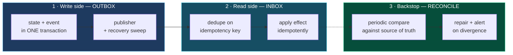

# Distributed consistency

## 7.1 Where multiple systems must agree

| # | Consistency surface | Correct model | Mechanism required |
|---|---|---|---|
| 1 | Database + broker (state change must produce an event) | Eventual, guaranteed-once-eventually | **Transactional outbox** |
| 2 | Broker + database (event must produce exactly one effect) | Eventual, at-least-once delivery + idempotent apply | **Inbox / idempotency key** |
| 3 | Payment provider + subscription + entitlement | Eventual, provider is authoritative | **Idempotent webhook + periodic reconciliation** |
| 4 | Usage events + ledger + balance | Eventual, ledger is authoritative | **Append-only journal + idempotency key per event** |
| 5 | Database + external resource provisioning (costed, irreversible) | Eventual with compensation | **Saga with compensating actions** |
| 6 | Cache + database | Eventual, database authoritative | **TTL + explicit invalidation on write** |
| 7 | Ephemeral coordination state + database | Cache is authoritative *while live*; database is the durable record | **Bounded lifetime + reconciliation sweep** |
| 8 | Search / analytics projections + primary | Eventual | **Event-driven projection, rebuildable from source** |

## 7.2 The mechanisms

| Mechanism | **Required** | Notes |
|---|---|---|
| Transactional outbox | **Required** | Two generations; the newer one is high quality (`08-transactional-outbox.md`) |
| Idempotency gate on consume | **Required** | Unique idempotency key on the newer outbox path |
| Saga with compensation | **Required** | Task chains with `execute` / `rollback` / `canContinue` |
| Retry with exponential backoff and jitter | **Required** | In the newer outbox dispatcher |
| Distributed lease / claim | **Required** | Atomic conditional update with lease expiry |
| Third-party circuit flag | **Required** | A cache-held flag disables an integration platform-wide |
| Rate limiting per tenant per integration | **Required** | Redis-backed, and correctly excluded from attempt counting |
| Dead-letter handling | **Required** | Handled by an out-of-band operational tool rather than broker topology |
| Periodic reconciliation against providers | **Required** | The backstop for every event that is silently lost |
| `Idempotency-Key` on the public API | **Required** | At-least-once is the only delivery guarantee a client can offer |

## 7.3 Reference flow: the three-mechanism spine

Almost all distributed consistency in a SaaS reduces to three mechanisms used together:



**Outbox** guarantees the event is never lost. **Inbox** guarantees the effect is never doubled. **Reconciliation** catches everything both miss — and something always escapes both, which is why the third mechanism is not optional for money.

## 7.4 Reference flow: reconciliation, the missing backstop

Reconciliation is the mechanism most often omitted and the one that matters most for financial correctness. Outbox and inbox handle *known* failures. Reconciliation handles the unknown ones: a webhook that was never delivered, a provider-side state change made by a human in a dashboard, a bug that ran for a week.

```
Nightly, per tenant with activity:
  1. Pull authoritative state from the provider (subscriptions, invoices, payments)
  2. Compare against local state
  3. For each divergence:
       - classify   (missing locally / missing remotely / value mismatch)
       - repair     (only where the repair is provably safe and idempotent)
       - record     (an audit row for every divergence, repaired or not)
       - alert      (any divergence in money is a paging-level signal, not a log line)
  4. Emit a metric: divergences_found, by class
     A reconciliation job that never reports zero is broken;
     one that always reports zero is probably not running.
```

**Principle.** *For any state mirrored from an external authority — especially money — a periodic reconciliation job is a required component, not a nice-to-have. Idempotency prevents damage from the failures you predicted; reconciliation is how you find out about the ones you did not.*

## 7.5 Choosing a consistency model

```
Would a user notice, and be harmed, if these two systems disagreed for 5 seconds?
├─ NO  → Eventual consistency. Outbox + idempotent consumer. Done.
└─ YES → Is all the data in ONE database?
         ├─ YES → One transaction. Do not distribute this.
         └─ NO  → Can the operation be reordered so the authoritative
                  system commits first and everything else follows async?
                  ├─ YES → Do that. (e.g. charge, THEN provision.)
                  └─ NO  → Saga with compensation, and accept that
                           compensation is best-effort. Add reconciliation.
                           Then ask again whether the boundary is in the
                           right place — a saga is often the price of a
                           boundary drawn incorrectly.
```

**Principle.** *Strong consistency across services is not available. What is available is: one transaction inside one database, or eventual consistency with idempotency and reconciliation. Choosing a service boundary is choosing which invariants you give up — make that choice explicitly, and write it down.*
