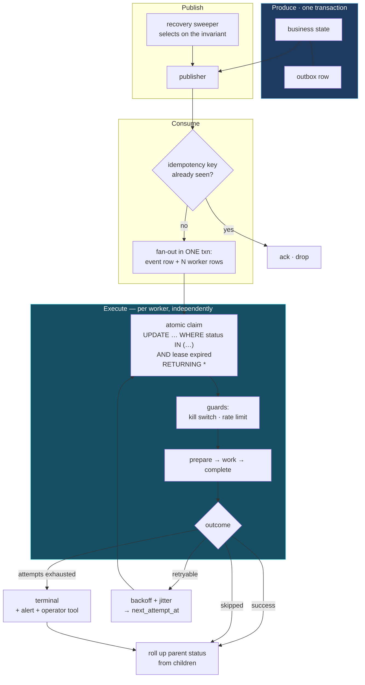

# Transactional outbox

The mechanism that makes "a state change and its consequence both happen, or
neither does" true across a process boundary. Cheaper than the first lost event.

---

## 1 The guarantees to implement

| Guarantee | Implementation | Why it matters |
|---|---|---|
| **Atomicity of state + event** | Aggregate rows and the outbox row inserted in one transaction | Without it, a crash between the two loses the event or emits one for a change that rolled back |
| **Atomic fan-out** | A consumed event and all its child worker rows committed in one transaction | A partial fan-out silently drops one consumer |
| **Idempotency on consume** | Unique idempotency key checked before fan-out; a unique constraint as the concurrent-delivery backstop | Belt and braces: the check handles the common case, the constraint handles the race |
| **Exactly-once execution per worker** | Atomic conditional `UPDATE` claims a row with a lease; zero rows updated means another runner owns it | No distributed lock needed |
| **Retry with backoff** | Exponential backoff with jitter, written to `next_attempt_at` | Jitter prevents replicas retrying in unison |
| **Attempt cap snapshotting** | `max_attempts` copied onto the worker row at creation | In-flight work stays stable if configuration changes mid-flight |
| **Rate-limit accounting** | A rate-limited attempt does **not** consume an attempt | Subtle and important: being throttled is not failing |
| **Per-attempt audit trail** | Every attempt is its own row with status, reason, start and finish | "Why did this not deliver" becomes answerable |
| **Status roll-up** | Parent status derived from children: all succeeded → completed; mixed → partially failed; none → failed | Partial failure is a state, not an inference from logs |
| **Terminal no-op state** | A dedicated `skipped` status distinguishes "nothing to do" from "failed" | Prevents false alarms |
| **Third-party kill switch** | A flag disables an integration platform-wide | Disable a misbehaving provider without a deploy |
| **Registry-driven routing** | A table maps event type → one or more handlers, scoped by tenant with wildcards | Per-customer integrations without a deploy — see §4 |

This is the clearest example of the standard's central claim: **in an ecosystem
without a framework, platform capability has to be built deliberately — and when
it is built well, it is better than a framework default because it fits the
domain.**

---

## 2 Reference architecture



---

## 3 Why the *worker* is the retryable unit — the key design insight

Most outbox implementations make the *event* the retryable unit. When one event
fans out to several handlers and one handler fails, retrying the event re-runs
the handlers that already succeeded — so every handler must be idempotent
against a retry it did not cause.

Making the **worker row** the retryable unit removes that requirement:

- Each handler retries on its own schedule with its own attempt count.
- A failing handler never re-runs a sibling that has completed.
- A partial failure is visible as a state (`partially_failed`), not inferred
  from logs.
- Handlers can be added or removed per tenant without touching the event
  contract.

**Principle.** *When one event drives multiple side effects, make each side
effect independently retryable and independently observable. The unit of retry
should equal the unit of failure.*

**Applicability.** **ADVANCED**, and worth it as soon as a single event drives
more than two side effects.

---

## 4 The handler registry — power and the guardrail it needs

Routing event type → handlers through a **database table**, scoped by tenant
with wildcard support, means integrations can be enabled per customer without a
deploy. That is genuinely valuable for a multi-tenant product with per-customer
integrations.

The property to design for deliberately: **routing configuration becomes
production state.** A registry with no rows for an event type produces an event
that is durably recorded and never acted upon.

### Reference flow: registry guardrails

1. **Distinguish "no handler configured" from "handler failed."** They have
   different causes and different responses. Give the former its own terminal
   status — `no_handler_registered` — so it can be alerted on and audited
   distinctly.
2. **Distinguish broadcast events from targeted events.** For a broadcast event,
   zero handlers is normal. For a targeted event, zero handlers is a
   configuration error and should page someone. Encode which is which in the
   event-type definition, not in a code comment.
3. **Validate the registry in CI.** Every `worker_type` value in the registry
   must resolve to a handler that exists in code. A registry row referencing a
   removed handler is a silent hole; a CI check turns it into a failed build.
4. **Never let a misconfigured row disappear silently.** A row that resolves to
   no handler should produce an audit record and a metric, not just a log line.
5. **Version the registry with migrations**, not by hand-editing production.
   Routing is code that happens to live in a table.

---

## 5 Reference flow: acknowledge the broker at the durability boundary

The point at which a broker message may be acknowledged is **the moment the
fan-out transaction commits** — from then on the work is durable and the sweeper
guarantees progress. Anything after that point is optimisation.

```
✗  consume → fan-out (commit) → run all handlers inline → ack
     A slow handler delays the ack. If it exceeds the broker's
     visibility timeout, the message is redelivered while still
     being processed, and prefetch fills with messages that are
     already durably recorded.

✓  consume → fan-out (commit) → ACK  →  then attempt handlers inline
     Durability is established at the commit. The ack reflects it.
     Inline execution stays as a latency optimisation, and the
     sweeper remains the correctness guarantee.
```

**Principle.** **Acknowledge at the durability boundary, not at the completion
boundary.** Conflating "durable" with "done" couples broker flow control to
handler latency.

---

## 6 When to use an outbox — and when not to

**Use it when any of these hold:**

- A state change must produce an event, and losing the event corrupts business
  state.
- An event drives money, provisioning, or anything a customer can observe.
- A state change must produce an external side effect — email, webhook, provider
  call.
- You need an audit trail of what was dispatched, when, and how many times.
- Consumers are unreliable, rate-limited, or slow.

**It is unnecessary complexity when:**

- The event is purely a UI notification, and a missed one self-heals on the next
  poll or refresh. *(Fire-and-forget pub/sub is correct here — and is precisely
  what it is for.)*
- Producer and consumer are the same transaction in the same database. Just do
  the work.
- You are still finding product-market fit and the failure cost is a manual fix.
  Ship without it; add it when the first lost event costs real money.
- The operation is idempotent and cheap to re-drive from the source on demand —
  a rebuildable projection needs a rebuild command, not an outbox.

**The most important boundary rule:** *if a side effect must accompany a state
change, an outbox row and a background worker is the **default**
implementation — not the advanced one. "Commit then call" is the pattern to
avoid, and it is the pattern most code reaches for first.*
