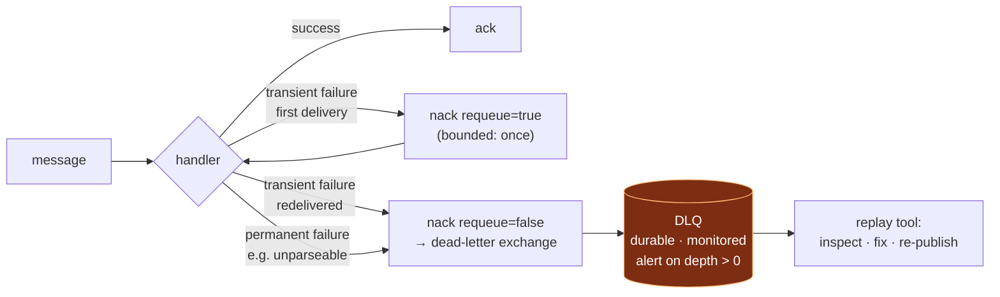
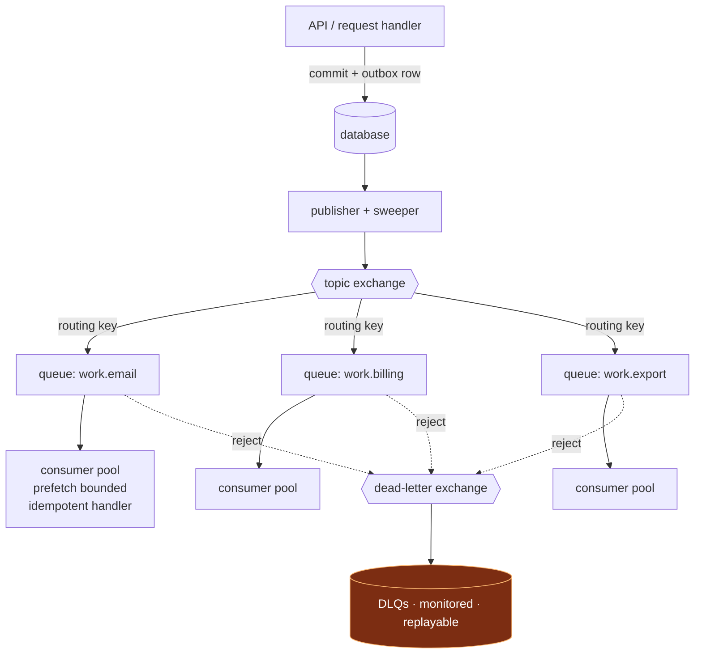

# Queues, async processing and background jobs

## Part 9 — Message queues and asynchronous processing

### 9.1 The reference implementation

| Property | Implementation |
|---|---|
| Broker | RabbitMQ via `amqp-connection-manager` (auto-reconnect, connection lifecycle events logged) |
| Topology | A direct exchange is declared; publishing uses `sendToQueue`, which routes via the default exchange |
| Producer wrapper | Singleton producer per queue; recursive publish retry with exponential delay |
| Consumer wrapper | Singleton consumer per queue; per-queue handler |
| Acknowledgement | Explicit `ack` on success; `nack` with `requeue = !redelivered` on failure — one requeue, then reject |
| Message durability | `sendToQueue` called without a persistence option |
| Prefetch | Not configured |
| Dead-letter exchange | Not configured on queues; a separate operational tool drains failures |
| Ordering | Not relied upon |
| Log transport | Application logs published to the broker and consumed into a document store |

### 9.2 Reference flow: queue and channel configuration

Broker defaults are chosen for compatibility, not for production. Every one of the following must be set explicitly, because the default is wrong for a production SaaS:

```ts
// ── Topology: declare it once, deliberately, with a dead-letter path ──
await channel.assertExchange('app.events',   'topic',  { durable: true });
await channel.assertExchange('app.dlx',      'topic',  { durable: true });

await channel.assertQueue('billing.usage', {
  durable: true,                                  // queue survives broker restart
  deadLetterExchange:    'app.dlx',               // rejected messages go somewhere
  deadLetterRoutingKey:  'billing.usage.failed',
  messageTtl:            24 * 60 * 60 * 1000,     // bound the blast radius of a backlog
  maxLength:             1_000_000,                // bounded queue: shed, don't die
  // quorum queues for replicated durability in a clustered deployment
  arguments: { 'x-queue-type': 'quorum' },
});
await channel.assertQueue('billing.usage.dlq', { durable: true });
await channel.bindQueue('billing.usage.dlq', 'app.dlx', 'billing.usage.failed');

// ── Publish: persistent, routed through the exchange, with confirms ──
await channel.publish('app.events', 'billing.usage', payload, {
  persistent:     true,        // ← deliveryMode 2; without this, a broker restart
                               //   loses the message even from a durable queue
  messageId:      idempotencyKey,
  correlationId:  ctx.correlationId,
  timestamp:      Date.now(),
  headers: { 'x-tenant-id': tenantId, 'x-schema-version': 2 },
});

// ── Consume: bounded in-flight work ──
await channel.prefetch(20);     // ← without this, prefetch is unlimited: one consumer
                                //   pulls the whole queue into memory
```

Four of these are the difference between a queue that works and a queue that fails quietly:

| Setting | Default | Consequence of the default |
|---|---|---|
| `persistent: true` on publish | **off** | A durable queue with non-persistent messages still loses everything on broker restart. Queue durability and *message* durability are separate settings. |
| `prefetch(n)` | **unlimited** | One consumer pulls the entire backlog into memory. No backpressure, unbounded heap, and redelivery storms when it dies. |
| `deadLetterExchange` | **none** | A rejected message with `requeue = false` is **discarded**. Poison-message protection becomes silent data loss. |
| `maxLength` / `messageTtl` | **none** | An unbounded queue converts a slow consumer into a broker memory exhaustion event that takes down every other queue with it. |

**Principle.** *Declare durability, prefetch, dead-lettering, and queue bounds explicitly for every queue. Broker defaults optimise for a demo, not a production service. A queue's configuration is part of its contract.*

### 9.3 Reference flow: publish through an exchange, not to a queue

Publishing directly to a queue name binds the producer to the consumer's topology. Adding a second consumer means changing the producer.

```
✗ producer → sendToQueue('billing.usage')            (producer knows the consumer)
✓ producer → publish('app.events', 'billing.usage')  (producer knows only the event)
                    ↓ topic exchange, routing key
              billing.usage   → billing service
              audit.all       → audit sink        ← added with zero producer changes
```

**Principle.** *Producers publish events to an exchange with a routing key. Consumers bind queues to what they care about. Adding a consumer must never require a producer change — that is the whole purpose of an exchange.*

### 9.4 Reference flow: poison-message handling

`nack(requeue = !redelivered)` — requeue once, reject on the second delivery — is a reasonable poison-message strategy, and it is only safe when a dead-letter exchange exists. Without one, the reject **discards the message**.



**Reference rules.**

1. *Every queue has a dead-letter queue.* No exceptions.
2. *DLQ depth greater than zero is an alert, not a dashboard.* A DLQ nobody watches is a delete.
3. *Distinguish transient from permanent failures.* A malformed payload will never succeed; requeueing it wastes capacity. A timeout may succeed on retry.
4. *Replay is a first-class, tested tool*, not a script written during an incident. It needs to inspect, filter, fix, and selectively re-publish.
5. *Cap redelivery.* Unbounded requeue is an infinite loop that consumes a consumer slot forever.

### 9.5 Reference flow: keep observability off the business broker

Routing application logs through the same broker that carries business messages creates a coupling that fails exactly when it matters:

- **The broker becomes a dependency of logging.** A broker incident blinds observability during the incident.
- **Error volume spikes during incidents** and competes with business traffic on the same infrastructure, amplifying the outage.
- **Every log call becomes a network publish on the request path**, coupling request latency to broker latency.

```
✗  service → await publish(log) → broker → sink        (logging on the hot path)

✓  service → stdout (structured JSON, synchronous, ~microseconds)
                ↓  collected out-of-process by the system
           CloudWatch Logs / Firehose / OpenSearch
                ↓
           retention · search · alerting
```

**Principle.** *Applications write logs to stdout as structured JSON and nothing else. Collection, shipping, retention, and indexing are platform concerns handled out-of-process. Never put an application's observability on the same infrastructure as its business messages, and never make logging an awaited network call.*

### 9.6 Standard SaaS queue architecture



#### What belongs asynchronous

| Work | Why |
|---|---|
| Email, push, SMS dispatch | Third-party latency and failure must not affect the response |
| Report generation, exports, bulk operations | Unbounded duration |
| Media processing and transcoding | CPU-bound; would starve an event loop |
| Third-party synchronisation (CRM, analytics) | Unreliable and rate-limited |
| Fan-out to many recipients | Duration scales with recipient count |
| Metering, usage aggregation, denormalisation | Not needed for the response |
| Anything retryable that the user is not waiting for | Definitional |

#### What must stay synchronous

| Work | Why |
|---|---|
| Authentication and authorization | The answer gates the request |
| Input validation | The caller must be told immediately |
| The write the user is waiting to be told succeeded | Eventual consistency the user can see is a bug report |
| Reads that render the current screen | — |
| Quota and entitlement checks that must *prevent* an action | An async check permits the action it was meant to block |

**The dividing line:** *if the user must be told the outcome before they act again, it is synchronous. Everything else is asynchronous — and everything asynchronous needs an idempotency key, a retry policy, a DLQ, and a metric.*

#### Consumer design checklist

```
□ Idempotent: keyed on a business identifier, safe to run twice
□ Bounded prefetch, matched to handler concurrency and memory
□ Explicit ack only after the effect is durable
□ Transient vs permanent failures distinguished
□ Retries bounded, with exponential backoff and jitter
□ Dead-letters after the cap, with the failure reason attached
□ Correlation ID propagated from the message headers into logs
□ Timeout on every external call the handler makes
□ Handler duration and failure rate emitted as metrics
□ Graceful shutdown: stop consuming, drain in-flight, then exit
□ Poison-message safe: a malformed payload dead-letters, it does not crash-loop
```

---

## Part 21 — Background jobs

### 21.1 The reference implementation

| Mechanism | Where | Trigger | Assessment |
|---|---|---|---|
| **Managed scheduler → HTTP callback** | Identity, billing, messaging | AWS EventBridge Scheduler | **Best pattern present** |
| Queue consumers | 8 services | Broker delivery | Correct pattern; see this document for configuration |
| **In-process infinite polling loop** | Outbox recovery | Started at process boot | See 21.3 |
| In-process cron (`node-cron`) | Messaging, provider integration | Process-local timer | See 21.4 |
| In-process cron (`gocron`) | Ledger | Process-local timer | See 21.4 |
| Out-of-band operational scripts | Automation repo | Manual invocation | Adequate for genuine one-offs |

### 21.2 Why externalised scheduling is the right default

Delegating timers to a managed scheduler that calls back over HTTP has four properties that in-process cron cannot match:

1. **Schedules survive deploys and restarts.** An in-process timer resets on every deploy; a schedule that fires monthly may never fire in a service that deploys weekly.
2. **The schedule fires once**, regardless of replica count.
3. **Schedules are per-entity, not per-process.** "Run this for this tenant at this time" is a first-class concept, so business timers become data.
4. **The schedule is externally visible and auditable** — you can list what is scheduled without reading the code.

**Principle.** *Business timers belong in a durable external scheduler, not in a process. In-process cron is acceptable only for process-local maintenance — cache warming, local metric flushing — where a missed run is harmless and duplicate runs across replicas are harmless.*

**Applicability.** **DEFAULT** for any scheduled business action. On AWS this is EventBridge Scheduler; the pattern is available on every platform.

### 21.3 Reference flow: background pollers belong in their own deployable

A recovery sweeper implemented as an infinite loop inside the API server process has three coupling problems:

```
✗ server.start():
      … register routes, begin listening …
      await recoverySweeper.runForever()      // never returns

  · Shares the API process's event loop → sweep work competes with request latency
  · Shares the API process's connection pool → sweeps consume request capacity
  · Runs in EVERY replica → N replicas sweep the same rows simultaneously
  · Cannot be scaled, paused, or deployed independently of the API
  · Its own failure is invisible: the process stays healthy while sweeping stopped
```

```
✓ Two deployables from one codebase, selected by an entrypoint flag:

   api-service     → serves requests. No background loops.
   worker-service  → runs sweepers, consumers, and scheduled handlers.
                     Own replica count, own pool size, own scaling policy,
                     own health endpoint reporting sweep liveness.
```

**And if multiple sweeper replicas are desirable** (they usually are, for availability), the claim must be atomic so they cannot process the same row:

```sql
-- Reference: many sweepers, no duplicate work, no distributed lock service
SELECT * FROM outbox
 WHERE state <> 'published' AND attempts < :max
   AND next_attempt_at <= now()
 ORDER BY next_attempt_at
 FOR UPDATE SKIP LOCKED          -- ← each sweeper gets a disjoint set
 LIMIT :batch;
```

`FOR UPDATE SKIP LOCKED` is the single most useful PostgreSQL feature for job processing: it turns a table into a work queue with correct concurrency semantics and no additional infrastructure. The alternative — the atomic conditional claim with a lease, as used in the outbox worker — is equally valid and additionally survives a process death without holding a transaction open.

**Principle.** *A background processor is a separate deployable with its own scaling, its own connection budget, and its own health signal. Concurrent processors coordinate through an atomic claim — `SKIP LOCKED` or a lease-based conditional update — never through "there is only one replica."*

### 21.4 Reference flow: in-process cron across replicas

An in-process cron in a service running N replicas fires N times. For a report generation job, that means N reports; for a charge, N charges.

```ts
✗ cron.schedule('0 2 * * *', () => generateDailyReports());
    // fires once per replica, every night

✓ // Option A (preferred): move it to the external scheduler entirely.

✓ // Option B: if it must stay in-process, take a distributed lease first.
  cron.schedule('0 2 * * *', async () => {
    // SET NX with a TTL longer than the job's maximum duration
    const won = await redis.set('cron:daily-reports', instanceId,
                                { NX: true, EX: 3_600 });
    if (!won) return;                       // another replica owns this run
    try {
      await generateDailyReports();
    } finally {
      // release only if we still hold it — never delete another holder's lease
      await releaseIfOwner('cron:daily-reports', instanceId);
    }
  });
```

The `releaseIfOwner` detail matters: a plain `DEL` can delete a lease that has since expired and been acquired by another replica, allowing two concurrent runs. Compare-and-delete via a small Lua script, or simply let the TTL expire.

**Principle.** *Any scheduled work running inside a replicated service must acquire a distributed lease, or move to an external scheduler. "We only run one replica" is a configuration, not a guarantee — and it forecloses horizontal scaling.*

### 21.5 Reference flow: idempotent job design

```
Every job answers these before it is written:

1. What is its idempotency key?
     A natural business key derived from the work itself — never generated
     at execution time, because a retry must produce the same key.

2. What happens if it runs twice concurrently?
     Either it is naturally idempotent, or it claims its work atomically.

3. What happens if it dies halfway?
     Which writes have landed? Is that state valid? Will a retry complete it,
     or does it need explicit cleanup?

4. How is partial progress recorded?
     A long job that processes 10,000 items must record its cursor, so a
     retry resumes rather than restarting.

5. What is the maximum runtime, and what happens at that limit?
     An unbounded job blocks its queue forever.

6. How is failure surfaced?
     A metric and an alert — never only a log line.

7. Is it safe to run out of order relative to other jobs?
     If not, what enforces the ordering?
```

**The batch-with-cursor pattern**, for any job over a large set:

```ts
// Resumable, bounded, observable
async function processBatch(jobId: string) {
  const job = await jobs.claim(jobId);            // atomic claim with a lease
  if (!job) return;                                // another worker owns it

  let cursor = job.cursor;                         // resume from where we stopped
  const deadline = Date.now() + MAX_RUNTIME_MS;

  while (Date.now() < deadline) {
    const batch = await source.fetchAfter(cursor, BATCH_SIZE);
    if (batch.length === 0) return jobs.complete(jobId);

    for (const item of batch) {
      await processItem(item);                     // itself idempotent
    }
    cursor = batch.at(-1)!.id;
    await jobs.saveProgress(jobId, cursor);        // durable progress + lease renewal
    metrics.gauge('job.progress', batch.length, { jobId });
  }
  await jobs.yield(jobId, cursor);                 // hand back for the next tick
}
```

### 21.6 Background-processing principles

1. **Business timers live in an external durable scheduler.**
2. **Background processors are separate deployables** with their own scaling and health.
3. **Concurrent processors claim work atomically** — `SKIP LOCKED` or a lease.
4. **Every job is idempotent, with a natural idempotency key.**
5. **Long jobs record durable progress and resume.**
6. **Every job has a maximum runtime and a defined behaviour at that limit.**
7. **Retries are bounded, with backoff and jitter; exhaustion is terminal, alertable, and replayable.**
8. **Job outcomes are metrics**: started, completed, failed, duration, queue depth, oldest-pending age.
9. **Oldest-pending age is the key health signal.** Queue depth alone hides a stalled consumer; age does not.
10. **Graceful shutdown**: stop claiming, finish or yield in-flight work, then exit.
