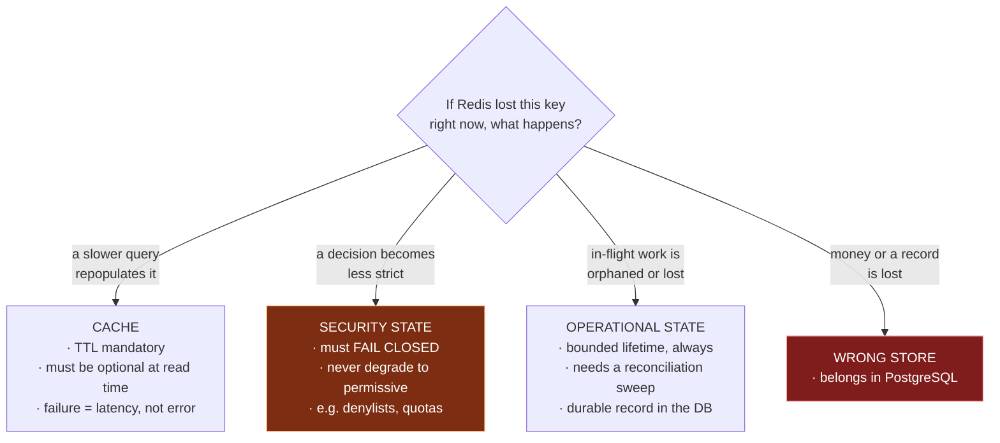

# Cache and distributed state

## 10.1 Usage, classified

| # | Usage class | What it holds | Is it the source of truth? | TTL | Assessment |
|---|---|---|---|---|---|
| 1 | **Cache** | Resolved tenant, plan, and reference data | No | Yes | Correct use |
| 2 | **Token denylist** | Revoked JWT identifiers | **Yes** — for the revocation decision | Yes, to token expiry | Correct and necessary |
| 3 | **Pub/sub fan-out** | Live-update delivery across replicas | No | N/A | Correct use |
| 4 | **Pub/sub as a work trigger** | Cross-service side-effect triggers | N/A | N/A | See 10.4 |
| 5 | **Rate-limit counters** | Per-tenant, per-integration windows | Yes, for the window | Yes | Correct use |
| 6 | **Distributed flags** | Platform-wide integration kill switches, maintenance locks | **Required** | Manual | Correct — see 10.5 |
| 7 | **Ephemeral coordination state** | Short-lived state for in-progress multi-party workflows | **Yes while the workflow is live** | See 10.3 | Correct pattern, requires bounded lifetime |
| 8 | **Atomic counters** | Participant/step counters within a live workflow | Yes | Bounded by workflow | Correct — atomic increments used |
| 9 | **Registry lists** | Sets of currently-active entities | Yes | See 10.3 | Requires set semantics — see 10.3 |
| 10 | **Deduplication** | Suppressing repeated notifications | Yes | Yes | Correct use |

Two logical Redis databases separate concerns on one instance. **Logical database separation is namespacing, not isolation** — one instance means one memory limit, one eviction policy, one failure domain, and one blast radius.

## 10.2 The classification that matters: cache vs. state



**Principle.** *For every Redis key, write down which quadrant it is in. A key whose loss produces incorrect behaviour is not a cache, and must be designed accordingly: bounded lifetime, a reconciliation path, and an explicit failure mode.*

## 10.3 Reference flow: bounded lifetime and correct collection types

Two design rules govern every non-cache key. Both address the same failure: **a distributed system loses messages, so any state that is cleaned up by a "finished" signal will sometimes never be cleaned up.**

**Rule 1 — every key gets a TTL at creation, generous but finite.**

```ts
// The TTL is not the expected lifetime; it is the maximum tolerable orphan window.
// Set it when the key is CREATED, not when the work is expected to end —
// the cleanup path is exactly what fails when a completion signal is lost.
await redis.hSet(key, fields);
await redis.expire(key, MAX_WORKFLOW_LIFETIME_SECONDS);   // e.g. 6h for a long workflow

// Refresh on activity if the workflow can legitimately outlive the window:
await redis.expire(key, MAX_WORKFLOW_LIFETIME_SECONDS);   // sliding window
```

Without this, a lost completion signal leaks a key permanently, and memory grows monotonically with total historical volume rather than with concurrent volume.

**Rule 2 — a registry of active entities is a SET, never a LIST.**

```ts
✗ await redis.lPush('active:tenants', tenantId);
    // A list appends unconditionally. One entry per event, forever, with
    // duplicates. Memory grows with cumulative volume; reading it requires
    // client-side de-duplication; and removal is O(n).

✓ await redis.sAdd('active:tenants', tenantId);        // idempotent by construction
  await redis.sRem('active:tenants', tenantId);        // O(1) removal
  const active = await redis.sMembers('active:tenants');

  // Better still, when entries must expire on their own:
  await redis.zAdd('active:tenants', { score: Date.now(), value: tenantId });
  await redis.zRemRangeByScore('active:tenants', 0, Date.now() - STALE_MS);
    // A sorted set by timestamp gives a self-trimming registry: entries that
    // stop being refreshed age out without needing an explicit removal signal.
```

**Principle.** *Choose the Redis collection type from the semantics you need, not from the write pattern that is convenient. "The set of things currently active" is a set (or a sorted set keyed by heartbeat), never a list. A list used as a set is an unbounded memory leak with duplicates.*

## 10.4 Reference flow: pub/sub is for notification, never for work

Redis pub/sub is **at-most-once with no persistence and no acknowledgement**. If no subscriber is connected at the instant of publication, the message is gone — silently, with no error at the publisher.

That makes it correct for one thing and incorrect for another:

| Use | Correct? | Why |
|---|---|---|
| Fan-out of live UI updates across API replicas | **Required** | The next query or reconnect resynchronises the UI. A lost update self-heals. |
| Presence and ephemeral status broadcast | **Required** | Inherently transient. |
| Cache invalidation broadcast | **Acceptable** with a TTL as backstop | The TTL bounds the staleness window. |
| **Triggering an email, a charge, a provisioning action, or any business side effect** | **No** | A lost message means the side effect never happens, no error is raised, and nothing detects it. |

```
✗  service A → redis.publish('send-welcome-email', payload)
                 └─ subscriber restarting? deploying? not yet connected?
                    → the customer never receives the email; nothing knows

✓  service A → INSERT outbox (type='email.welcome', payload) in the same txn
                 └─ durable, retried, audited, alertable
```

**Principle.** *Redis pub/sub delivers notifications, never work. If a missed message would require manual repair, it needs a durable queue with acknowledgement — not a broadcast.*

**Litmus test:** *would you be comfortable if this message were dropped during a deploy?* Deploys restart subscribers routinely. If the answer is no, it is work, not a notification.

## 10.5 Reference flow: security state must fail closed

A denylist, a quota, or a kill switch held in Redis creates a decision point when Redis is unavailable. That decision must be made deliberately and written down:

```ts
// Token revocation denylist — MUST fail closed
async function isRevoked(jti: string): Promise<boolean> {
  try {
    return (await redis.get(`revoked:${jti}`)) !== null;
  } catch (err) {
    logger.error('revocation check unavailable — denying', { err, jti });
    throw new UnauthenticatedError();     // ← deny. Never "assume not revoked".
  }
}

// Integration kill switch — fail OPEN is defensible here, and must be explicit
async function isIntegrationDisabled(name: string): Promise<boolean> {
  try {
    return (await redis.get(`kill:${name}`)) === 'true';
  } catch (err) {
    logger.error('kill-switch check unavailable — proceeding', { err, name });
    metrics.increment('killswitch.check_failed', { integration: name });
    return false;      // ← deliberate: a cache outage should not halt all integrations.
  }                    //   Documented, metered, and alertable.
}
```

**Principle.** *For every cache-dependent security or safety decision, state the failure mode in the code and justify it in a comment. Authentication and authorization fail closed. Availability-protecting switches may fail open — but only deliberately, with a metric and an alert, never by accident through a swallowed exception.*

## 10.6 Reference flow: never store credentials in a cache

Secrets and third-party credentials belong in a secrets manager, fetched with a short-lived in-process cache — not in a shared cache tier.

```
✗  cache key holds { tenantId, providerAccountId, providerAuthToken, … }
     · a shared cache is a different security boundary than a database
     · encryption at rest must be explicitly enabled and often is not
     · every service with cache access gains credential access
     · keys without TTL retain credentials indefinitely
     · cache dumps, replication, and backups now contain secrets

✓  cache key holds { tenantId, providerAccountId, credentialRef }
   credential fetched on use from AWS Secrets Manager / SSM Parameter Store
   in-process cache of the resolved secret, TTL ≤ 5 minutes
   IAM policy grants each service only the secret paths it needs
```

This also makes rotation possible: a reference can be re-resolved, whereas a copied secret must be hunted down across every cache entry that holds it.

**Principle.** *A cache holds references to secrets, never secrets. Rotation is impossible for a value you have scattered.*

## 10.7 General Redis principles

1. **Classify every key** as cache, security state, operational state, or misplaced-durable-data. Write the classification down.
2. **Every key gets a TTL at creation.** The only exceptions are deliberate, documented, and bounded in size.
3. **Choose the collection type from the semantics**: sets for membership, sorted sets for time-ordered or self-expiring registries, hashes for field-addressable records, lists only for genuine queues.
4. **Use atomic operations** (`INCRBY`, `HINCRBY`, `SETNX`, `ZADD`, Lua) for anything concurrent. An atomic increment followed by a separate read-and-compare is still a race — the atomicity must cover the *decision*, not just the write.
5. **Never store credentials or PII.**
6. **Define the failure mode for every read**: fail closed for security, fail open only deliberately and with a metric.
7. **Logical databases are namespacing, not isolation.** Separate instances for separate blast radii; separate instances when memory pressure profiles differ.
8. **Set `maxmemory` and an eviction policy explicitly.** `noeviction` turns memory pressure into write errors; `allkeys-lru` will evict your denylist. If both cache and state share an instance, the eviction policy is wrong for one of them — which is the strongest argument for separating them.
9. **Alert on memory usage, eviction rate, and key count**, not just availability.
10. **Any Redis-held operational state needs a reconciliation sweep** that finds and cleans orphans.
