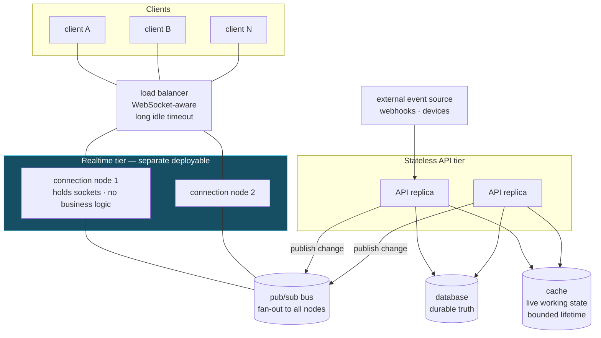
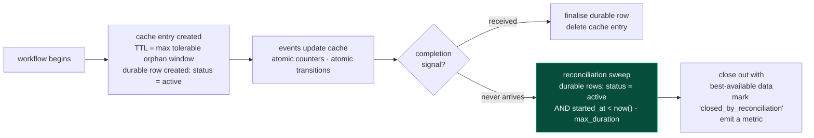

# Real-time architecture

*Described at the level of the engineering pattern. Domain-specific mechanisms are deliberately abstracted so the patterns transfer to any real-time system — collaborative editing, live dashboards, presence, streaming, multiplayer, or IoT telemetry.*

## 11.1 The general shape



**Five structural decisions**, each independently reusable:

1. **Connection handling is a separate deployable from business logic.** Long-lived connections and frequently-deployed business code have incompatible lifecycles: every API deploy would otherwise disconnect every user.*(a dedicated real-time service)*
2. **Fan-out goes through a pub/sub bus, not through connection nodes talking to each other.** Any node can serve any client; a change published once reaches every relevant socket. This is what makes the realtime tier horizontally scalable.
3. **Live working state lives in a shared cache, keyed by workflow, with a bounded lifetime.** Fast, shared across replicas, and — critically — surviving the death of any single node.
4. **The durable record lives in the database.** The cache holds what is needed *while the workflow is live*; the database holds what must be true afterwards.
5. **External event sources land on the stateless tier**, are validated and persisted there, and only then publish. Never let an external source write directly to connection state.

## 11.2 Reference flow: reconciling live state with durable state

The hardest problem in real-time systems is not fan-out; it is **what happens when the completion signal never arrives**. Networks drop, external providers miss callbacks, and processes die mid-workflow. Any design where cleanup depends on a "finished" message will accumulate orphans.



**Three required properties:**

1. **The durable row is created at the start, not at the end.** A workflow that only becomes visible in the database on completion is invisible precisely when it goes wrong. Create the row on the first event, with `status = active`.
2. **A reconciliation sweep closes out abandoned workflows.** Query the durable store for anything active beyond its maximum plausible duration. Close it with whatever data exists, mark *how* it was closed, and emit a metric.
3. **`closed_by_reconciliation` is a monitored metric.** A non-zero rate is a signal that upstream event delivery is degrading — often the earliest available warning.

**Principle.** *In any long-running distributed workflow, assume the completion signal will sometimes never arrive. Design the terminal state to be reachable by a timeout-driven sweep, and measure how often that path is taken.*

## 11.3 Reference flow: atomicity must cover the decision, not just the write

Atomic increments are necessary but not sufficient. This shape is still a race:

```ts
✗ await redis.hIncrBy(key, 'departed', 1);              // atomic ✓
  const total    = await redis.hGet(key, 'total');      // separate read
  const departed = await redis.hGet(key, 'departed');   // separate read
  if (Number(total) - Number(departed) === 0) {         // decision on stale values
      await teardown();                                  // may run twice, or never
  }
```

Two concurrent departures can both observe a non-zero remainder, or both observe zero. Teardown then runs zero times or twice.

```ts
✓ // The increment RETURNS the new value: decide on what the operation itself produced
  const [departed, total] = await redis
.multi()
.hIncrBy(key, 'departed', 1)
.hGet(key, 'total')
.exec();

  if (Number(total) - Number(departed) === 0) {
      // Idempotency latch: exactly one caller wins the teardown
      const won = await redis.set(`${key}:teardown`, '1', { NX: true, EX: 300 });
      if (won) await teardown();
  }
```

Or, for anything more involved, move the read-decide-write into a **single Lua script**, which Redis executes atomically:

```lua
-- decrement, and return 1 only to the caller that observes the transition to zero
local remaining = redis.call('HINCRBY', KEYS[1], 'departed', 1)
local total     = tonumber(redis.call('HGET', KEYS[1], 'total'))
if total - remaining == 0 and redis.call('SETNX', KEYS[1] .. ':teardown', '1') == 1 then
  redis.call('EXPIRE', KEYS[1] .. ':teardown', 300)
  return 1
end
return 0
```

**Principle.** *Atomicity must span the whole decision, not merely the mutation. Use the value returned by the atomic operation, wrap multi-step decisions in a Lua script, and guard any terminal action with an idempotency latch so it executes exactly once.*

## 11.4 Reference flow: connection lifecycle

| Concern | Requirement |
|---|---|
| **Authentication** | Authenticate on connect *and* re-verify on token expiry. A connection that outlives its token is an authorization hole; long-lived sockets make this a real risk. |
| **Authorization on subscribe** | Every subscription is a tenant-scoped read. Authorize the *subscription*, not just the connection — a connected user must not be able to subscribe to another tenant's topic. |
| **Backpressure** | A slow client must not grow an unbounded server-side buffer. Bound the per-connection queue and disconnect a client that cannot keep up. |
| **Heartbeat** | Ping/pong with a timeout. Without it, half-open connections accumulate and consume file descriptors. |
| **Reconnect and resume** | Clients reconnect with backoff and jitter (thundering-herd protection) and re-fetch current state on reconnect. Do not attempt to replay a missed message stream unless you have built durable per-client cursors. |
| **Graceful shutdown** | Stop accepting new connections, notify clients to reconnect elsewhere, drain, then exit. |
| **Load balancer configuration** | Idle timeout must exceed the heartbeat interval, or the balancer will sever healthy connections. |
| **Fan-out scope** | Publish to the narrowest possible topic — tenant-scoped, resource-scoped. A broad topic makes every node filter every message. |

## 11.5 Reusable real-time principles

1. **Separate connection state from business logic** into different deployables.
2. **Fan out through a bus**; never node-to-node.
3. **Every non-durable live state key has a bounded lifetime.**
4. **Every long-running workflow has a timeout-driven terminal path** and a metric counting how often it is used.
5. **Atomicity covers the decision.** Guard terminal actions with an idempotency latch.
6. **Authorize subscriptions, not just connections**, and re-verify credentials on long-lived sockets.
7. **Bound per-connection buffers**; disconnect slow consumers rather than accumulating memory.
8. **Real-time is an optimisation over a correct polling design**, not a replacement for one. The client must be able to recover full correct state by re-querying — that property is what makes at-most-once fan-out acceptable.
9. **Never make the real-time path the only path** by which important state reaches the user.
