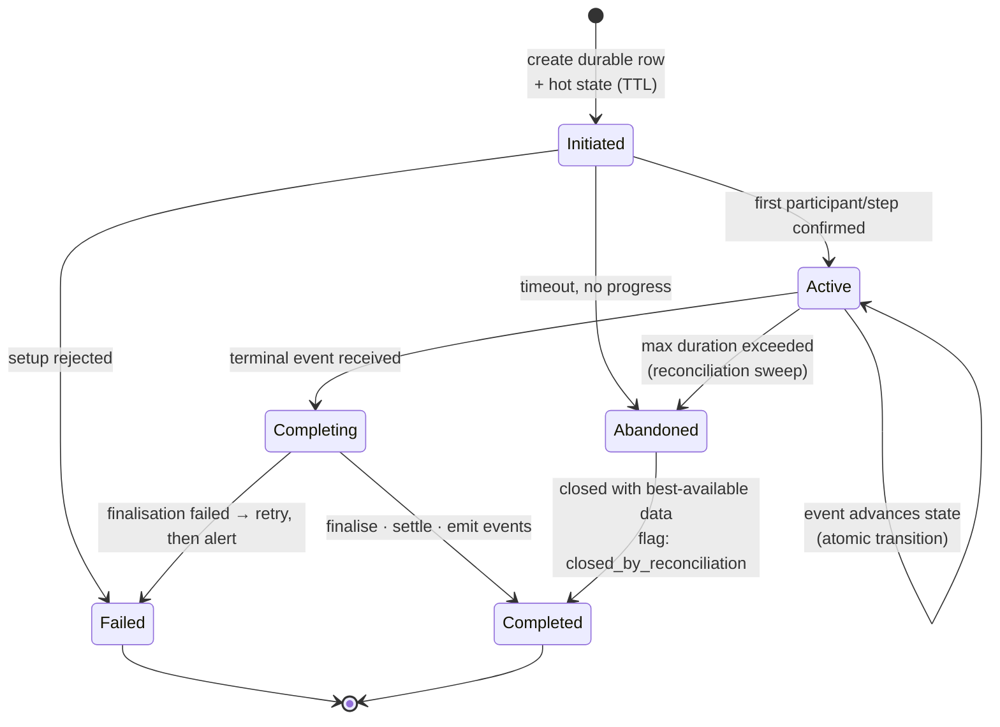

# Workflows and state machines

## Part 12 — Long-running workflow architecture

*The system's most domain-specific subsystem coordinates multi-party, externally-driven, long-running interactive sessions. The mechanism is proprietary; the **engineering problems** it solves are entirely general — order fulfilment, multi-step onboarding, document approval, provisioning pipelines, and CI orchestration all share them.*

### 12.1 The generalised problem

A **long-running, externally-driven workflow** has five properties that ordinary request/response work does not:

1. **It outlives a single request.** Its duration is minutes to hours; no HTTP request spans it.
2. **It is advanced by external events you do not control.** Progress arrives as inbound callbacks whose timing, ordering, and delivery are not guaranteed.
3. **It has concurrent participants.** Several actors mutate the same workflow simultaneously.
4. **It has irreversible, metered side effects.** Steps cost money and cannot be undone by a database rollback.
5. **Its completion signal is unreliable.** The terminal event is exactly the one most likely to be lost.

### 12.2 The seven reusable patterns

| # | Pattern | Problem solved | Applicability |
|---|---|---|---|
| 1 | **Explicit state machine with an enumerated transition table** | Prevents invalid transitions; makes "what can happen next" reviewable | **Universal** for any entity with a lifecycle |
| 2 | **Event-driven transitions via a filter/handler pipeline** | Each inbound event type maps to an ordered chain of small, independently testable handlers | **Universal** |
| 3 | **Hot state in a fast shared store; durable record in the database** | Sub-millisecond coordination without losing the audit trail | **Domain-dependent** — needed when coordination latency matters |
| 4 | **Timeout-driven terminal state** | Guarantees the workflow ends even if the completion event never arrives | **Universal** for long-running work |
| 5 | **Atomic counters for participant/step tracking** | Concurrent progress without lost updates | **Universal** |
| 6 | **A provider adapter layer** confining the external contract | Vendor churn stays in one module | **Universal** |
| 7 | **Compensating actions for irreversible steps** | Cleans up costed resources when the workflow fails midway | **Universal** where steps cost money |

### 12.3 Reference flow: the workflow engine shape



**The design rules that make this work in production:**

1. **The transition table is data, not scattered conditionals.** One structure declares, for each (current state, event) pair, the next state — or that the pair is invalid. Invalid transitions are rejected, logged, and metered, never silently ignored. This is the difference between a state machine and a pile of `if` statements.
2. **Every transition is a conditional write** whose predicate includes the expected current state (`06-transactions-and-integrity.md` §4). Concurrent events cannot corrupt the workflow.
3. **Out-of-order events are expected.** External sources reorder. A transition for a state already passed is a no-op, not an error; a transition for a future state is either buffered or rejected explicitly. Decide which, per event type, and write it down.
4. **Duplicate events are expected.** Every inbound event carries a provider identifier; store it, and make replays no-ops.
5. **Every irreversible step records what it created** *before* creating it, so compensation knows what to undo even if the process dies immediately after.
6. **Money settles at the terminal transition**, from the durable record, in one transaction — never incrementally from the hot state.

### 12.4 Reference flow: the handler pipeline

Mapping event type → an ordered list of small handlers, each with a defined contract, is a genuinely strong pattern and it appears in a system of this class in several places:

```ts
// The routing table is declarative and reviewable in one place
const PIPELINE: Record<EventType, Handler[]> = {
  'workflow.started':   [ValidateTenant, ResolveConfig, CreateDurableRow, EmitStarted],
  'participant.joined': [ValidateTenant, LoadWorkflow, IncrementParticipants, Broadcast],
  'workflow.ended':     [ValidateTenant, LoadWorkflow, Finalise, Settle, Broadcast, Cleanup],
};

// Each handler is small, independently testable, and declares its own control flow
interface Handler<C, R> {
  execute(id: string, ctx: C): Promise<R>;
  rollback(id: string, ctx: C): Promise<R>;   // compensation, if this step is reversible
  canContinue(result: R): boolean;            // does the chain proceed?
}
```

**Why this is worth copying:** adding a step to a workflow is adding one class and one array entry. The full behaviour of an event type is readable in one line. Each step is unit-testable in isolation. Compensation is a first-class part of the step contract rather than an afterthought.

**The guardrails to add:**

- **A registration API that cannot silently discard steps.** A method named for a single registration that *replaces* the collection will drop earlier steps when called twice. Use `add` (append) and `set` (replace) as distinct, unambiguously named operations.
- **Compensation runs in strict reverse order over exactly the steps that executed.** This is the single most important correctness property of a saga and the easiest to get subtly wrong:

```ts
✓ public async compensate(id: string, ctx: C): Promise<void> {
    // iterate a REVERSED COPY of the EXECUTED steps — never the full registered list,
    // and never mutate the registered list (a reversing sort in place corrupts
    // the manager for every subsequent execution)
    for (const step of [...this.executed].reverse()) {
      try {
        await step.rollback(id, ctx);
      } catch (err) {
        // A failed compensation is an operational event, not a silent one:
        // record it, alert, and continue compensating the remaining steps.
        logger.error('compensation failed', { step: step.constructor.name, id, err });
        metrics.increment('saga.compensation_failed', { step: step.constructor.name });
      }
    }
  }
```

Three properties in that snippet, each load-bearing: **iterate a copy** (so the registered order is never mutated), **reverse** (undo the newest effect first), and **iterate only what executed** (never compensate a step that never ran). Continuing after a failed compensation is deliberate — stopping would leave earlier steps uncompensated, which is strictly worse.

- **Typed results, not `any`.** A pipeline whose control flow reads an untyped property loses the compiler's help exactly where control flow is most subtle.

### 12.5 What is domain-specific and must not be generalised

| Decision | Why it exists here | Do not copy unless |
|---|---|---|
| Sub-millisecond coordination state in a cache | Interactive sessions with human-perceptible latency budgets | Your workflow has a hard sub-second coordination requirement |
| Hot-path validation collapsed into one database round trip | Very high inbound event rate on a latency-critical path | You have measured the round trips and they matter |
| Per-tenant credentials for an external provider | The provider's multi-tenant model requires it | Your provider imposes the same structure |
| Second-granularity metering | Usage-based billing on continuous consumption | You bill by continuous usage |

**Principle.** *Copy the seven patterns in 12.2. Do not copy the latency-driven mechanisms unless you have measured the same constraint. Optimisations without the constraint that motivated them are pure complexity.*

---

## Part 13 — State machines

### 13.1 Implementation shapes

| Entity | Lifecycle states | Explicit machine? | Assessment |
|---|---|---|---|
| Outbox event (v2) | pending → dispatched → completed / partially_failed / failed | **Yes** — enumerated, with documented roll-up rules | **Exemplary** |
| Outbox worker (v2) | pending → processing → completed / failed / blocked / limited / terminated / skipped | **Yes** — enumerated, with atomic claim transitions | **Exemplary** |
| Outbox attempt (v2) | pending → completed / failed / limited | **Required** | Correct |
| Outbox row (producer) | initial → pending → published / publish_failed / terminated / failed | Enumerated | Correct |
| Tenant | created → approved → payment_failed / closed | Enumerated, enforced in the auth layer | Correct |
| Supervision session | pending → active → completed | Enumerated | Correct |
| Provisioned resource | pending → active / failed / document_required / released | Enumerated | Correct |
| Interactive session | timestamp-based (`started_at`, `terminated_at`) | **Implicit** | See 13.3 |
| Subscription | Delegated to the payment provider | External | Provider-owned; requires reconciliation |

### 13.2 What a well-built state machine gets right

The outbox worker machine is worth studying as a template:

1. **States are an enumerated type with a comment per state**, so the meaning is unambiguous at the definition site.
2. **A terminal no-op state (`skipped`) is distinct from failure.** Without it, "there was correctly nothing to do" is recorded as an error, and the error rate becomes uninformative. This single distinction is the difference between an alertable error metric and one everybody ignores.
3. **A distinct state per *cause* of non-progress**: `blocked` (disabled upstream), `limited` (rate-limited), `failed` (will retry), `terminated` (attempts exhausted). Each implies a different operational response, so each is its own state.
4. **Transitions are atomic conditional writes** that name the permitted source states in the predicate.
5. **Parent status is derived from children** by an explicit, documented roll-up rather than being written independently in several places.

**Principle.** *Model states by the operational response they require, not by a generic success/failure axis. If two situations need different human action, they are different states. If one needs no action at all, it must not be recorded as an error.*

### 13.3 Reference flow: from timestamps to an explicit machine

Encoding a lifecycle as a set of nullable timestamps (`started_at`, `confirmed_at`, `terminated_at`) is a common and initially convenient choice. It has three costs that grow with the entity's importance:

- **The state must be inferred** by combining several columns, and the inference is duplicated at every call site.
- **Invalid combinations are representable** — `terminated_at` set with `started_at` null — and nothing prevents them.
- **The transition rules exist only in the code that happens to perform them**, so they cannot be reviewed as a whole.

```sql
-- Reference: an explicit status column alongside the timestamps.
-- The status is the state; the timestamps become the audit trail.
ALTER TABLE sessions
  ADD COLUMN status text NOT NULL DEFAULT 'active',
  ADD COLUMN version integer NOT NULL DEFAULT 0,
  ADD CONSTRAINT sessions_status_valid
      CHECK (status IN ('initiated','active','completing','completed','failed','abandoned')),
  -- the database now rejects states the code was never supposed to produce
  ADD CONSTRAINT sessions_terminal_consistency
      CHECK ((status IN ('completed','failed','abandoned')) = (terminated_at IS NOT NULL));

-- Partial index for the reconciliation sweep: it only ever scans live rows,
-- so its cost stays proportional to CONCURRENT work, not to history.
CREATE INDEX sessions_active_idx ON sessions (started_at)
  WHERE status IN ('initiated','active','completing');
```

And in code, the transition table is data:

```ts
const TRANSITIONS: Record<Status, Partial<Record<Event, Status>>> = {
  initiated:  { confirmed: 'active',     rejected: 'failed',    timeout: 'abandoned' },
  active:     { ended:     'completing', timeout:  'abandoned' },
  completing: { finalised: 'completed',  failed:   'failed' },
  completed:  {},  failed: {},  abandoned: {},          // terminal
};

function next(current: Status, event: Event): Status | null {
  return TRANSITIONS[current]?.[event] ?? null;         // null ⇒ invalid, log + meter
}
```

**Principle.** *Any entity whose lifecycle has more than three states, or whose transitions are driven by external events, gets an explicit status column, a database `CHECK` constraint, a declarative transition table, and a partial index on the non-terminal states.*

### 13.4 State-machine design checklist

```
□ States are an enumerated type; each has a comment explaining its meaning
□ States are distinguished by the operational response they require
□ A terminal no-op state exists and is NOT counted as a failure
□ Terminal states are explicitly identified as terminal
□ Transitions live in one declarative table, not scattered across handlers
□ Invalid transitions are rejected, logged, and metered — never silently ignored
□ Every transition is an atomic conditional write naming permitted source states
□ Out-of-order and duplicate external events are defined as no-ops or explicit rejections
□ Every non-terminal state has a timeout path to a terminal state
□ A database CHECK constraint enforces the allowed state values
□ A partial index covers non-terminal states for sweeps
□ A metric counts entities per state; a stuck state is alertable
□ Parent/child status roll-up, if any, is derived in exactly one place
```

**The last item is the one most often missed.** A gauge of entities per state is the highest-value, lowest-effort observability you can add to a workflow system: a growing count in a non-terminal state is the earliest signal that something upstream has broken.
