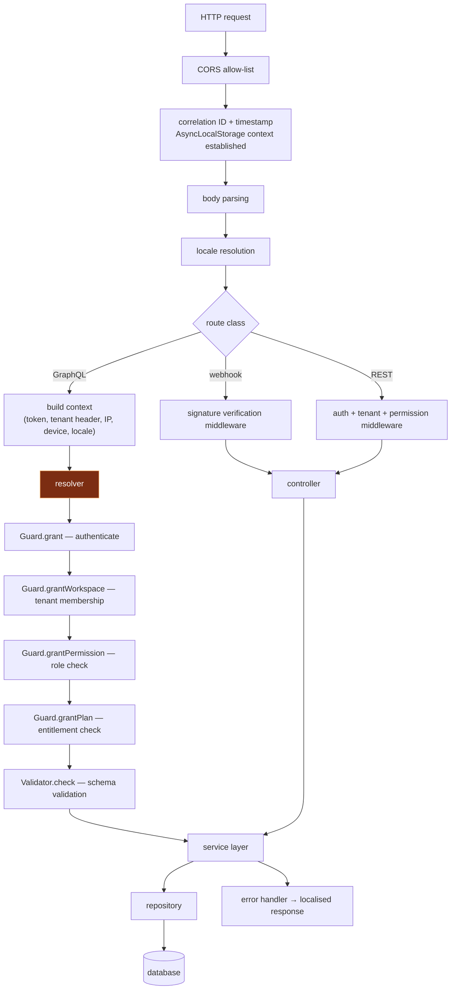

# Middleware and the request lifecycle

## 15.1 The request pipeline



The highlighted node is the important one: **on the GraphQL path, authentication and authorization happen *inside* each resolver**, not in a middleware layer that runs before it.

## 15.2 Where the layering is right, and where GraphQL forces a compromise

**What is right:** layer responsibilities are clean and consistently applied.

| Layer | Responsibility | Assessment |
|---|---|---|
| Middleware | Transport concerns: CORS, body parsing, correlation, locale, signature verification | Correct |
| Guard | Authentication and the four authorization layers | Correct as a *unit*; see below for *placement* |
| Validator | Schema validation of inputs | Correct |
| Resolver / controller | Orchestration only — no business rules | Mostly correct |
| Service | Business logic, transaction boundaries, cross-repository coordination | Correct |
| Repository | Data access only | Correct |
| Provider / adapter | External system access | Correct |
| Error handler | Mapping to transport-level responses | Correct |

This six-layer separation is applied uniformly across a large codebase. That consistency is a real achievement and the main reason the code is navigable at all.

**The structural compromise GraphQL imposes.** REST has one route per operation, so authorization can be declared as route middleware and a route with no auth middleware is visible at a glance. GraphQL has one endpoint and hundreds of operations, so authorization moves into the resolver body — where it becomes **an instruction to remember rather than a structure that enforces**. The predictable result is that authentication gets applied nearly universally while the role-permission layer reaches a substantially smaller subset, because the difference is a matter of per-operation judgement rather than a declared policy.

### Reference flow: make authorization structural, not remembered

The fix is to move the decision out of the resolver body and into something that cannot be omitted. Three options, in increasing strength:

**Option A — wrapper composition (lowest effort, immediately effective):**

```ts
// A resolver is not a function; it is a policy plus a function.
export const resolvers = {
  Mutation: {
    // the policy is visible in the signature and cannot be forgotten silently
    deleteRecord: authorized(
      { permission: 'records.delete', plan: 'records.advanced' },
      async (_parent, args, ctx: AuthedContext) => {
        // ctx.tenantId and ctx.user are GUARANTEED present and typed non-optional
        return new RecordService().delete(args.id, ctx.tenantId);
      },
),
  },
};
```

Two properties make this work: the policy is declared adjacent to the operation name where a reviewer sees it, and the handler receives a **different, narrower context type** (`AuthedContext`) in which tenant and user are non-optional. An unwrapped resolver receives the raw context and cannot compile against a service that requires the authed type.

**Option B — schema directives (declarative, self-documenting):**

```graphql
type Mutation {
  deleteRecord(id: ID!): Result!
    @auth(permission: "records.delete", plan: "records.advanced")
}
```

The policy now lives in the schema, is visible to anyone reading the contract, and can be **verified in CI**: a test that walks the schema and asserts every field in `Mutation` carries an `@auth` directive turns a missing policy into a failed build.

**Option C — a default-deny registry (strongest):**

```ts
// Every operation must appear in the policy map. Absence is a build failure,
// and at runtime an unmapped operation is denied rather than allowed.
const POLICY: Record<string, Policy> = { deleteRecord: {...}, /* … */ };

// CI test: schema fields  ==  policy keys, exactly. No extras, no omissions.
```

**Principle.** **Authorization must be structurally impossible to omit.** A convention that every resolver calls the guard will hold at 50 resolvers and will not hold at 500. Move the policy to where a missing policy fails a build.

## 15.3 Request context propagation

`AsyncLocalStorage` is the correct mechanism for ambient request context — the Node equivalent of a thread-local or Spring's `RequestContextHolder`. Two refinements make it reliable:

**1. Install the context for *every* entry point, not only HTTP.**

Background consumers, cron jobs, and scheduled callbacks have no HTTP request, so an HTTP-only context installation leaves all asynchronous work without correlation. A context accessor that throws when no store exists then turns a missing context into a crash in a worker.

```ts
// One helper, used by every entry point: HTTP, consumer, cron, scheduler callback
export function withContext<T>(seed: Partial<Ctx>, fn: () => Promise<T>): Promise<T> {
  return als.run({ correlationId: seed.correlationId ?? newId(), ...seed }, fn);
}

// Consumer entry point — correlation flows from the message headers
await withContext(
  { correlationId: msg.properties.correlationId, tenantId: msg.headers['x-tenant-id'] },
  () => handler(msg),
);

// Accessor returns a safe default rather than throwing, so a missing context
// degrades logging instead of failing the operation
export const ctx = (): Ctx => als.getStore() ?? { correlationId: 'no-context' };
```

**2. Read correlation from the context, not from a threaded parameter.**

Passing a correlation identifier explicitly through every function signature works, but it is only as good as the least careful call site, and it clutters every signature it touches. The context exists precisely so ambient data need not be threaded.

```ts
✗ async function doWork(logId: string, tenantId: number, input: Input) { … }
    // every caller must remember to pass both; one omission breaks the trace

✓ async function doWork(input: Input) {
    const { correlationId, tenantId } = ctx();   // ambient, always present
  }
```

**Principle.** *Ambient request data — correlation ID, tenant, principal, locale — lives in one context installed at every entry point and read by the logger automatically. It never appears in a function signature.*

## 15.4 Middleware principles

1. **Middleware handles transport; services handle business rules.** A guard that performs quota accounting or writes business state is a service being invoked from the wrong layer.
2. **Authorization is structural, not remembered.**
3. **Validate once, at the boundary, with a schema.** Reject unknown fields.
4. **Controllers and resolvers orchestrate only** — parse, delegate, shape a response.
5. **Repositories perform data access only.** No business rules, no external calls.
6. **One context, installed at every entry point.**
7. **One error handler** mapping domain errors to transport responses; handlers never format HTTP responses themselves.
8. **Keep the pipeline order explicit and identical across services.** A shared bootstrap is better than eleven hand-assembled pipelines.
