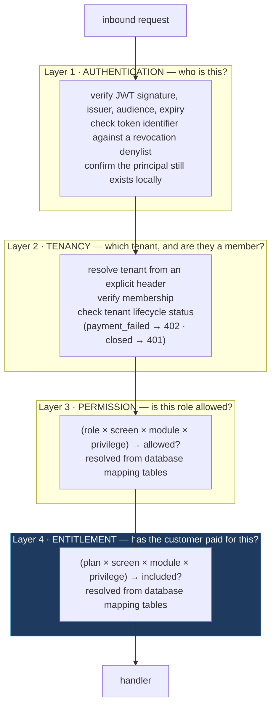

# Authentication and authorization

Four questions, answered in order, on every request. Keeping them separate is
the single highest-value structural decision in a commercial multi-tenant
product.

---

## 1 The four-layer model



---

## 2 Why the fourth layer is the important one

Most systems conflate **permission** ("this role may delete records") with
**entitlement** ("this plan includes the records feature"). They are different
questions with different owners and different lifecycles:

| | Permission | Entitlement |
|---|---|---|
| Question | May this *role* do it? | Did this *customer* buy it? |
| Owned by | The tenant's own administrator | Your commercial and pricing team |
| Changes when | A customer reorganises their team | You launch, reprice, or repackage a plan |
| Failure response | `403 FORBIDDEN` — ask your admin | `402 PAYMENT_REQUIRED` — upgrade |
| Where it lives | Role → capability mapping | Plan → capability mapping |

Modelling both as **data** — `(role × capability)` and `(plan × capability)`
mapping tables sharing one capability vocabulary — produces four properties that
are hard to get any other way:

1. **Launching a plan is a data change, not a deploy.** Pricing experiments do
   not require engineering.
2. **The upgrade path is derivable.** "Which plans include this capability?" is
   a query, which means the upgrade prompt in the UI can be generated rather
   than hard-coded.
3. **Auditability.** "What can this customer do?" is answerable exactly, from
   the database, at any point in time.
4. **No plan names in application code.** `if (plan === 'pro')` is the string
   that ends up in forty files and blocks every repackaging.

**Principle.** **Model permission and entitlement as two independent lookups
over one shared capability vocabulary, both resolved from data.** This is the
highest-value single pattern in this standard, and it applies to every
commercial multi-tenant product.

**Applicability.** **DEFAULT** for any SaaS with more than one paid tier — which
is nearly all of them.

---

## 3 Reference flow: token revocation with stateless tokens

Stateless JWTs cannot be revoked by design; the standard answer is a short-lived
access token plus a denylist for the residual window.

```
logout / password change / session revocation
        └──▶ SET revoked:<jti>  TTL = remaining token lifetime
                     (the TTL bounds the denylist automatically —
                      it can never grow beyond concurrent live tokens)

every request
        └──▶ verify signature ─▶ EXISTS revoked:<jti> ─▶ present ⇒ 401
                                        │
                              cache unavailable ⇒ 401  (fail closed)
```

**Reference rules.**

1. *Keep access tokens short-lived* (5–15 minutes). The denylist then only needs
   to cover minutes, and a compromised token expires on its own.
2. *TTL the denylist entry to the token's remaining lifetime.* Storage stays
   proportional to concurrent sessions rather than to cumulative logouts.
3. *Fail closed.* An unavailable denylist means "cannot prove this token is
   valid", which is a `401`.
4. *Support tenant-wide and user-wide revocation*, not only per-token: a
   `revoked_after:<userId>` timestamp compared against the token's `iat` revokes
   every token for a principal in one write.

---

## 4 Reference flow: token audience selection must not depend on client-supplied data

Where multiple token audiences exist — for example a short-lived audience for
browsers and a longer-lived one for mobile — **which audience is accepted must
not be selected from a client-supplied value.** Headers such as `User-Agent` are
attacker-controlled, so selecting the verification audience from one lets a
caller choose which token class is accepted.

```ts
✗ const clientId = userAgent.includes('Mobile') ? LONG_LIVED_CLIENT : WEB_CLIENT;
  await verify(token, { audience: clientId });
    // the caller decides which audience is checked, by setting a header

✓ // Accept the token if it matches ANY known audience, then read the platform
  //   from the VERIFIED claims — cryptographically bound, not client-asserted.
  const claims   = await verify(token, { audience: [WEB_CLIENT, MOBILE_CLIENT] });
  const platform = claims.aud === MOBILE_CLIENT ? 'mobile' : 'web';

  // Platform-dependent policy now derives from a signed claim
  if (platform === 'web' && claims.exp - claims.iat > MAX_WEB_TOKEN_LIFETIME) {
    throw new UnauthenticatedError();   // a long-lived token presented as a web token
  }
```

**Principle.** *Every security decision derives from a cryptographically
verified claim or from server-side state — never from an unauthenticated header.
If a header changes which validation path runs, the caller controls your
validation.*

---

## 5 Reference flow: uniform validation across environments

Credential validation must be **identical in every environment**. Where a check
is conditioned on the environment — for example requiring a `Bearer ` prefix
only in staging — production exercises a different code path than the one that
was tested, and the difference is invisible in review.

```ts
✗ if (!token || (env !== 'production' && !token.startsWith('Bearer '))) reject();
✓ if (!token?.startsWith('Bearer ')) reject();      // one rule, all environments
  const raw = token.slice('Bearer '.length);
```

**Principle.** *Security validation is environment-independent. Environments may
differ in verbosity, sampling, or feature flags — never in what they accept.*

---

## 6 Reference flow: shared-secret endpoints

Internal callbacks — scheduler invocations, service-to-service calls — are often
authenticated with a static shared key. That is acceptable for internal traffic
if three properties hold:

```ts
import { timingSafeEqual, createHash } from 'crypto';

function validSharedSecret(presented: string | undefined, expected: string): boolean {
  if (!presented) return false;
  // Hash both sides to equal-length buffers so length is not itself a signal,
  // then compare in constant time.
  const a = createHash('sha256').update(presented).digest();
  const b = createHash('sha256').update(expected).digest();
  return timingSafeEqual(a, b);
}
```

1. **Constant-time comparison.** `===` on secrets leaks length and prefix
   information through timing.
2. **Distinct secrets per caller**, so one can be rotated or revoked without
   affecting the others.
3. **Not reachable from the public internet** where avoidable — restrict by
   security group, private endpoint, or firewall rule so the secret is
   defence-in-depth rather than the only control.

**Better still:** for callers inside your own cloud account, prefer
**signed requests using platform identity** over a static secret. The credential
then rotates automatically and is never stored anywhere.

---

## 7 The reusable authorization model

```
┌─ Layer 0 · TRANSPORT ────────── TLS, CORS allow-list, WAF, rate limit
├─ Layer 1 · AUTHENTICATION ───── signature · issuer · audience · expiry
│                                 revocation denylist  (fail closed)
│                                 principal still exists and is active
├─ Layer 2 · TENANCY ──────────── tenant from explicit header or signed claim
│                                 membership verified
│                                 tenant lifecycle gate (suspended · closed · unpaid)
├─ Layer 3 · PERMISSION ───────── (role × capability) from data
├─ Layer 4 · ENTITLEMENT ──────── (plan × capability) from data
└─ Layer 5 · RESOURCE SCOPE ───── EVERY query filtered by tenant
                                  enforced by the data layer, not the call site
```

**Layer 5 is the one that decides whether the other five matter.** Layers 1–4
answer "may this principal perform this kind of operation?" Only Layer 5 answers
"on *this* object?" `16-multi-tenancy.md` is entirely about making Layer 5
structural, and `24-security-appsec-controls.md` §2 covers the within-tenant
half of the same question.

---

## Principles

1. **Four questions, four answers**: who are you, which tenant, what may your
   role do, what did your plan include.
2. **Permission and entitlement are separate lookups over one capability
   vocabulary, both from data.**
3. **Every security decision derives from a verified claim or server-side
   state.**
4. **Validation is identical across environments.**
5. **Fail closed.** Ambiguity is denial.
6. **Short access tokens, TTL'd denylist, principal-wide revocation.**
7. **Constant-time comparison for every secret.**
8. **Tenant scope is enforced by the data layer**, never by the call site.
9. **Authorization coverage is measured**, not assumed — a CI check asserting
   every operation has a declared policy.
10. **Prefer platform identity to static secrets** for service-to-service calls.
