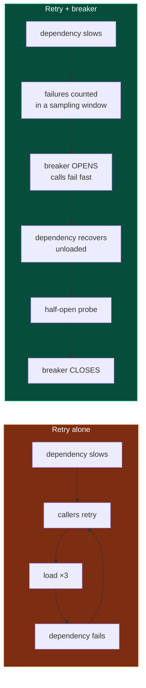
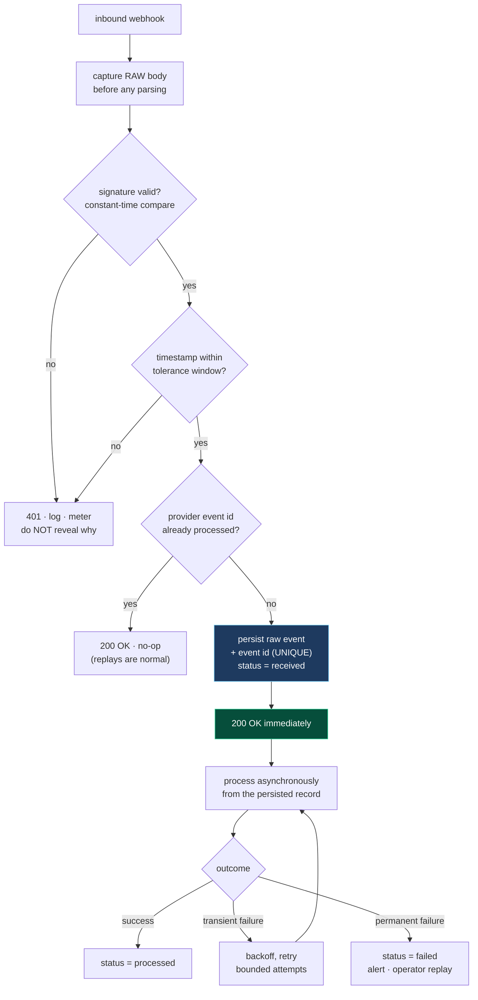

# External integrations and webhooks

## Part 18 — External integration architecture

### 18.1 The integration surface

*(Timeout / retry / breaker columns describe what the integration layer provides; blank means the SDK or platform default applies.)*

| Integration | Purpose | Protocol | Auth | Timeout | Retry | Breaker | Idempotency | Inbound webhook | Failure handling |
|---|---|---|---|---|---|---|---|---|---|
| **Cognito** | Identity, JWT, MFA | HTTPS SDK | Platform identity | SDK default | SDK default | No | N/A | No | Exception → 401 |
| **Primary metered provider** | The core metered dependency the product is built on | HTTPS SDK + webhooks | Per-tenant credentials | **Explicit (via resilience pipeline)** | **Explicit, transient-only** | **Required** | Provider-side | **Yes, signature-verified** | Retry then persist a failure state |
| **Chargebee** | Subscriptions, invoicing | HTTPS SDK + webhooks | API key | **Explicit** | **Explicit** | **Required** | Partial | **Yes, shared-secret** | Task chain with compensation |
| **Stripe** | Payments, disputes, refunds | HTTPS SDK + webhooks | Secret key | SDK default | SDK default | No | Provider-side | **Yes, HMAC-signed** | Task chain per event type |
| **S3** | Object storage | HTTPS SDK | Platform identity | SDK default | SDK default | No | Idempotent by key | No | Exception propagates |
| **SES** | Transactional email | HTTPS SDK | Platform identity | SDK default | SDK default | No | No | No | Logged |
| **KMS** | Field encryption | HTTPS SDK | Platform identity | SDK default | SDK default | No | N/A | No | Exception propagates |
| **EventBridge Scheduler** | Durable timers | HTTPS SDK | Platform identity | SDK default | SDK default | No | Named schedules | **Yes, shared-secret callback** | Schedule persists |
| **Managed AI / ML inference** | AI / ML inference | HTTPS SDK | Platform identity | SDK default | SDK default | No | Job names | Poll / callback | Job state machine |
| **Firebase FCM** | Push notification | HTTPS SDK | Service account | SDK default | SDK default | No | No | No | Logged |
| **CRM platforms** | Contact and activity sync | HTTPS + OAuth2 | OAuth2, KMS-encrypted tokens | Via outbox | **Outbox retry** | **Kill switch + rate limit** | Outbox idempotency key | Partial | **Outbox with backoff** |
| **Email verification** | Address validation | HTTPS | API key | SDK default | No | No | N/A | No | Logged |
| **IP intelligence** | Geolocation | HTTPS | API key | SDK default | No | No | N/A | No | Logged |
| **KYC provider** | Identity verification | HTTPS + webhook | API key | SDK default | No | No | Partial | **Required** | Status state machine |
| **Sentry** | Error tracking | HTTPS SDK | DSN | SDK default | SDK default | No | N/A | No | Best-effort |

### 18.2 Why this integration shape is right

**Adapter isolation.** Every external system is reached through a dedicated `providers/` module, and business services depend on the adapter rather than the vendor SDK. This is the single most important integration decision and it is applied consistently.

**Principle.** *Every external system is reached through exactly one adapter module. Business logic imports the adapter; nothing else imports the vendor SDK. Vendor churn then costs one module, not a codebase-wide search.*

**A vendor-neutral resilience pipeline.** Retry, timeout, circuit breaker, bulkhead, rate limiter, and fallback are implemented as interchangeable middleware behind an adapter layer over the underlying library, composed through a builder:

```ts
this.pipeline = new ResilienceBuilder()
.use(retryPolicy)     // outer: retries the whole attempt
.use(timeoutPolicy)   // inner: bounds each individual attempt
.build('provider-name');
```

The composition order is correct and worth stating explicitly, because it is easy to get backwards: **retry must be outside timeout.** Timeout inside retry bounds each attempt; timeout outside retry would bound the entire retry sequence, so a single slow attempt consumes the whole budget and no retry ever happens.

**Retry only on transient errors.** The retry predicate distinguishes transient failures (network, 429, 5xx) from permanent ones (400, 401, 404, validation). Retrying a permanent error is pure waste: it never succeeds, it multiplies load, and it delays the error the caller needs to see.

**Principle.** *A retry policy without a transient-error predicate is a load amplifier. Classify every error as transient or permanent before deciding to retry.*

### 18.3 Reference flow: retry requires a circuit breaker

Retry and circuit breaking are not alternatives; **retry without a breaker is actively dangerous.** When a dependency degrades, every caller retries, and retries multiply the load on the failing dependency at exactly the moment it can least absorb it. This is the retry-storm mechanism by which a partial degradation becomes a total outage.



```ts
// Reference: the full pipeline, outermost first
new ResilienceBuilder()
.use(bulkheadPolicy({ maxConcurrent: 20, maxQueued: 50 }))   // bound concurrency
.use(circuitBreakerPolicy({                                   // stop retry storms
      strategy: { type: 'sampling', duration: 30_000, threshold: 0.5, minimumRps: 5 },
      halfOpenAfterMs: 10_000,
      shouldTrip: isTransient,      // a 400 must never open the breaker
  }))
.use(retryPolicy({                                            // retry transient only
      maxAttempts: 3,
      backoff: { type: 'exponential', baseDelay: 200, exponent: 2, maxDelay: 5_000,
                 jitter: true },
      shouldRetry: isTransient,
  }))
.use(timeoutPolicy({ duration: 5_000, strategy: 'aggressive' }))  // bound each attempt
.build('provider-name');
```

Each policy earns its place:

| Policy | Failure it prevents |
|---|---|
| **Bulkhead** | One slow dependency consuming all concurrency and starving unrelated work |
| **Circuit breaker** | Retry storms; wasted latency calling a dependency that is known-down |
| **Retry** | Losing a request to a transient blip |
| **Timeout** | A hung request holding a connection, a worker, and a pool slot indefinitely |

**Order matters.** Bulkhead outermost (reject before consuming resources), breaker next (fail fast before retrying), retry inside that, timeout innermost (bound each attempt).

**Principle.** *If you have retry, you need a breaker. If you call anything over a network, you need a timeout. These are not tuning parameters; they are correctness requirements.*

### 18.4 Reference flow: no unbounded default timeouts

An SDK's default timeout is frequently 30–120 seconds, and sometimes there is none. On a request path with a 30-second gateway timeout, a dependency without an explicit timeout will hold a connection past the point where anyone is waiting for the answer.

```ts
// Reference: a central registry of dependency policies — one place, reviewable
export const DEPENDENCY_POLICY = {
  paymentProvider: { timeoutMs: 10_000, retries: 3, breaker: true,  critical: true  },
  emailProvider:   { timeoutMs:  5_000, retries: 3, breaker: true,  critical: false },
  objectStore:     { timeoutMs: 30_000, retries: 3, breaker: false, critical: true  },
  ipIntelligence:  { timeoutMs:  1_000, retries: 0, breaker: true,  critical: false },
  //               ↑ a non-critical enrichment call gets a SHORT timeout and no retry:
  //                 it must degrade instantly rather than delay the request
} as const;
```

Two policy rules follow from that table:

- **Non-critical enrichment calls get short timeouts, zero retries, and a fallback.** A geolocation lookup that adds a nice-to-have field must never add a second to the request.
- **Critical calls get generous timeouts, retries, and a breaker** — but are still bounded, and still fail the request cleanly rather than hanging.

**Principle.** *Every external call has an explicit timeout, chosen from the caller's latency budget rather than inherited from the SDK. Write the budget down: the sum of the timeouts on a request path must be less than the gateway timeout.*

### 18.5 Reference flow: client instantiation and connection reuse

Creating an SDK client per call discards the connection pool, repeats TLS handshakes, and re-runs credential resolution on every operation.

```ts
✗ function encrypt(data: string) {
    return new KMSClient({ region }).send(new EncryptCommand({ … }));
    // new client, new pool, new TLS handshake, per call
  }

✓ // One client per process, created at startup, with explicit configuration
  const kms = new KMSClient({
    region,
    maxAttempts: 3,
    requestHandler: new NodeHttpHandler({
      connectionTimeout: 1_000,
      requestTimeout:    5_000,
      httpsAgent: new https.Agent({ keepAlive: true, maxSockets: 50 }),
    }),
  });
  export const encrypt = (data: string) => kms.send(new EncryptCommand({ … }));
```

**Principle.** *SDK and HTTP clients are process-level singletons configured at startup with explicit timeouts and keep-alive. A client constructed inside a request handler is a resource leak with a latency penalty.*

### 18.6 Reference flow: credentials and encryption on AWS

Two patterns are worth prescribing explicitly for an AWS deployment.

**Use platform identity instead of static keys.** Long-lived access keys in environment variables must be rotated manually, appear in process listings and crash dumps, and cannot be scoped per-request.

```
✗ new KMSClient({ credentials: { accessKeyId: env.AWS_KEY,
                                 secretAccessKey: env.AWS_SECRET } })

✓ new KMSClient({ region })     // credentials resolved from the environment's
                                // instance profile / task role / IRSA —
                                // rotated automatically, never stored
```

The IAM policy attached to that role is where least privilege is expressed: this service may `kms:Decrypt` only under this key and only for this encryption context.

**Use envelope encryption with a data-key cache for field-level encryption.** Calling KMS directly for every field encrypt and decrypt puts a network round trip and an API-quota consumption on the hot path.

```
✗ per operation:  KMS Encrypt(plaintext) / KMS Decrypt(ciphertext)
     · a network round trip per field
     · counts against the account's KMS request quota
     · cost scales linearly with traffic
     · KMS availability becomes request-path availability

✓ envelope encryption with a cached data key:
     · KMS GenerateDataKey once per cache window (per key, per encryption context)
     · encrypt/decrypt locally with the data key (AES-GCM, microseconds)
     · cache bounded by max messages, max bytes, and max age
     · the AWS Encryption SDK's caching CMM implements exactly this
     · encryption context binds ciphertext to its tenant — a ciphertext
       from tenant A cannot be decrypted in tenant B's context
```

**Principle.** *Use envelope encryption with a bounded data-key cache for field-level encryption, and bind every ciphertext to its tenant with an encryption context. Direct per-operation KMS calls make your request path depend on a rate-limited external service.*

### 18.7 External integration engineering standard

```
□ Exactly one adapter module per external system; nothing else imports the SDK
□ Explicit timeout on every call, derived from the caller's latency budget
□ Retry only on classified transient errors, with exponential backoff and jitter
□ Circuit breaker wherever there is retry
□ Bulkhead limiting concurrency per dependency
□ Idempotency key on every mutating call the provider supports it for
□ Response validation — never trust a provider's schema to be stable
□ Credentials from platform identity where available; otherwise from a secrets
  manager with rotation; never from an environment variable holding a long-lived key
□ SDK clients are process-level singletons with explicit configuration
□ Per-tenant rate limiting so one tenant cannot exhaust a shared provider quota
□ A kill switch per integration, flippable without a deploy
□ Cost visibility: metered provider calls emit a counter tagged by tenant
□ Metrics per dependency: call rate, error rate, latency percentiles, breaker state
□ A documented degradation mode: what the product does when this provider is down
□ Sandbox credentials in non-production, enforced by configuration validation
□ Every provider interaction logged with the correlation ID and the provider's own
  request identifier — without it, a vendor support ticket is unanswerable
```

### 18.8 Reference flow: protecting metered endpoints

Any endpoint that triggers a **billable** third-party call is a cost-amplification target: an attacker does not need to breach anything to make it expensive. Such endpoints need protection proportional to their cost, not to their apparent sensitivity.

```
Every endpoint that triggers a metered external call requires:
  1. Authentication, or a signed request — no anonymous access
  2. Rate limiting per principal AND per IP AND a global ceiling
  3. A daily spend cap per tenant, enforced before the call
  4. A cost counter emitted per call, tagged by tenant and endpoint
  5. An alert on unusual volume — not a monthly invoice surprise
  6. A cached result where the upstream answer is stable
     (validation and lookup answers rarely change; caching them
      converts a metered call into a free one for repeats)
```

**Principle.** *Classify endpoints by the cost they can cause, not only by the data they expose. An unauthenticated endpoint that triggers a paid API call is a billing vulnerability, and the standard security review will not find it because no data leaks.*

---

## Part 19 — Webhook architecture

### 19.1 Inbound webhooks

| Source | Authentication | Idempotency | Persistence | Processing | Assessment |
|---|---|---|---|---|---|
| Primary metered provider | **HMAC signature over URL + body, per-tenant secret** | Provider event identifiers available | Events persisted | Handler pipeline per event type | **Strong** |
| Stripe | **HMAC signature with timestamp (replay-protected)** | Event identifiers available | Records persisted | Declarative event → task-chain map | **Strong** |
| Chargebee | Shared-secret HTTP Basic | Not enforced | Records persisted | Task chain | See 19.4 |
| Scheduler callback | Shared static key | Schedule-name based | Yes | Handler pipeline | Adequate for internal |
| KYC provider | Provider-specific | Status state machine | Yes | State machine | Adequate |
| Status callbacks (public) | None on some paths | Varies | Varies | Direct handler | See 19.5 |

### 19.2 What a correct implementation gets right

**Per-tenant signature verification.** Verifying with the *tenant's own* provider credential rather than one platform-wide secret means a compromised tenant credential cannot be used to forge events for a different tenant. This is a genuinely good detail that most implementations miss.

**A declarative event → pipeline map.** Mapping each event type to an explicit ordered list of small handlers makes the full behaviour of an event readable in one place and each step independently testable. This is the pattern to copy.

### 19.3 Reference flow: the correct webhook receiver



**The two structural decisions:**

1. **Persist, then acknowledge, then process.** The HTTP response confirms *receipt*, not *completion*. Processing inline means the provider's timeout governs your processing budget — and when you exceed it, the provider retries an event you are still working on.
2. **Deduplicate on the provider's event identifier**, stored with a `UNIQUE` constraint. Every major provider redelivers; redelivery must be a no-op, and the constraint is what makes that true under concurrency rather than merely usually.

### 19.4 Reference flow: shared secrets are not signatures

HTTP Basic authentication on a webhook endpoint proves the caller knows a secret. It does **not** bind the request body, which leaves two gaps:

| Property | Shared secret | HMAC signature |
|---|---|---|
| Caller authentication | Yes | Yes |
| **Payload integrity** | **No** — anyone with the secret can send any body | Yes — the body is signed |
| **Replay protection** | **No** — a captured request replays indefinitely | Yes, when a signed timestamp is included |
| Secret exposure | Transmitted on every request | Never transmitted |
| Rotation | Requires coordinated cutover | Supports overlapping keys |

Where a provider offers only shared-secret authentication, the gap must be closed on your side:

```ts
// Compensating controls when the provider offers no signature
async function handleWebhook(req: Request) {
  if (!validSharedSecret(req.headers.authorization, expected)) return unauthorized();

  // 1. Deduplicate on the provider's event id — this is what defeats replay
  //    when the transport cannot. A UNIQUE constraint does the work.
  const inserted = await events.insertIfNew({
    providerEventId: req.body.id,        // UNIQUE(provider, provider_event_id)
    payload: req.body,
  });
  if (!inserted) return ok();            // already seen: replay is a no-op

  // 2. Never trust the payload's contents: re-fetch authoritative state
  //    from the provider's API using only the identifier.
  const authoritative = await provider.fetchEvent(req.body.id);

  // 3. Reject stale events outright
  if (Date.now() - Date.parse(authoritative.occurred_at) > MAX_EVENT_AGE_MS) {
    return ok();                         // acknowledged and ignored, with a metric
  }

  await enqueue({ eventId: req.body.id });
  return ok();
}
```

Step 2 is the important one: **treat an unsigned webhook as a notification that something happened, not as a statement of what happened.** Fetch the truth from the provider's API. That reduces a forged payload to a forged *trigger*, which is harmless.

**Principle.** *Prefer HMAC signature verification with a timestamp. Where a provider offers only a shared secret, deduplicate on the provider's event identifier and re-fetch authoritative state rather than trusting the payload.*

### 19.5 Reference flow: no unauthenticated write paths

An endpoint reachable without authentication and without signature verification is an untrusted write path. Where such an endpoint is required — a status callback from a provider that supports neither — the following are minimum controls:

```
□ Signature verification, if the provider supports it at all (check again — many
  added it after the integration was written)
□ Source IP allow-list from the provider's published ranges
□ A path secret: a high-entropy, per-tenant segment in the callback URL,
  rotatable without a code change
□ Strict schema validation; reject unknown fields
□ Rate limiting per source
□ Treat the payload as a trigger only: re-fetch authoritative state
□ Never let the payload determine a tenant — derive tenancy from the
  path secret or from a locally-stored provider identifier
□ Metric on unverified inbound volume, with an alert on anomalies
```

The last two matter most: **a webhook that takes a tenant identifier from its own payload lets the caller choose the tenant.** Tenancy must come from something the caller cannot assert.

### 19.6 Reference flow: outbound webhooks

If your product delivers webhooks to customers, you owe them the same guarantees you expect from your providers:

```
□ HMAC signature over timestamp + body, with the algorithm documented
□ A timestamp in the signed payload so recipients can reject replays
□ Overlapping key rotation: sign with the new key, accept both for a window
□ A stable event identifier, so recipients can deduplicate
□ At-least-once delivery with exponential backoff over hours, not minutes
□ A delivery log the customer can inspect: attempts, response codes, bodies
□ Manual redelivery the customer can trigger themselves
□ Automatic suspension of endpoints failing persistently, with notification
□ A published, versioned event schema and a documented deprecation policy
□ A short delivery timeout (5–10s) — a slow customer must not consume your workers
□ Per-customer delivery concurrency limits (a bulkhead per destination)
```

### 19.7 Webhook principles

1. **Verify before parsing.** Capture the raw body; signature verification over a re-serialised body is unreliable.
2. **Persist, acknowledge, then process.** The response confirms receipt.
3. **Deduplicate on the provider's event identifier, backed by a `UNIQUE` constraint.**
4. **Replays are normal traffic**, not errors. Return 200 and record a metric.
5. **Treat unsigned payloads as triggers**; re-fetch authoritative state.
6. **Tenancy never comes from the payload.**
7. **Events arrive out of order.** Compare against the current state; ignore transitions already superseded.
8. **Return 200 for anything you will not retry**, so the provider stops retrying — and record it. A provider that keeps retrying an event you have decided to drop will eventually disable your endpoint.
9. **Constant-time comparison for every secret and signature.**
10. **Alert on signature failures.** A sustained rate is either a rotation you forgot or someone probing.
