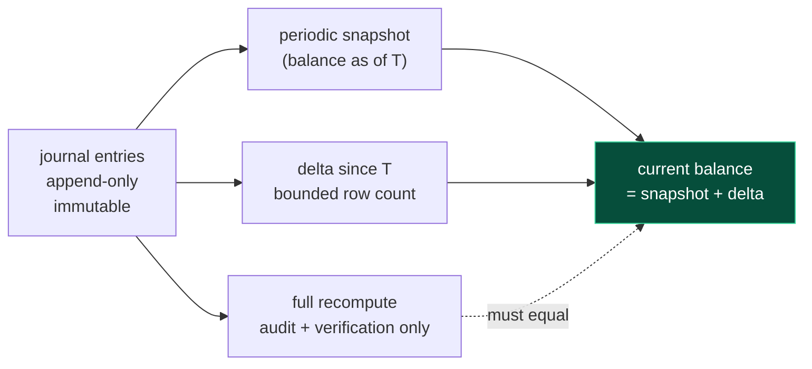
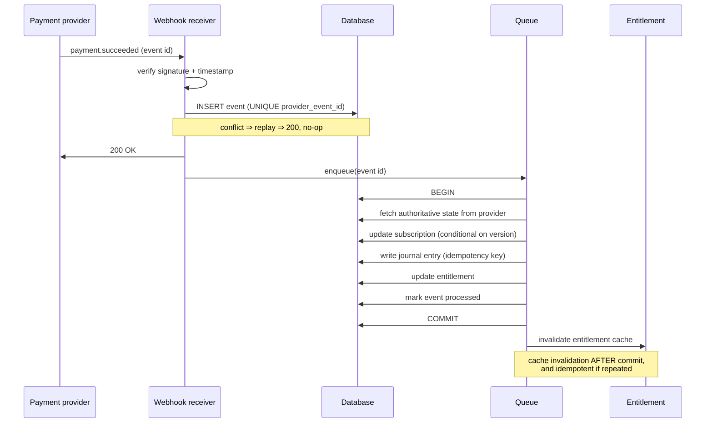

# Billing and money

The area where a defect is not a bug but a discrepancy — auditable, sometimes
legally exposed, and usually discovered long after it was introduced.

---

## 1 The architecture

| Concern | Requirement |
|---|---|
| Subscription management | A specialist provider as the system of record |
| Payment gateway | A specialist provider — payments, disputes, refunds |
| Usage metering | An event-consuming component, isolated from the request path |
| Ledger | **Double-entry journal** — credit and debit per entry, append-only |
| Balance | A **maintained projection** with a snapshot watermark |
| Auto-recharge | Threshold-triggered top-up with a handshake record |
| Invoices | Generated locally and by the provider |
| Usage notifications | Threshold percentages with a dedupe check |
| Provisioning flows | Saga task chains with explicit compensation |
| Entitlement enforcement | Plan → capability mapping in the authorization layer |
| Money representation | Exact decimal or integer minor units, end to end |
| Reconciliation | A required component, with a monitored divergence metric |

### Why this shape

**A double-entry, append-only journal.** Every financial movement is a journal
entry rather than a mutation of a balance field. This delivers three properties
a mutable balance cannot:

1. **Auditability** — every balance is explainable by the entries that produced
   it.
2. **Immutability** — a correction is a new compensating entry, so history is
   never rewritten.
3. **Reconstructability** — the balance can be recomputed from first principles
   at any point in time.

**Principle.** *Money is an append-only ledger, never a mutable balance field. A
balance is a **projection** of the ledger, not a source of truth.*

**Separate the ledger from the biller.** The ledger records what happened; the
billing system decides what to charge. Different correctness requirements,
different change cadence, different failure tolerance. Keeping them apart is
good design.

**Delegate subscription management to a specialist provider.** Proration,
dunning, tax, currency, invoicing and payment-method lifecycle are enormous
problem domains. Buying them is almost always correct.

**Use sagas with compensation for provisioning.** A flow that creates a
subscription, an invoice item and an external resource cannot be a transaction.
Modelling it as a chain of compensable steps is the right shape — see
`12-workflows-and-state-machines.md`.

---

## 2 Reference flow: exact decimal money

Binary floating point cannot represent most decimal fractions exactly. The
consequences are cumulative and they surface late — typically as a
reconciliation discrepancy nobody can explain.

```
float32 holds ~7 significant decimal digits.
  A balance of 1,234,567.89 cannot be represented; it rounds.
  Once a tenant's lifetime credit exceeds ~$100,000, cent-level precision is gone.

float64 holds ~15–17 significant digits — better, and still not exact:
  0.1 + 0.2 === 0.30000000000000004

Summing 100,000 journal entries in float accumulates error in the last digits.
Two systems computing the same total in different orders get different answers,
and neither is reproducible.

Mixing float32 and float64 for credit and debit within one ledger means the two
sides of the same equation have different precision, so credit − debit has an
error term that depends on magnitude.
```

**The reference representation:**

```sql
-- Store money as an exact type. Two acceptable choices:

-- (a) NUMERIC with explicit precision and scale — exact decimal arithmetic in SQL
credit   NUMERIC(19,4) NOT NULL DEFAULT 0 CHECK (credit >= 0),
debit    NUMERIC(19,4) NOT NULL DEFAULT 0 CHECK (debit  >= 0),
currency CHAR(3)       NOT NULL,
CHECK (NOT (credit > 0 AND debit > 0)),   -- an entry is one side or the other

-- (b) BIGINT minor units — integer arithmetic, no rounding, no ambiguity
credit_minor BIGINT NOT NULL DEFAULT 0,   -- cents, or the currency's minor unit
debit_minor  BIGINT NOT NULL DEFAULT 0,
currency     CHAR(3) NOT NULL,
```

```go
// In application code, an exact decimal type end to end — never float
type JournalEntry struct {
    Credit   decimal.Decimal `gorm:"type:numeric(19,4)"`
    Debit    decimal.Decimal `gorm:"type:numeric(19,4)"`
    Currency string          `gorm:"type:char(3)"`
}

// Rounding is explicit, at defined points, with a stated mode — never implicit
rate     := decimal.NewFromFloat(0.0085)              // a rate may come as float
duration := decimal.NewFromInt(int64(seconds))
amount   := rate.Mul(duration).Round(4)               // explicit scale, explicit rounding
```

**Three supporting rules:**

1. **Currency travels with every amount.** A number without a currency is not
   money. Never sum across currencies.
2. **Rounding happens at defined boundaries with a declared mode** — banker's
   rounding for statistical neutrality, or half-up if your jurisdiction requires
   it — never as an accident of a display format.
3. **The database enforces the invariants** it can: non-negative amounts, one
   side per entry, a valid currency code.

**Principle.** *Money is `NUMERIC` or integer minor units, in the database and
in application code, with an explicit currency and explicit rounding. A
floating-point money field is a defect that reports itself months later as an
unexplainable discrepancy.*

---

## 3 Reference flow: balance as a maintained projection

Recomputing `SUM(credit) − SUM(debit)` over a tenant's full history has a cost
proportional to that tenant's lifetime activity. It is fast for a new tenant and
slow for your best customer — the worst possible scaling shape, because the cost
grows exactly where the revenue is.



```sql
-- A snapshot table: one row per tenant per period, closing the books
CREATE TABLE balance_snapshots (
  tenant_id     bigint      NOT NULL,
  as_of         timestamptz NOT NULL,
  last_entry_id bigint      NOT NULL,        -- the watermark: exactly what is included
  balance       numeric(19,4) NOT NULL,
  currency      char(3)     NOT NULL,
  PRIMARY KEY (tenant_id, as_of)
);

-- Current balance = latest snapshot + only the entries after its watermark.
-- Cost is proportional to activity SINCE the snapshot, not to all history.
SELECT s.balance
     + COALESCE(SUM(j.credit), 0)
     - COALESCE(SUM(j.debit),  0) AS balance
  FROM balance_snapshots s
  LEFT JOIN journal_entries j
         ON j.tenant_id = s.tenant_id
        AND j.id > s.last_entry_id
 WHERE s.tenant_id = :tenant
 ORDER BY s.as_of DESC
 LIMIT 1;
```

The full recomputation is retained deliberately — as a **verification job**, not
as the read path. A nightly job that recomputes from zero and compares against
the projection is how you discover a projection bug before a customer does.

**Principle.** *An append-only ledger is the source of truth; a balance is a
maintained projection with a snapshot watermark. Keep the full recomputation as
a verification job that must agree with the projection, and alert on any
disagreement.*

---

## 4 Reference flow: charging with an idempotent, race-free debit

The classic error is check-then-debit:

```
✗ balance = getBalance(tenant)          ← read
  if (balance < amount) reject()        ← decide
  insertDebit(tenant, amount)           ← write
     Two concurrent charges both read a sufficient balance and both proceed.
     The account goes negative by the amount of the smaller charge.
```

```sql
✓ -- One statement: the balance check IS the write predicate, and the
  -- idempotency key makes a retry a no-op rather than a second charge.
  WITH current AS (
    SELECT balance FROM v_tenant_balance WHERE tenant_id = :tenant FOR UPDATE
  )
  INSERT INTO journal_entries
      (tenant_id, debit, currency, reference, idempotency_key, charge_type)
  SELECT :tenant, :amount, :currency, :reference, :idemKey, :chargeType
    FROM current
   WHERE current.balance >= :amount          -- ← the precondition, in the predicate
  ON CONFLICT (tenant_id, idempotency_key) DO NOTHING
  RETURNING id;
  -- 0 rows ⇒ either insufficient funds or an already-applied charge.
  --          Distinguish by probing the idempotency key.
```

Three properties, each essential:

1. **`UNIQUE (tenant_id, idempotency_key)`** makes the debit idempotent under
   retry. Every usage event that produces a charge carries a natural idempotency
   key derived from the event itself — never a generated one, which would differ
   on each retry.
2. **The balance predicate is part of the write**, so concurrent charges cannot
   both pass.
3. **`FOR UPDATE` serialises concurrent charges for the same tenant** — and only
   for that tenant, so tenants do not contend with each other.

**Principle.** *Every charge carries an idempotency key derived from the event
that caused it, enforced by a unique constraint. Every balance check is the
predicate of the write, never a preceding read.*

---

## 5 Reference flow: the payment webhook lifecycle



### The failure-mode matrix — answer these in design, not in production

| Scenario | Required behaviour | Mechanism |
|---|---|---|
| Payment succeeds | Subscription active, entitlement granted, journal entry written, all in one transaction | One transaction + idempotency key |
| Payment fails | Tenant marked unpaid; grace period begins; capability restricted, not deleted | Tenant lifecycle state machine |
| **Webhook duplicated** | Second delivery is a no-op | `UNIQUE (provider, provider_event_id)` |
| **Webhook delayed** | State is applied only if it is newer than what is stored | Compare provider timestamps or versions; ignore stale |
| **Webhook lost entirely** | Detected and repaired without customer contact | **Periodic reconciliation** |
| **Processing crashes mid-way** | Either fully applied or fully unapplied; retried automatically | One transaction + a persisted event row + retry |
| **Webhooks arrive out of order** | Final state matches the provider, regardless of arrival order | Version or timestamp comparison, not blind application |
| **Entitlement cache stale after change** | Bounded staleness, and invalidation is idempotent | Short TTL + post-commit invalidation |
| Refund or dispute | Compensating journal entry; entitlement re-evaluated | Append-only correction, never a mutation |
| Provider unreachable during a charge | Charge is retried; never double-applied | Idempotency key on the provider call |

**The row that matters most is "webhook lost entirely."** It is the only one
that idempotency does not solve, and it is the one that requires reconciliation.
A subscription that silently failed to activate is a support ticket; a
subscription that silently failed to *cancel* is revenue leakage in the
customer's favour and a compliance problem in yours.

---

## 6 Principles

1. **The provider is the system of record for subscriptions.** Your database
   holds a cache of provider state, and treats it as such.
2. **Money is an append-only ledger.** Balances are projections.
3. **Exact decimal or integer minor units.** Never floating point.
4. **Currency travels with every amount.**
5. **Every charge has an idempotency key derived from its cause**, enforced by a
   unique constraint.
6. **Every balance check is the predicate of a write.**
7. **Webhooks are signature-verified, deduplicated, persisted, then processed
   asynchronously.**
8. **Reconciliation is a required component**, and its divergence count is a
   monitored metric.
9. **Entitlement is data**, derived from the plan, cached briefly, invalidated
   after commit.
10. **Failed payment restricts capability; it never deletes data.** A customer
    who pays late must get their account back intact.
11. **Every financial mutation records who, when, why, and under what
    authority.** Corrections are new entries.
12. **The billing path is the most-tested code in the system.** Tests for
    duplicate webhooks, out-of-order webhooks, concurrent charges, insufficient
    funds, refunds, and mid-transaction crashes are not optional.
13. **Never trust a webhook payload's contents** — re-fetch authoritative state
    from the provider.
14. **Alert on financial anomalies**: charges above a threshold, balances going
    negative, reconciliation divergences, unusual per-tenant velocity.
