# Infrastructure and deployment

## 31.1 The reference implementation

| Concern | Implementation |
|---|---|
| Cloud provider | AWS |
| Compute | EC2 hosts running Docker Compose |
| Container build | Built on the target host from a git checkout |
| Container registry in the pipeline | **Required — commonly missing** |
| Orchestration | Docker Compose; a `make` wrapper |
| Service exposure | Fixed host port per service |
| Load balancing | AWS load balancer, TLS termination |
| CDN | CloudFront (signing utilities present) |
| Managed data services | RDS, ElastiCache, and a broker |
| Environment separation | Separate hosts and branches per environment |
| Configuration | `.env` files on hosts, plus compose `env_file` |
| Infrastructure as code | **Required — commonly missing** |
| Auto-scaling | **Required — commonly missing** |
| Secrets manager | **Required — commonly missing** |

## 31.2 Reference flow: an immutable artifact pipeline

The property that matters most in a deployment pipeline is that **the thing you tested is the thing that runs, and you can run it again identically**. That requires a build that happens once, produces a content-addressed artifact, and is promoted unchanged through environments.

```mermaid
graph LR
    C["commit"] --> CI["CI: install from lockfile<br/>lint · typecheck · test · audit"]
    CI --> B["build image ONCE<br/>tag with the commit SHA"]
    B --> SCAN["scan image + SBOM"]
    SCAN --> REG[("registry<br/>ECR")]
    REG --> D1["deploy to dev<br/>same digest"]
    D1 --> D2["deploy to staging<br/>same digest"]
    D2 --> GATE{"approval"}
    GATE --> D3["deploy to production<br/>same digest"]
    D3 --> RB["rollback = redeploy<br/>the previous digest"]
    style B fill:#1e3a5f,stroke:#7dd3fc,color:#fff
    style REG fill:#064e3b,stroke:#34d399,color:#fff
```



**Why building on the target host is worth replacing:**

| Property | Build-on-host | Registry artifact |
|---|---|---|
| Reproducibility | Depends on host state and dependency resolution at build time | Content-addressed by digest |
| Rollback | Re-checkout and rebuild — and hope it builds the same | Redeploy the previous digest |
| "Did we test this exact code?" | Unanswerable | Answerable by digest |
| Build failure impact | Occurs on the production host, mid-deploy | Occurs in CI, before anything deploys |
| Build resources | Consumed on the production host | Consumed by CI runners |
| Multi-host deploy | Each host builds separately, possibly differently | All hosts pull one identical image |
| Deploy duration | Full build per deploy | Image pull only |

**Principle.** *Build once, tag by commit digest, promote the identical artifact through every environment. A deployment that rebuilds is a deployment that cannot be reproduced or reliably rolled back.*

## 31.3 Reference flow: deterministic version selection

A deploy step must deploy **exactly** the version the pipeline was triggered for. Selecting a version by querying the repository for "the most recent tag" introduces a race: a tag created between the trigger and the step changes what deploys.

```yaml
✗ # resolves at run time, on the host, to whatever is newest then
  git checkout $(git describe --tags $(git rev-list --tags --max-count=1))

✓ # the trigger's own ref is the deployment identity, resolved once
  env:
    IMAGE: ${{ vars.ECR_REGISTRY }}/service:${{ github.sha }}
  steps:
    - run: aws ecs update-service --force-new-deployment \
             --task-definition $(render-task-def "$IMAGE")
```

**Principle.** *The artifact identity is fixed at build time by the triggering commit, and every downstream step refers to that identity. Nothing in a deploy step may resolve "latest."*

## 31.4 Reference flow: zero-downtime deployment

`compose down && compose up` produces a gap in which the service is absent. Zero-downtime requires the system to run old and new simultaneously and shift traffic only when the new one is proven healthy.

```
Rolling deploy, per replica:
  1. Start the new task with the new image
  2. Wait for its readiness endpoint to pass
  3. Register it with the load balancer target group
  4. Deregister one old task; wait for connection draining
  5. Send SIGTERM to the old task; it drains in-flight work
  6. Repeat until all replicas are replaced
  7. On any readiness failure: stop, roll back, alert — never proceed
```

On AWS, the smallest step from Compose-on-EC2 that provides this is **ECS on Fargate**: task definitions replace compose files, the service definition provides rolling deploys with health gating and automatic rollback, and there is no cluster to operate. That is a substantially smaller step than Kubernetes and provides most of the operational benefit.

```
Compose on EC2  →  ECS/Fargate  →  EKS
    manual          managed          full orchestration
    ~0 ops          low ops          significant ops

Choose EKS only when you need something ECS lacks — and name it
before adopting it.
```

## 31.5 Reference flow: database migrations in the pipeline

Migrations applied by hand are a class of deploy risk that automation removes entirely.

```
Pipeline order — migrations before the application, always:

  1. Run migrations as a separate, blocking pipeline step
       · a dedicated short-lived task, not the application container
       · advisory-locked so concurrent deploys cannot both migrate
       · fails the deploy on error; the application never starts
  2. Deploy the application only after migrations succeed
  3. Verify: a startup assertion that the schema version is the expected one

Every migration must be backward-compatible with the RUNNING version,
because during a rolling deploy both versions execute simultaneously:

  ✓ add a nullable column                      — safe
  ✓ add a table                                — safe
  ✓ add an index CONCURRENTLY                  — safe, no write lock
  ✗ drop a column still read by the old version — breaks it
  ✗ rename a column                            — breaks it
  ✗ add NOT NULL without a default             — breaks inserts
  ✗ CREATE INDEX without CONCURRENTLY          — locks writes on a large table

Breaking changes use the expand/contract sequence, across releases:
  Release 1: add the new column; write to BOTH; read from the old
  Release 2: backfill; read from the new
  Release 3: stop writing the old
  Release 4: drop the old column
```

**Principle.** *Migrations are an automated, locked, blocking pipeline step, and every migration is backward-compatible with the currently-running version. A migration that requires a maintenance window is a migration that has not been decomposed.*

## 31.6 Reference flow: infrastructure as code

Manually-created infrastructure has no history, no review, no reproducibility, and no disaster-recovery story beyond memory.

```
Minimum viable IaC, in adoption order:

  1. Import what exists — Terraform import, or CDK on existing resources.
     Do not rebuild; describe.
  2. Networking, security groups, IAM roles          (highest blast radius)
  3. Data services: RDS, ElastiCache, broker          (hardest to recreate)
  4. Compute: ECS services, task definitions, scaling policies
  5. Observability: alarms, dashboards, log groups
  6. Everything else

Properties gained:
  □ Review — an infrastructure change is a pull request
  □ History — why a security group rule exists is answerable
  □ Reproducibility — a second environment is a variable file
  □ Disaster recovery — the plan is `terraform apply`, and it is testable
  □ Drift detection — `plan` reveals manual changes
```

**Principle.** *Every production resource is described in code and created by a pipeline. Manual infrastructure is undocumented infrastructure, and its recovery plan is an individual's memory.*

## 31.7 Infrastructure principles

1. **Build once; promote an immutable, content-addressed artifact.**
2. **Deploy the exact version the pipeline was triggered for.**
3. **Zero-downtime rolling deploys, health-gated, with automatic rollback.**
4. **Migrations are automated, locked, blocking, and backward-compatible.**
5. **Infrastructure as code for everything in production.**
6. **Secrets from a managed store, injected at runtime, rotatable without a deploy.**
7. **Environments differ only in configuration**, never in code or topology.
8. **Auto-scale on a measured signal**; set minimums for availability and maximums for cost.
9. **Choose the least orchestration that meets the requirement.**
10. **Managed services over self-operated ones** unless you can name what the managed one lacks.
