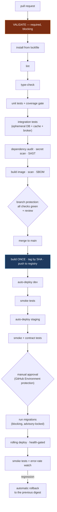

# CI/CD

## 32.1 The reference implementation

| Stage | Requirement | Notes |
|---|---|---|
| Trigger | Yes | Tag push, or manual dispatch with an input |
| Checkout | Yes | — |
| Dependency install in CI | — | Not present; installation happens on the host at build |
| Lint | — | Scripts exist in the repositories; no workflow runs them |
| Type-check | — | Not run in any workflow |
| **Test** | — | **Not run in any of the 40 workflows** |
| Security scanning | — | Not present |
| Build verification | — | Occurs on the target host during deploy |
| Artifact publication | — | No registry step |
| Migration step | — | Not present |
| Deploy | Yes | SSH to host; git pull; compose build and up |
| Smoke test after deploy | — | Not present |
| Rollback | — | Manual |
| Release creation | Yes | On the web client's production workflow |
| Access control | Partial | An actor allow-list in one workflow |

**The characterising observation:** the pipelines are **deployment automation**, not continuous integration. Tests exist in the repositories (137 files) and are not executed by any pipeline, so correctness is verified only when an engineer chooses to run them locally.

## 32.2 Reference flow: the complete pipeline



## 32.3 Reference implementation

```yaml
name: CI/CD

on:
  pull_request:
  push:
    branches: [main]

env:
  NODE_VERSION: '22.17'

jobs:
  # ── Blocking on every PR. This is the gate that makes tests meaningful. ──
  validate:
    runs-on: ubuntu-latest
    services:
      postgres:
        image: postgres:16
        env: { POSTGRES_PASSWORD: test, POSTGRES_DB: test }
        options: >-
          --health-cmd pg_isready --health-interval 5s --health-retries 10
      redis:
        image: redis:7
        options: --health-cmd "redis-cli ping" --health-interval 5s
    steps:
      - uses: actions/checkout@v4
      - uses: actions/setup-node@v4
        with:
          node-version: ${{ env.NODE_VERSION }}
          cache: npm                      # cache keyed on the lockfile
      - run: npm ci                       # install from the lockfile, not resolve
      - run: npm run lint
      - run: npx tsc --noEmit             # type errors fail the build
      - run: npm test -- --coverage
      - run: npm run test:integration     # against the service containers above
        env:
          DB_HOST: localhost
          REDIS_HOST: localhost
      - run: npm audit --audit-level=high
      - uses: gitleaks/gitleaks-action@v2 # committed-secret detection

  build:
    needs: validate
    if: github.ref == 'refs/heads/main'
    runs-on: ubuntu-latest
    permissions:
      id-token: write                     # OIDC to AWS: no stored AWS keys
      contents: read
    outputs:
      image: ${{ steps.meta.outputs.image }}
    steps:
      - uses: actions/checkout@v4
      - uses: aws-actions/configure-aws-credentials@v4
        with:
          role-to-assume: ${{ secrets.AWS_DEPLOY_ROLE }}   # short-lived credentials
          aws-region: ${{ vars.AWS_REGION }}
      - uses: aws-actions/amazon-ecr-login@v2
      - id: meta
        run: echo "image=${{ vars.ECR }}/service:${{ github.sha }}" >> "$GITHUB_OUTPUT"
      - run: |
          docker build -t "${{ steps.meta.outputs.image }}" .
          docker push  "${{ steps.meta.outputs.image }}"
      - uses: aquasecurity/trivy-action@master
        with:
          image-ref: ${{ steps.meta.outputs.image }}
          severity: HIGH,CRITICAL
          exit-code: '1'

  deploy-production:
    needs: build
    runs-on: ubuntu-latest
    environment: production              # ← reviewers, wait timers, and branch
                                         #   restrictions configured in GitHub,
                                         #   not encoded in workflow YAML
    permissions: { id-token: write, contents: read }
    steps:
      - uses: aws-actions/configure-aws-credentials@v4
        with:
          role-to-assume: ${{ secrets.AWS_DEPLOY_ROLE }}
          aws-region: ${{ vars.AWS_REGION }}
      - name: Run migrations (blocking)
        run: ./scripts/run-migrations.sh "${{ needs.build.outputs.image }}"
      - name: Rolling deploy
        run: ./scripts/deploy.sh "${{ needs.build.outputs.image }}"
      - name: Smoke tests
        run: ./scripts/smoke.sh "${{ vars.PRODUCTION_URL }}"
      - name: Rollback on failure
        if: failure()
        run: ./scripts/rollback.sh
```

## 32.4 Reference flow: access control belongs in the system

Encoding an approver list inside workflow YAML — for example, comparing the triggering actor against a hard-coded array of usernames — has three drawbacks: changing the list requires a code change and a review, account handles are mutable so the mapping can silently break, and the control is invisible to anyone auditing repository settings.

```yaml
✗ if: contains(fromJSON('["alice","bob"]'), github.actor)

✓ environment: production
    # In repository settings → Environments → production:
    #   · Required reviewers: a TEAM, not individuals
    #   · Wait timer
    #   · Deployment branches: main only
    #   · Environment secrets scoped to this environment alone
    # Auditable, changeable without a commit, and enforced by the system.
```

**Principle.** *Deployment authorisation belongs in platform configuration — environments, protection rules, teams, and IAM — not in pipeline code. A control encoded in YAML is a control that changes with a commit.*

## 32.5 Reference flow: supply-chain hygiene in CI

```yaml
✗ uses: some-org/ssh-action@master
    # A mutable ref: whatever that branch contains at run time executes,
    # with access to the secrets this step is given.

✓ uses: some-org/ssh-action@a1b2c3d4e5f6…      # pinned to a commit SHA
```

Additional required practices:

```
□ Pin every third-party action to a commit SHA; automate the bumps
□ Use OIDC federation for cloud credentials — no long-lived keys in secrets
□ Scope every token to the minimum permission (`permissions:` per job)
□ Never expose secrets to workflows triggered by `pull_request_target`
  from forks
□ Require signed commits on protected branches (ADVANCED)
```

## 32.6 Reference flow: environment topology

```
Environment    Deploy trigger                 Data              Purpose
─────────────────────────────────────────────────────────────────────────────
dev            auto on merge to main          synthetic         integration
staging        auto after dev smoke passes    anonymised copy    pre-production
production     manual approval               real              customers

Rules:
  □ Identical images across environments; only configuration differs
  □ Identical topology; only scale differs
  □ Third-party sandbox credentials outside production, enforced by
    configuration validation at boot (a service that finds a live payment
    key in staging must refuse to start)
  □ Production data is never copied to a lower environment un-anonymised
  □ Every environment has the same health, metrics, and log pipeline —
    otherwise you cannot practise incident response anywhere but production
```

## 32.7 CI/CD principles

1. **CI runs on every pull request and blocks the merge.** Without a gate, tests are documentation.
2. **The gate is: install from lockfile → lint → type-check → unit → integration → audit → build.**
3. **Build once; deploy an immutable digest.**
4. **Migrations are an automated, locked, blocking step before the application deploys.**
5. **Smoke tests after every deploy, with automatic rollback on regression.**
6. **Rollback is one command and is rehearsed.**
7. **Deployment authorisation lives in platform configuration.**
8. **Cloud credentials via OIDC; no long-lived keys in CI.**
9. **Third-party actions pinned by digest.**
10. **Every deploy is traceable**: commit, artifact digest, approver, timestamp.
11. **A red main branch is the highest-priority work in the team.**
