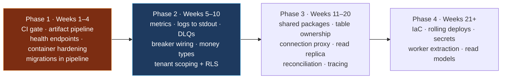
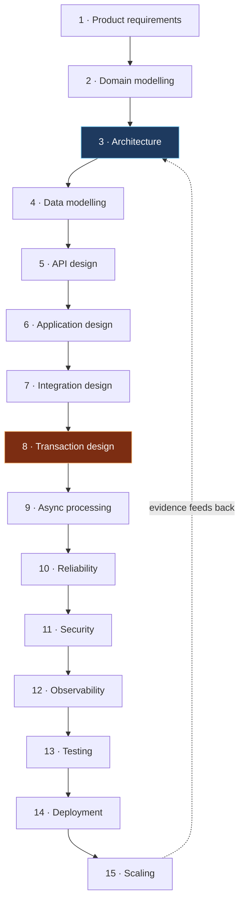

# Principles, investment and sequencing

## Part 34 — Architectural investment register

Presented as prioritised engineering work rather than as a defect list. **Impact** is the cost of not doing it; **Effort** is a rough order of magnitude.

### 34.1 Foundation — do these first

| # | Investment | Why it matters | Impact | Effort | Reference |
|---|---|---|---|---|---|
| 1 | **CI quality gate on every PR** | Every other quality investment compounds through this one; without it, tests, types, and audits are advisory | Critical | Days | `32-cicd.md` |
| 2 | **Immutable artifact pipeline with a registry** | Makes deploys reproducible and rollback possible in one command | Critical | Days | `31-infrastructure-and-deployment.md` §2 |
| 3 | **Exact-decimal money types + balance projection** | Removes silent precision loss and an unbounded per-request cost from the money path | Critical | Weeks | `18-billing-and-money.md` §3–20.4 |
| 4 | **Framework-enforced tenant scoping (required parameter + RLS)** | Converts isolation from a convention into a mechanism | Critical | Weeks | `16-multi-tenancy.md` §3 |
| 5 | **Automated, locked migration step in the pipeline** | Removes a manual step from every deploy | High | Days | `31-infrastructure-and-deployment.md` §5 |
| 6 | **Liveness / readiness / startup endpoints everywhere** | The system cannot route or restart correctly without them | High | Days | `19-reliability.md` §5 |
| 7 | **Container hardening: lockfile builds, non-root, init as PID 1** | Reproducible builds; graceful shutdown actually runs | High | Days | `22-security-architecture.md` §4 |

### 34.2 Observability and reliability

| # | Investment | Why it matters | Impact | Effort | Reference |
|---|---|---|---|---|---|
| 8 | **Metrics: RED, USE, saturation, business** | Latency, saturation, and queue health are currently unanswerable | High | Weeks | `21-observability.md` §3 |
| 9 | **Logs to stdout; collection off the business broker** | Removes the coupling that blinds observability during an incident | High | Days | `09-queues-and-async.md` §5 |
| 10 | **Distributed tracing across HTTP and queue boundaries** | Turns "it's slow" into "it's this dependency" | High | Weeks | `21-observability.md` §3 |
| 11 | **Dead-letter queues in the broker topology + monitoring** | Makes failed messages recoverable rather than discarded | High | Days | `09-queues-and-async.md` §4 |
| 12 | **Bounded prefetch and persistent publishes on every queue** | Bounded consumer memory; messages survive a broker restart | High | Days | `09-queues-and-async.md` §2 |
| 13 | **Wire the circuit breaker and bulkhead already implemented** | Retry without a breaker amplifies a degradation into an outage | High | Days | `17-integrations-and-webhooks.md` §3 |
| 14 | **Reconciliation jobs against payment and provider state** | The only mechanism that catches a lost webhook | High | Weeks | `07-distributed-consistency.md` §4 |
| 15 | **Unhandled errors exit non-zero after flushing telemetry** | Prevents a process continuing in unknown state | Medium | Hours | `19-reliability.md` §3 |
| 16 | **Await dependency connection before accepting traffic** | Eliminates a class of confusing startup errors | Medium | Hours | `19-reliability.md` §4 |

### 34.3 Structure and scaling

| # | Investment | Why it matters | Impact | Effort | Reference |
|---|---|---|---|---|---|
| 17 | **Publish shared libraries as versioned packages** | One source of truth for security-critical shared code | High | Weeks | `30-code-architecture.md` §5 |
| 18 | **Nominate an owning service per shared table; schemas + DB roles** | The highest-leverage step toward real data ownership | High | Weeks | `02-architecture-and-boundaries.md` §3 |
| 19 | **Connection proxy (RDS Proxy) + env-driven pool sizes** | Decouples replica count from the database connection ceiling | High | Days | `05-data-architecture.md` §6 |
| 20 | **Read replica for analytics and reporting** | Removes analytical load from the write primary | High | Days | `02-architecture-and-boundaries.md` §2 |
| 21 | **Extract background pollers into a worker deployable with atomic claiming** | Independent scaling; no duplicate work across replicas | Medium | Weeks | `09-queues-and-async.md` §3 |
| 22 | **Infrastructure as code (import first, then extend)** | Review, history, reproducibility, and a testable DR plan | High | Weeks | `31-infrastructure-and-deployment.md` §6 |
| 23 | **Zero-downtime rolling deploys (ECS/Fargate)** | Removes the deploy gap and enables automatic rollback | High | Weeks | `31-infrastructure-and-deployment.md` §4 |
| 24 | **Secrets manager + platform identity instead of static keys** | Rotation without a deploy; no long-lived credentials | High | Weeks | `22-security-architecture.md` §3 |

### 34.4 Correctness hardening

| # | Investment | Why it matters | Impact | Effort | Reference |
|---|---|---|---|---|---|
| 25 | **Conditional-write state transitions everywhere** | Eliminates read-check-write races structurally | High | Weeks | `06-transactions-and-integrity.md` §4 |
| 26 | **Atomic reservation for every quota and limit** | Makes limits hold under concurrency | High | Days | `05-data-architecture.md` §4 |
| 27 | **Move every external call out of transactions** | Prevents a slow third party from exhausting the connection pool | High | Days | `06-transactions-and-integrity.md` §3 |
| 28 | **Recovery sweeps query the invariant, not the error state** | Recovers from crashes, not only from recorded failures | High | Days | `06-transactions-and-integrity.md` §2 |
| 29 | **Idempotency keys on every consumer and mutation** | At-least-once delivery is the only guarantee available | High | Weeks | `13-api-design.md` §4 |
| 30 | **Private SQLSTATE class for business signals from stored logic** | Separates business rejections from genuine database errors | Medium | Days | `05-data-architecture.md` §4 |
| 31 | **Bounded TTLs and correct collection types for all cache state** | Bounds memory by concurrent rather than cumulative volume | Medium | Days | `10-cache-and-distributed-state.md` §3 |
| 32 | **Test suite for money, tenancy, webhooks, and concurrency** | The four areas where a defect is most expensive | Critical | Weeks | `33-testing.md` |
| 33 | **Retire the second error-tracking system; INFO log level in production** | Reduces cost, noise, and PII exposure | Low | Hours | `21-observability.md` §6 |
| 34 | **Consolidate duplicated configuration patterns across services** | One bootstrap, one pipeline order, one config contract | Medium | Weeks | `14-middleware-and-request-lifecycle.md` §4 |

### 34.5 Sequencing



**Phase 1 is first because it is the multiplier.** Without a CI gate and reproducible artifacts, every subsequent improvement is unverified and un-rollbackable. With them, everything after is safer and faster to land.

---

## Part 36 — Implementation → principle mapping

The core knowledge-transfer table.

| What the system does | Why it exists | Underlying principle | General SaaS use case | Reusability |
|---|---|---|---|---|
| Writes business state and an event row in one transaction, publishes after commit, sweeps for unpublished rows | An event lost after a commit corrupts downstream state | **Atomicity between a state change and its side effect requires a durable intermediate record** | Any state change with an external effect | **Universal** |
| Fans one event out into independently-retried worker rows | Retrying an event re-runs handlers that already succeeded | **The unit of retry must equal the unit of failure** | Any event driving multiple side effects | **High** |
| Claims work with a conditional `UPDATE … RETURNING` and a lease | Multiple runners must not process the same item | **A conditional write with a lease is a distributed lock that needs no lock service** | Job processing, leader election, work distribution | **Universal** |
| Excludes rate-limited attempts from the attempt count | A throttled attempt is not a failed attempt | **Distinguish "could not try" from "tried and failed"** | Any retry budget | **High** |
| Snapshots the attempt cap onto each work row at creation | Changing configuration must not alter in-flight work | **In-flight work carries its own policy** | Any long-running retryable work | **High** |
| Provides a terminal `skipped` state distinct from failure | "Correctly nothing to do" is not an error | **Model states by the operational response they require** | Any workflow with conditional steps | **Universal** |
| Resolves `(role × capability)` and `(plan × capability)` from data | Pricing and permissions change on different schedules, neither of which should need a deploy | **Permission and entitlement are separate questions over one capability vocabulary** | Any tiered multi-tenant product | **Universal** |
| Keeps a revoked-token denylist with TTL, failing closed | Stateless tokens cannot be revoked | **Bound the revocation window; ambiguity is denial** | Any JWT-based system | **Universal** |
| Verifies webhook signatures with per-tenant provider credentials | A shared secret makes one compromise cross-tenant | **Scope verification secrets to the narrowest principal** | Any per-tenant provider integration | **High** |
| Composes retry, timeout, breaker, and bulkhead as ordered middleware behind an adapter | Resilience policies must be reusable and vendor-independent | **Cross-cutting policy is composable middleware, not scattered try/catch** | Every external dependency | **Universal** |
| Retries only classified transient errors | Retrying a permanent error multiplies load and delays the answer | **Classify before retrying** | Every retry policy | **Universal** |
| Implements task chains with `execute`, `rollback`, and `canContinue` | Multi-system operations cannot be transactional | **Cross-system consistency is a saga with explicit compensation** | Provisioning, onboarding, order fulfilment | **High** |
| Exits the process when a required configuration value is absent | A missing variable must not surface as `undefined` later | **Validate configuration at boot; fail fast and loudly** | Every service | **Universal** |
| Isolates long-lived connections in their own deployable | Frequent deploys would disconnect every connected user | **Separate lifecycles belong in separate deployables** | Any real-time or streaming feature | **High** |
| Fans out live updates through pub/sub rather than node-to-node | Any node must be able to serve any client | **Broadcast through a bus; never couple nodes to each other** | Any multi-replica real-time system | **High** |
| Delegates timers to a managed durable scheduler | In-process timers die with the process and multiply with replicas | **Business timers are durable external state** | Trials, reminders, renewals, scheduled reports | **Universal** |
| Records money as append-only credit/debit journal entries | A mutable balance destroys its own audit trail | **Money is a ledger; a balance is a projection** | Any product that moves money | **Universal** |
| Delegates subscription management to a specialist provider | Proration, tax, dunning, and invoicing are enormous domains | **Buy commodity complexity; build differentiating complexity** | Any subscription product | **Universal** |
| Maps each webhook event type to a declarative ordered task list | Event handling grows into unmaintainable conditionals | **Declarative routing tables beat imperative dispatch** | Any multi-type event handler | **High** |
| Applies one identical layered structure across every service | Engineers must be able to move between services | **Consistency compounds; local optimality does not** | Any multi-service codebase | **Universal** |
| Generates client types from the server GraphQL schema | A contract enforced by review is enforced sometimes | **Every boundary needs a contract that fails a build** | Every client/server and service/service boundary | **Universal** |
| Provides a generic typed repository layer over the ORM | Data access must be uniform and transaction-aware | **Uniform data access is where invariants like tenant scope can be enforced** | Every data-access layer | **Universal** |
| Uses time-sortable opaque identifiers | Random identifiers fragment indexes; sequential ones are enumerable | **Identifiers should be sortable, non-guessable, and coordination-free** | Every entity in every system | **Universal** |
| Localises error messages server-side with stable codes | Clients need to branch; humans need to read | **Errors carry a machine code and a human message** | Any product with a UI | **High** |
| Provides a per-integration kill switch | A vendor incident must be containable without a deploy | **Every integration has an off switch that is not a deploy** | Every external integration | **High** |
| Runs graceful shutdown with ordered dependency closure | In-flight work must not be dropped on deploy | **Shutdown is a designed sequence, not a process exit** | Every service | **Universal** |

---

## Part 42 — The Scalable SaaS Engineering Blueprint

The synthesis: a recommended lifecycle, with what to design, what to decide, what to avoid, and which principle applies at each stage.



#### 1 · Product requirements
- **Design:** tenancy model (who is the tenant), pricing model (what is metered), the consistency the *user* can observe, compliance obligations.
- **Decide:** is anything usage-priced? Are there real-time requirements? Which data is regulated?
- **Avoid:** deferring the tenancy and pricing models — both are pervasive and expensive to retrofit.
- **Applies:** entitlement as data; money as a ledger.

#### 2 · Domain modelling
- **Design:** entities, lifecycles, invariants, and the language the team will use consistently.
- **Decide:** which entities have state machines; what each invariant is and where it is enforced.
- **Avoid:** modelling lifecycles as nullable timestamps; letting each service invent its own vocabulary.
- **Applies:** explicit state machines; states modelled by operational response.

#### 3 · Architecture
- **Design:** one modular monolith with two entrypoints; module seams; the system layer.
- **Decide:** which capabilities are DEFAULT now versus OPTIONAL later.
- **Avoid:** microservices before boundaries are proven; any service without owned tables.
- **Applies:** a boundary is a data-ownership boundary; build the system layer first.

#### 4 · Data modelling
- **Design:** schema with tenant columns, constraints, indexes, RLS policies; identifier strategy.
- **Decide:** soft delete or hard; global versus tenant-scoped tables; sortable opaque identifiers.
- **Avoid:** floating-point money; enumerable public identifiers; unique indexes missing the tenant column.
- **Applies:** one writer per table; exact decimals; constraints over application checks.

#### 5 · API design
- **Design:** contract, DTOs, cursor pagination, error taxonomy, idempotency, correlation.
- **Decide:** REST or GraphQL; versioning strategy; rate-limit dimensions.
- **Avoid:** returning ORM models; offset pagination; 403 for cross-tenant access.
- **Applies:** contracts that fail a build; stable machine codes with human messages.

#### 6 · Application design
- **Design:** layers, constructor injection, tenant-scoped repositories, declared authorization policies.
- **Decide:** module boundaries; where transaction boundaries live.
- **Avoid:** business logic in controllers or middleware; abstractions that re-export their dependency's types.
- **Applies:** structural authorization; deep modules; consistency over local optimality.

#### 7 · Integration design
- **Design:** one adapter per provider with a full resilience policy; a kill switch; a webhook receiver.
- **Decide:** the timeout budget per dependency; which are critical; what degradation looks like.
- **Avoid:** SDK imports outside adapters; retry without a breaker; trusting webhook payloads.
- **Applies:** explicit timeouts; classified retries; verify-dedupe-persist-ack-process.

#### 8 · Transaction design
- **Design:** the invariant each transaction protects; conditional writes for transitions; atomic reservations for limits.
- **Decide:** isolation levels where multi-statement invariants exist; where sagas are required.
- **Avoid:** I/O inside transactions; read-check-write; `Promise.all` for consistency.
- **Applies:** database work only inside transactions; preconditions in predicates.

#### 9 · Async processing
- **Design:** outbox, queues with DLQs, idempotent handlers, worker entrypoint, external scheduler.
- **Decide:** what is synchronous (the user is waiting) versus asynchronous (everything else).
- **Avoid:** unbounded prefetch or queues; non-persistent messages; pub/sub for work.
- **Applies:** the unit of retry equals the unit of failure; recovery queries the invariant.

#### 10 · Reliability
- **Design:** timeout/retry/breaker/bulkhead per dependency; health endpoints; graceful shutdown; degradation matrix.
- **Decide:** availability targets; what degrades versus what fails.
- **Avoid:** liveness probes that check dependencies; swallowing unhandled errors; accepting traffic before readiness.
- **Applies:** fail fast; restart clean; every dependency has a documented degradation mode.

#### 11 · Security
- **Design:** four-layer authorization, RLS, secrets management, platform identity, container hardening, audit log.
- **Decide:** the compliance target; data classification; retention.
- **Avoid:** static cloud credentials; environment-dependent validation; secrets in caches.
- **Applies:** fail closed; isolation by mechanism; assert security properties at boot.

#### 12 · Observability
- **Design:** logs, metrics, traces, health, SLOs, alerts, runbooks.
- **Decide:** SLO targets; alert routing; retention per log class.
- **Avoid:** observability on the business broker; awaited log calls; per-tenant metric labels.
- **Applies:** all three pillars; alert on symptoms at a burn rate.

#### 13 · Testing
- **Design:** the CI gate; integration tests on real infrastructure; generated cross-tenant matrix; concurrency and failure-injection suites.
- **Decide:** coverage floors weighted by failure cost.
- **Avoid:** mocking the database; tolerating flaky tests; tests that never run in CI.
- **Applies:** tests that do not run do not exist; weight by failure cost.

#### 14 · Deployment
- **Design:** IaC, build-once artifact pipeline, migrations-then-rolling-deploy, smoke tests, automatic rollback.
- **Decide:** orchestration platform (least that suffices); environment topology; approval gates.
- **Avoid:** building on the target host; `latest` base images; approver lists in pipeline YAML.
- **Applies:** immutable artifacts promoted by digest; rollback is one rehearsed command.

#### 15 · Scaling
- **Design:** the ordered intervention list — proxy, replicas, projections, partitioning, extraction, sharding.
- **Decide:** which measured signal triggers each intervention.
- **Avoid:** scaling by intuition; adding complexity before the constraint binds.
- **Applies:** no per-request cost grows with history; data ownership is a prerequisite beyond one database.

---

## Part 43 — Engineering principles

Forty-two rules, derived from the analysis. Written to be followed and to be cited in code review.

#### Architecture
1. A service boundary is a data-ownership boundary, or it is decoration.
2. Exactly one component owns a table's schema and owns its migrations.
3. Prefer a modular monolith until a boundary has a *measured* independent scaling curve.
4. Every deployable must justify itself by data ownership, scaling, failure isolation, or security posture.
5. Build the system layer before the first feature; in an ecosystem without an opinionated framework, nobody else will.
6. Architecture follows business and scaling requirements, never technology trends.
7. Do not introduce a distributed component because it is popular; name the measured problem it solves.

#### Data
8. Start relational; add a second datastore only when access pattern, durability, retention, *and* cost all diverge.
9. Every tenant-scoped table has a tenant column, a leading index on it, and a query layer that cannot omit it.
10. No per-request cost may grow with cumulative history.
11. Money is exact decimal or integer minor units, with a currency, always.
12. Money is an append-only ledger; a balance is a projection with a verification job.
13. Prefer a database constraint to application logic for anything expressible declaratively.
14. Never expose an enumerable identifier as a public resource identifier.
15. Database connections are a global budget; size centrally and front with a proxy.

#### Transactions and consistency
16. A transaction is a business consistency boundary — name the invariant it protects.
17. A database transaction contains only database work.
18. Express a state transition as a conditional write whose predicate encodes the precondition.
19. Every limit and quota is an atomic reservation, never a read-then-compare.
20. A reconciliation query is defined by the invariant, not by the error path.
21. Once the commit lands, the response reflects the commit; delivery is recovery's problem.
22. For any state mirrored from an external authority, a reconciliation job is a required component.

#### Asynchrony
23. If a side effect must accompany a state change, the outbox is the default implementation.
24. Every asynchronous consumer must tolerate duplicate processing.
25. The unit of retry should equal the unit of failure.
26. Acknowledge at the durability boundary, not at the completion boundary.
27. Every queue has bounded prefetch, persistent messages, a dead-letter queue, and a size bound.
28. Redis pub/sub delivers notifications, never work.
29. Business timers live in a durable external scheduler.

#### Reliability
30. Every external dependency has an explicit timeout, derived from the caller's latency budget.
31. Every retryable operation must be evaluated for idempotency before retry is enabled.
32. If you have retry, you need a circuit breaker.
33. Do not assume external APIs are reliable, ordered, or non-duplicating.
34. Bound everything: concurrency, queues, retries, payloads, caches, query results.
35. An unhandled exception means unknown state: log, flush, exit non-zero, restart clean.
36. Every dependency has a documented, tested degradation mode.

#### Security
37. Tenant isolation must be enforced by a mechanism, not maintained by discipline.
38. Every security decision derives from a verified claim or server-side state, never from an unauthenticated header.
39. Fail closed; ambiguity is denial.
40. Authorization must be structurally impossible to omit — a declared policy per operation, verified in CI.
41. Rotation must be possible without a deploy.
42. Assert security properties at startup and fail closed; never infer them from configuration that looks correct.

#### Operations
43. Tests that do not run in CI do not exist.
44. Build once; promote an immutable artifact by digest.
45. Rollback is one command, and it has been rehearsed.
46. Applications write structured logs to stdout; collection is a platform concern.
47. Logs, metrics, and traces are three requirements, not three options.
48. Alert on symptoms the user experiences, at a burn rate that threatens the budget.
49. Every alert has a runbook.
50. Shared code is a versioned package; copies diverge and packages do not.

---

## Part 44 — Final architecture review

### 1 · What are the strongest architectural decisions?

1. **The transactional outbox with worker-level fan-out, atomic lease claiming, attempt auditing, and status roll-up.** A hard pattern implemented well, with details — attempt-cap snapshotting, rate-limited attempts excluded from the budget, a terminal no-op state — that only emerge from operating the thing.
2. **The four-layer authorization model with entitlement as data.** The most transferable idea here.
3. **The composable resilience pipeline** behind a vendor-neutral adapter layer.
4. **A uniform layered structure, maintained at scale.** Navigability at this scale is worth more than most individual design choices.
5. **Fail-fast configuration validation at boot.**
6. **Externalised durable scheduling.**
7. **Isolating long-lived connections in their own deployable.**
8. **Double-entry ledger separated from the billing provider.**
9. **Cursor pagination as a shared package**, so it is applied consistently rather than per endpoint.
10. **Generated client types from the API schema** — the one boundary with a build-enforced contract.

### 2 · Which decisions enabled the system to scale?

- **A stateless service tier** — every API service scales horizontally without coordination.
- **Asynchronous offloading** of email, media, AI, metering, and exports, keeping request latency independent of slow work.
- **Federation**, which let domains grow into separate codebases without a client-side rewrite.
- **The outbox**, which made cross-service work reliable enough to depend on.
- **Cursor pagination**, which kept list endpoints constant-cost as data grew.
- **A managed identity provider and a managed billing provider**, removing two enormous domains from the team's scope.
- **A compiled service for compute-heavy aggregation**, keeping that work off the event loops.

### 3 · Which decisions exist because of the real-time domain?

- Sub-millisecond coordination state in a cache tier.
- Collapsing hot-path validation into a single database round trip.
- A dedicated real-time fan-out tier and connection service.
- Second-granularity usage metering.
- Per-tenant external provider credentials.
- Provider webhook filter pipelines handling high-volume, multi-type inbound events.

**None of these should be copied without the constraint that produced them.** An optimisation without its constraint is pure complexity.

### 4 · Which decisions should become organisational standards?

| Standard | Scope |
|---|---|
| Four-layer authorization with entitlement as data | Every multi-tenant product |
| Transactional outbox for state-change side effects | Every product |
| Idempotency keys on consumers and mutations | Every product |
| One adapter per external provider, with a full resilience policy | Every product |
| Exact-decimal money and append-only ledgers | Every product that moves money |
| Cursor pagination and explicit DTOs | Every API |
| Fail-fast configuration validation | Every service |
| Structured logs, RED/USE metrics, tracing, health endpoints | Every service |
| Uniform layered structure and a shared platform layer | Every codebase |
| Blocking CI gate and immutable artifacts | Every repository |
| Integration tests against real infrastructure | Every service |
| Generated cross-tenant test matrix | Every multi-tenant product |

### 5 · Which decisions should not be copied into every SaaS?

- **One shared database across many services** — the coupling that costs the most.
- **ORM models duplicated per service** — replace with a published contract package.
- **Building images on the target host** — replace with a registry artifact pipeline.
- **Business rules in stored procedures** — only for a measured hot path, with guardrails.
- **Application logs through the business broker** — stdout plus platform collection.
- **In-process background polling loops** — a worker deployable with atomic claiming.
- **Two ORMs over one schema; two error trackers** — one owner, one tool.
- **Static cloud credentials and approver lists in pipeline YAML** — platform identity and platform protection.
- **Very small services split along team lines** — modules, not deployables.

### 6 · Where should investment be concentrated?

In the order given in this document: **the CI gate and the immutable artifact pipeline first**, because they are the multiplier for everything else; then **money types and tenant scoping**, because those are where a defect is most expensive; then **observability**, because incidents are currently diagnosed without metrics or traces; then **structural work** — shared packages, table ownership, connection proxying, read replicas; then **infrastructure as code and rolling deploys**.

### 7 · What would be designed differently today?

| Today | Instead |
|---|---|
| Eleven services on one database | A modular monolith with two entrypoints, extracting only where data ownership is clean |
| Shared code vendored by copy | A private registry with versioned packages from day one |
| Tenant scoping by convention | A required branded tenant parameter plus RLS from the first migration |
| Money as floating point | `NUMERIC` with a balance projection from the first ledger entry |
| SSH deploys building on host | ECR artifacts and ECS rolling deploys from the first release |
| No CI gate | A blocking gate from the first commit — the cheapest possible moment to add it |
| Logs through the broker | stdout and platform collection |
| No metrics or tracing | OpenTelemetry in the system layer from week one |
| Manual infrastructure | Terraform or CDK from the first environment |
| Static AWS keys | Instance and task roles throughout |
| Two error trackers, two ORMs | One of each |
| Authorization checked inside resolvers | Declared per operation, verified by a CI check |

**The pattern in that table is instructive:** almost every entry is something that costs *days* at the start of a project and *quarters* later. The list is a rank-ordered argument for building the system layer before the first feature.

### 8 · What should the default architecture be for the next product?

`01-golden-path.md`, in one line: **a modular monolith on PostgreSQL with row-level tenancy and RLS, two entrypoints, a purpose-built platform layer, managed identity and billing, a transactional outbox, a managed queue with dead-letter queues, full observability, infrastructure as code, and a blocking CI pipeline promoting immutable artifacts — deployed on ECS Fargate.**

### 9 · What should require architectural review before implementation?

```
□ Any new deployable service
□ Any new datastore technology
□ Any new external provider dependency
□ Any change to a shared table's schema
□ Any change to the authorization model
□ Any code path that moves money
□ Any new unauthenticated endpoint
□ Any endpoint that triggers a metered external call
□ Any transaction spanning more than one aggregate
□ Any new cache key that is not a pure cache
□ Any migration that is not backward-compatible
□ Any change to retry, timeout, or breaker policy
□ Any new queue or topic
□ Any deviation from the system layer
```

### 10 · What should every senior engineer understand?

1. **A service boundary is a data-ownership boundary.** Everything else about microservices follows from this.
2. **Atomicity across systems does not exist.** You get one transaction in one database, or eventual consistency with idempotency and reconciliation.
3. **At-least-once is the only delivery guarantee available.** Therefore every consumer is idempotent.
4. **A precondition belongs in the predicate of a write**, not in a preceding read.
5. **Retry without a circuit breaker amplifies failures.**
6. **Every external call has a timeout**, or it is a resource leak waiting for a slow day.
7. **A transaction holds locks and a connection**; nothing that talks to a network belongs inside one.
8. **Money is exact decimal, append-only, and reconciled.**
9. **Tenant isolation must be enforced by a mechanism.** Discipline does not scale with headcount.
10. **Fail closed on security; fail open only deliberately, with a metric.**
11. **No per-request cost may grow with cumulative data.**
12. **Bound everything.** Every scaling failure is an unbounded thing meeting growth.
13. **Tests that do not run in CI do not exist.**
14. **You cannot roll back to an artifact you cannot rebuild identically.**
15. **Logs, metrics, and traces answer different questions**; none substitutes for another.
16. **Complexity must be justified by a measured problem**, never by convention.
17. **In an ecosystem without an opinionated framework, the system layer is the first feature.**
